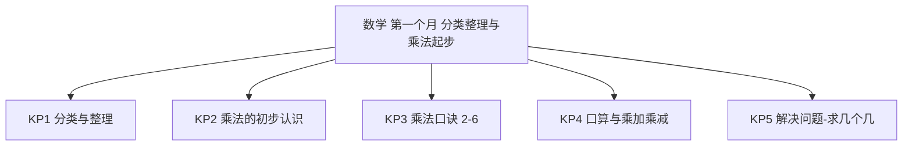
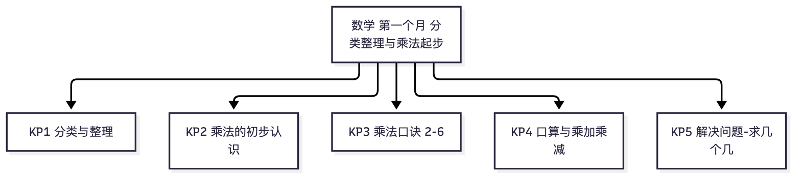

# 数学·二年级上学期第一个月自我检测（教师版）

> 适用：湖南省二年级上学期第 1 个月（2026 年 9 月）｜ 满分 100 分 ｜ 建议用时 35 分钟
> 教材对照：数学人教版（2025 年秋新修订版）第 1~2 单元主题（分类与整理 · 1~6 的表内乘法）——2024 年审核通过的新版教材，本批学生一年级已用新版；旧版二上"长度单位、100 以内笔算"不是本月内容。以学校实际用书与进度为准。
> 教师版含答案解析、双向细目表（评价接口）与知识框架图；学生用 学生版，家庭用 家长版。
> （注：评价接口第 2 项"各学生学科短板评估"为后续版本预留——本卷 JSON 接口已备好读取入口；教学进度以 §一 4 周速览表承载。）

## 一、本月学什么（教学范围）

第一个月两条主线：一是"会把东西整理清楚"——按给定标准分类、按自己选的标准分类，知道标准不同结果可能不同，还会一层一层地分；二是"乘法起步"——相同加数的连加可以写成乘法，认识乘号、乘数和积，背熟 1~6 的乘法口诀，会算表内乘法和乘加、乘减两步式题。注意：新修订教材本月**没有**竖式笔算，也没有厘米和米（那是第 3 单元，10 月中下旬以后），本卷不涉及。

| 周次 | 教学内容（主题级） | 家里能观察到的迹象 |
|---|---|---|
| 第 1 周 | 分类与整理：按给定的标准分、按自己的标准分、逐层分类 | 会把玩具、书包按自己说的标准分堆，说得清"为什么同类" |
| 第 2 周 | 乘法的初步认识；5 的乘法口诀 | 能把 4＋4＋4 写成 4×3；口诀三五十五张口就来 |
| 第 3 周 | 2、3、4 的乘法口诀；乘加、乘减；6 的乘法口诀 | 口算变快；会算 4×3＋2 这样的两步式题 |
| 第 4 周 | 口诀巩固；解决问题（求几个几）；月末自检 | 买东西会说"每盒 5 支、3 盒一共 15 支" |

**进度差异说明**：个别学校月末尚未讲到"6 的乘法口诀"——第 19、20、23 题可跳过；尚未讲到"乘加乘减"——第 21、22、27 题可跳过。等级按已做题得分折算后对照。

## 二、试卷

### 一、填空（本题 6 小题，共 18 分）

1. 4＋4＋4＋4＋4＝（　　）；写成乘法算式：（　）×（　）或（　）×（　）。（3分）
2. 在 6×4＝24 中，6 和 4 都叫（　　　），24 叫（　　　）。（3分）
3. 把口诀补充完整：三五（　　　）；四六（　　　）。（3分）
4. 2×4 读作（　　　　　）；计算 2×4 和 4×2 用的都是口诀（　　　　　）。（3分）
5. 6＋6＋6＋6 改写成乘法算式是（　）×（　），用口诀（　　　　　）来计算。（3分）
6. 把"桃　辣椒　梨　茄子　苹果　白菜"分一分：水果有（　）个，蔬菜有（　）个。（3分）

### 二、判断（对的画"√"，错的画"×"）（本题 4 小题，共 8 分）

7. 分类标准不同，分类的结果也可能不同。（　）（2分）
8. 5＋5＋5＋4 可以直接用一句乘法口诀算出结果。（　）（2分）
9. 计算 3×6 和 6×3 用的是同一句口诀。（　）（2分）
10. 在算式 2×5＝10 中，10 叫乘数。（　）（2分）

### 三、选择（本题 4 小题，共 12 分）

11. "3 个 6 相加"写成的乘法算式是：A　3＋6　B　3×6　C　6－3　D　6＋3（3分）
12. 每盒有 5 支铅笔，买了 3 盒，一共有多少支？正确的算式是：A　5×3　B　5＋3　C　5－3　D　5＋5＋5＋5（3分）
13. 计算 4×3＋2 时，要先算：A　加法　B　减法　C　乘法　D　先算 2（3分）
14. 下面哪道题**不能**用口诀"三五十五"来计算？A　5×3　B　3×5　C　5＋5＋5　D　5＋3（3分）

### 四、口算（本题 8 小题，共 16 分）

15. 3×5＝（　）（2分）
16. 2×6＝（　）（2分）
17. 4×4＝（　）（2分）
18. 6×2＝（　）（2分）
19. 5×6＝（　）（2分）
20. 6×6＝（　）（2分）
21. 3×4＋2＝（　）（2分）
22. 5×4－3＝（　）（2分）

### 五、算式与口诀（写一写）（本题 2 小题，共 16 分）

23. 把口诀补充完整，再写出它对应的两道乘法算式：三六（　　　）；（　）×（　）＝（　）、（　）×（　）＝（　）。（8分）
24. 写出两道积是 12 的乘法算式（乘数都不超过 6）：（　）×（　）＝12、（　）×（　）＝12。（8分）

### 六、解决问题（本题 3 小题，共 30 分）

25. 把"菠萝　白菜　辣椒　西瓜　茄子　梨"分一分：（1）按"水果和蔬菜"分成两类，写出每类有哪些；（2）自己再想一个不同的分类标准，按你的标准把结果写下来。（10分）
26. 同学们做操，站了 4 排，每排 6 人。一共有多少人？（10分）
27. 树上挂着 3 串气球，每串 5 个，旁边还有 2 个单独的气球。一共有多少个气球？（10分）

## 三、参考答案与解析

### 答案速查

```
1. 20；4×5 或 5×4
2. 乘数；积
3. 十五；二十四
4. 2乘4；二四得八
5. 6×4（或 4×6）；四六二十四
6. 3；3
7. 对
8. 错
9. 对
10. 错
11. B
12. A
13. C
14. D
15. 15
16. 12
17. 16
18. 12
19. 30
20. 36
21. 14
22. 17
23. 十八；3×6＝18、6×3＝18
24. 见解析
25. 见解析
26. 24 人
27. 17 个
```

### 逐题解析

1. 5 个 4 相加是 20；相同加数连加可以写成乘法：4×5 或 5×4 都对。判错点：把加数个数写反还没发现——新教材两种写法都算对，关键是积等于 20。
2. 新教材把乘号两边都叫"乘数"（旧资料有写"因数"的，以课本为准），乘得的结果叫"积"。判错点：受旧资料影响写成"因数"。
3. 三五十五；四六二十四。判错点：口诀背串（如写成"四五二十"）。
4. 读作"2乘4"；2×4 和 4×2 交换乘数位置，积不变，都用"二四得八"。
5. 4 个 6 相加，写成 6×4 或 4×6 都对，口诀"四六二十四"。判错点：写成 6×4 却背"六四二十四"——口诀里乘数读法有固定顺序。
6. 水果：桃、梨、苹果共 3 个；蔬菜：辣椒、茄子、白菜共 3 个。判错点：把"辣椒"当成水果（按生活与课本分类它是蔬菜）。
7. 对——同一堆东西，按颜色分和按形状分，结果可以不一样；但不管怎么分，总数不变。
8. 错——乘法口诀算的是"相同加数"连加；5＋5＋5＋4 的"4"不是 5，要用乘加 3×5＋4 来算。
9. 对——3×6 和 6×3 只是交换了乘数，都用"三六十八"。
10. 错——2 和 5 是乘数，10 是积。
11. B——"3 个 6 相加"写成乘法：3×6（写成 6×3 也对，但四个选项里只有 B 是乘法算式）。判错点：见"3"和"6"就选加法。
12. A——3 个 5 相加（5 支的盒子买了 3 盒），用乘法 5×3＝15（支）。D 是 4 个 5，多加了一盒。
13. C——乘加、乘减式题先算乘法，再算加（减）法：4×3＋2＝12＋2＝14。
14. D——5＋3 的两个数不相同，没有对应口诀；A、B、C 都是"3 个 5"，积 15。
15. 15。"三五十五"。
16. 12。"二六十二"。
17. 16。"四四十六"。
18. 12。"二六十二"——和 16 题同一句口诀。
19. 30。"五六三十"。
20. 36。"六六三十六"。判错点：和"六六三十四"背混。
21. 14。先算 3×4＝12，再加 2。
22. 17。先算 5×4＝20，再减 3。
23. 三六十八；3×6＝18 和 6×3＝18。一句口诀通常对应两道乘法算式（乘数交换）。判错点：漏写第二道。
24. 示例：2×6＝12 和 3×4＝12（写 6×2、4×3 也对；任意两道积是 12、乘数不超过 6 的都给分）。判错点：写成 1×12——乘数超过 6，超出本月口诀范围。
25. 采分点：（1）水果——菠萝、西瓜、梨，蔬菜——白菜、辣椒、茄子，每分对一类得 3 分（写对类别归属即可，顺序不限），共 6 分；（2）新标准合理（如"长在树上／长在地里""颜色""能不能直接吃"）得 2 分，分类结果与自己的标准一致得 2 分。判错点：新标准和结果对不上（说按颜色分却把不同颜色混在一类）。
26. 4×6＝24（人）或 6×4＝24（人）。采分点：算式 4 分、结果 4 分、单位与答句完整 2 分。判错点：把"4 排"和"每排 6 人"相加。
27. 3×5＋2＝17（个）或 5×3＋2＝17（个）。采分点：算式 5 分（两步式题）、结果 3 分、单位与答句 2 分。判错点：只算 3×5 丢了单独的 2 个，或列成 3＋5＋2。

## 四、评价接口（双向细目表）

| 题号 | 分值 | 知识点 | 课标锚点（2022版·内容要求摘句） | 难度 | 大纲匹配 |
|---|---|---|---|---|---|
| 1 | 3 | KP2 乘法的初步认识 | 数与运算：把相同加数连加改写成乘法算式 | 易 | 强 |
| 2 | 3 | KP2 乘法的初步认识 | 数与运算：知道乘法算式各部分名称（乘数、积） | 易 | 强 |
| 3 | 3 | KP3 乘法口诀（2~6） | 数与运算：熟记 2~6 的乘法口诀 | 易 | 强 |
| 4 | 3 | KP3 乘法口诀（2~6） | 数与运算：会读乘法算式，知道交换乘数积不变 | 中 | 中 |
| 5 | 3 | KP3 乘法口诀（2~6） | 数与运算：把连加改写成乘法并选择口诀 | 易 | 强 |
| 6 | 3 | KP1 分类与整理 | 数据分类：按给定标准对事物进行分类并计数 | 易 | 强 |
| 7 | 2 | KP1 分类与整理 | 数据分类：知道分类标准不同结果可能不同 | 易 | 强 |
| 8 | 2 | KP2 乘法的初步认识 | 数与运算：辨析相同加数连加与乘法的关系 | 中 | 中 |
| 9 | 2 | KP3 乘法口诀（2~6） | 数与运算：交换乘数用同一句口诀 | 易 | 强 |
| 10 | 2 | KP2 乘法的初步认识 | 数与运算：知道乘法算式各部分名称 | 易 | 强 |
| 11 | 3 | KP2 乘法的初步认识 | 数与运算：理解乘法是求几个相同加数和的简便运算 | 中 | 强 |
| 12 | 3 | KP5 解决问题-求几个几 | 数量关系：从情境中选择乘法解决问题 | 易 | 强 |
| 13 | 3 | KP4 口算与乘加乘减 | 数与运算：知道乘加乘减两步式题先算乘法 | 中 | 中 |
| 14 | 3 | KP3 乘法口诀（2~6） | 数与运算：依据口诀的适用条件辨析算式 | 较难 | 中 |
| 15 | 2 | KP4 口算与乘加乘减 | 数与运算：能口算表内乘法 | 易 | 强 |
| 16 | 2 | KP4 口算与乘加乘减 | 数与运算：能口算表内乘法 | 易 | 强 |
| 17 | 2 | KP4 口算与乘加乘减 | 数与运算：能口算表内乘法（同数相乘） | 易 | 强 |
| 18 | 2 | KP4 口算与乘加乘减 | 数与运算：能口算表内乘法 | 易 | 强 |
| 19 | 2 | KP4 口算与乘加乘减 | 数与运算：能口算 6 的乘法口诀 | 中 | 强 |
| 20 | 2 | KP4 口算与乘加乘减 | 数与运算：能口算 6 的乘法口诀（同数相乘） | 中 | 强 |
| 21 | 2 | KP4 口算与乘加乘减 | 数与运算：能口算乘加两步式题 | 中 | 强 |
| 22 | 2 | KP4 口算与乘加乘减 | 数与运算：能口算乘减两步式题 | 中 | 强 |
| 23 | 8 | KP3 乘法口诀（2~6） | 数与运算：由口诀写出对应的两道乘法算式 | 中 | 强 |
| 24 | 8 | KP3 乘法口诀（2~6） | 数与运算：逆向搜索积对应的口诀与算式 | 较难 | 拓展 |
| 25 | 10 | KP1 分类与整理 | 数据分类：按给定标准与自选标准分类整理并表达 | 中 | 中 |
| 26 | 10 | KP5 解决问题-求几个几 | 数量关系：解决"每份同样多、求总数"的问题 | 易 | 强 |
| 27 | 10 | KP5 解决问题-求几个几 | 数量关系：解决乘加两步的实际问题 | 较难 | 拓展 |

```json
{
  "subject": "数学",
  "duration_min": 35,
  "total_score": 100,
  "items": [
    {"no": 1, "score": 3, "kp": "KP2", "difficulty": "易", "match": "强"},
    {"no": 2, "score": 3, "kp": "KP2", "difficulty": "易", "match": "强"},
    {"no": 3, "score": 3, "kp": "KP3", "difficulty": "易", "match": "强"},
    {"no": 4, "score": 3, "kp": "KP3", "difficulty": "中", "match": "中"},
    {"no": 5, "score": 3, "kp": "KP3", "difficulty": "易", "match": "强"},
    {"no": 6, "score": 3, "kp": "KP1", "difficulty": "易", "match": "强"},
    {"no": 7, "score": 2, "kp": "KP1", "difficulty": "易", "match": "强"},
    {"no": 8, "score": 2, "kp": "KP2", "difficulty": "中", "match": "中"},
    {"no": 9, "score": 2, "kp": "KP3", "difficulty": "易", "match": "强"},
    {"no": 10, "score": 2, "kp": "KP2", "difficulty": "易", "match": "强"},
    {"no": 11, "score": 3, "kp": "KP2", "difficulty": "中", "match": "强"},
    {"no": 12, "score": 3, "kp": "KP5", "difficulty": "易", "match": "强"},
    {"no": 13, "score": 3, "kp": "KP4", "difficulty": "中", "match": "中"},
    {"no": 14, "score": 3, "kp": "KP3", "difficulty": "较难", "match": "中"},
    {"no": 15, "score": 2, "kp": "KP4", "difficulty": "易", "match": "强"},
    {"no": 16, "score": 2, "kp": "KP4", "difficulty": "易", "match": "强"},
    {"no": 17, "score": 2, "kp": "KP4", "difficulty": "易", "match": "强"},
    {"no": 18, "score": 2, "kp": "KP4", "difficulty": "易", "match": "强"},
    {"no": 19, "score": 2, "kp": "KP4", "difficulty": "中", "match": "强"},
    {"no": 20, "score": 2, "kp": "KP4", "difficulty": "中", "match": "强"},
    {"no": 21, "score": 2, "kp": "KP4", "difficulty": "中", "match": "强"},
    {"no": 22, "score": 2, "kp": "KP4", "difficulty": "中", "match": "强"},
    {"no": 23, "score": 8, "kp": "KP3", "difficulty": "中", "match": "强"},
    {"no": 24, "score": 8, "kp": "KP3", "difficulty": "较难", "match": "拓展"},
    {"no": 25, "score": 10, "kp": "KP1", "difficulty": "中", "match": "中"},
    {"no": 26, "score": 10, "kp": "KP5", "difficulty": "易", "match": "强"},
    {"no": 27, "score": 10, "kp": "KP5", "difficulty": "较难", "match": "拓展"}
  ]
}
```

## 五、知识体系框架图




（查看器不渲染 mermaid 时看上方 PNG。）

---
*AI 辅助生成，内容仅供参考，请以教材与老师要求为准；使用前请教师/家长抽查核对。hunan-g2-learn / month1-selfcheck · 2026-09*
