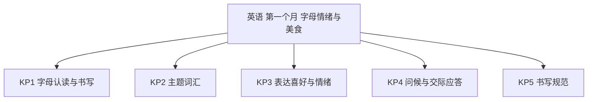
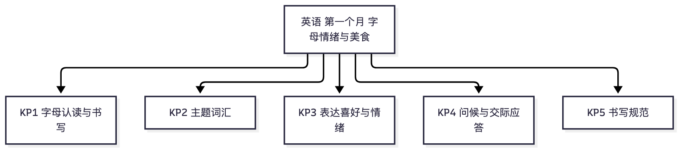

# 英语·二年级上学期第一个月自我检测（教师版）

> 适用：湖南省二年级上学期第 1 个月（2026 年 9 月）｜ 满分 100 分 ｜ 建议用时 30 分钟
> 教材对照：英语外研版（一年级起点）二年级上册——2024 年审定新版《新交际》：The ABC song + Unit 1 Feelings · Unit 2 Yummy, yummy food!（本月主体）；部分学校仍用经典版《新标准》：Module 1 字母歌与 I like · Module 2 食物与 I don't like。两版第一个月共通的是字母歌与字母 Aa~Dd、I like 喜好表达、食物词汇；个别版本差异题见"进度差异说明"。以孩子课本目录为准（目录是 Module 1~10 = 经典版；是 The ABC song + Unit 1~6 = 新交际）。
> 教师版含答案解析、双向细目表（评价接口）与知识框架图；学生用 学生版，家庭用 家长版。
> （注：评价接口第 2 项"各学生学科短板评估"为后续版本预留——本卷 JSON 接口已备好读取入口；教学进度以 §一 4 周速览表承载。听力纸面测不到，家长版附替代小测法。）

## 一、本月学什么（教学范围）

二年级第一个月四件事：把字母歌和字母 Aa~Dd 认读写熟；会用 I'm happy / I'm tired 说出自己的情绪，会说 I'm hungry. Let's have dinner.；认识米饭、面条、牛奶、香蕉这些食物词；会用 I like rice and milk. 说出自己喜欢的东西。抄写句子时记住两句硬规矩：句首大写、词与词留空。不考语法术语、不考写话。

| 周次 | 教学内容（主题级） | 家里能观察到的迹象 |
|---|---|---|
| 第 1 周 | Unit 1 Feelings 起步：情绪词 sad / angry / tired / hungry；字母 Aa Bb | 做表情说情绪：I'm happy / I'm tired. |
| 第 2 周 | Unit 1 收束：I'm hungry. Let's have dinner.；字母 Aa Bb 巩固 | 吃饭前会冒一句 I'm hungry |
| 第 3 周 | Unit 2 起步：食物词 rice / noodles / milk / banana；字母 Cc Dd | 指着家里的食物说英文名 |
| 第 4 周 | Unit 2 收束：I like … and …. / Yummy!；月末自检 | 会说我喜欢的两种食物 |

**进度差异说明**：本卷两版教材通用。若孩子课本目录是 Module 1~10（经典版《新标准》），第 11、12、16、18 题可跳过（情绪表达是新版 Unit 1 内容）；若目录是 The ABC song + Unit 1~6（新交际），第 15 题可跳过（I don't like 是经典版 Module 2 内容）。字母教学各校快慢不同——若班级尚未学到字母 Cc，第 1、3 题可跳过。等级按已做题得分折算后对照。

## 二、试卷

### 一、字母（本题 6 小题，共 24 分）

1. 写出大写字母 C 的小写形式：（　　）（3分）
2. 写出小写字母 d 的大写形式：（　　）（3分）
3. 按字母歌顺序填空：Aa　Bb　Cc　（　　）　Ee（3分）
4. 按字母歌顺序填空：（　　）　Bb　Cc　Dd（3分）
5. 下面哪个是元音字母？A　b　B　a　C　c　D　d（6分）
6. 大写字母 B 在四线三格里占：A　上面两格　B　中间一格　C　下面两格　D　三格全占（6分）

### 二、词汇（本题 6 小题，共 18 分）

7. 选出不同类的一项：A　rice　B　noodles　C　ice cream　D　like（3分）
8. "rice" 的意思是：A　米饭　B　面条　C　肉　D　糖（3分）
9. "ice cream" 的意思是：A　蛋糕　B　牛奶　C　冰淇淋　D　面包（3分）
10. "milk" 的意思是：A　米饭　B　牛奶　C　苹果　D　香蕉（3分）
11. "tired" 的意思是：A　高兴的　B　饿的　C　伤心的　D　累的（3分）
12. "banana" 的意思是：A　香蕉　B　面包　C　蛋糕　D　米饭（3分）

### 三、情景选择（本题 4 小题，共 16 分）

13. 你吃到好吃的食物，会说：A　Yummy!　B　I'm sad!　C　Goodbye!　D　I'm angry!（4分）
14. 你想说"我喜欢米饭和牛奶"，应该说：A　I like rice.　B　I like milk.　C　I like rice and milk.　D　I don't like milk.（4分）
15. 你不喜欢吃姜，应该说：A　I don't like ginger.　B　I like ginger.　C　I don't like meat.　D　I like rice.（4分）
16. 你很累了，应该说：A　I'm hungry.　B　I'm tired.　C　I'm angry.　D　I'm sad.（4分）

### 四、对话匹配（从 B 栏中选出 A 栏各句的应答，把字母写在括号里）（本题 5 小题，共 20 分）

17. Hello! I'm Sam.（　）（4分）
18. I'm hungry.（　）（4分）
19. How are you?（　）（4分）
20. Nice to meet you.（　）（4分）
21. What's your name?（　）（4分）

　　B 栏：A．I'm fine, thank you.　　B．My name is Amy.　　C．Let's have dinner!
　　　　　D．Nice to meet you, too.　　E．Hi! I'm Amy.　　F．Goodbye!

### 五、书写（本题 2 小题，共 22 分）

22. 把下面的句子抄写正确（注意大小写与标点）：i like rice.（8分）
23. 照样子，补全句子并抄写工整：I like rice and milk.（把横线上的食物换成你喜欢的两种食物：I like ____ and ____.）（14分）

## 三、参考答案与解析

### 答案速查

```
1. c
2. D
3. Dd
4. Aa
5. B
6. A
7. D
8. A
9. C
10. B
11. D
12. A
13. A
14. C
15. A
16. B
17. E
18. C
19. A
20. D
21. B
22. I like rice.（句首 I 大写）
23. 见解析
```

### 逐题解析

1. c——大写 C 的小写是 c；判错点：与 o 混（c 开口朝右）。
2. D——小写 d 的大写是 D；判错点：b、d 认反（小写 d 的"肚子"朝右）。
3. Dd——Aa Bb Cc Dd Ee 顺次；判错点：写成小写 dd，大小写要成对写。
4. Aa——字母歌从头唱：Aa 打头；判错点：从 Bb 唱起漏了第一个。
5. B——元音字母是 a、e、i、o、u；本题里只有 a 是元音。一年级学过 a 在 apple 里的发音，可以让孩子说说。
6. A——大写字母 B 有"小辫子"，占上面两格（中格和上格）；占中格的是 a、c、e 这类小写字母。
7. D——rice、noodles、ice cream 都是食物，like 是"喜欢"，表示动作不是食物。
8. A——rice 是米饭；判错点：与 noodles（面条）混。
9. C——ice cream 是冰淇淋。
10. B——milk 是牛奶。
11. D——tired 是累的；判错点：与 hungry（饿的）混——累是困，饿是想吃东西。
12. A——banana 是香蕉；判错点：与 bread（面包）混。
13. A——Yummy! 是"好吃！"的感叹；I'm sad / I'm angry 是难过生气，Goodbye 是告别。
14. C——"米饭和牛奶"两样都喜欢，用 and 连起来：I like rice and milk.；A、B 各只说了一样，不完整。
15. A——不喜欢说 I don't like…；"不喜欢吃姜"就是 I don't like ginger.；C 说的是不喜欢肉，不是姜。
16. B——累是 I'm tired.；hungry 是饿，angry 是生气，sad 是难过——四个情绪词要分清。
17. E——别人自我介绍 Hello! I'm Sam.，回敬自己的名字：Hi! I'm Amy.
18. C——I'm hungry.（我饿了）接 Let's have dinner!（我们吃饭吧！）正好。
19. A——How are you? 问"你好吗"，答 I'm fine, thank you.
20. D——Nice to meet you. 应答 Nice to meet you, too.——too 不能丢。
21. B——问 What's your name? 答 My name is Amy.（我叫艾米）。
22. 正确抄写：I like rice.——句首字母必须大写。采分点：句首 I 大写 4 分；抄写正确、词间留空、句点齐全 4 分。
23. 示例：I like noodles and bananas.——换成自己喜欢的两种食物。采分点：填出两种食物词、拼写正确 6 分（每种 3 分）；I like 句型完整、and 使用正确 4 分；抄写工整、句首大写与句点齐全 4 分。判错点：整句小写（i like …）——句首大写是硬规矩。

## 四、评价接口（双向细目表）

| 题号 | 分值 | 知识点 | 课标锚点（2022版·内容要求摘句） | 难度 | 大纲匹配 |
|---|---|---|---|---|---|
| 1 | 3 | KP1 字母认读与书写 | 写：正确书写字母的大小写形式 | 易 | 强 |
| 2 | 3 | KP1 字母认读与书写 | 写：正确书写字母的大小写形式 | 易 | 强 |
| 3 | 3 | KP1 字母认读与书写 | 语音知识：按字母歌顺序认读 26 个字母 | 易 | 强 |
| 4 | 3 | KP1 字母认读与书写 | 语音知识：按字母歌顺序认读 26 个字母 | 易 | 强 |
| 5 | 6 | KP1 字母认读与书写 | 语音知识：感知元音字母，正确认读 | 中 | 中 |
| 6 | 6 | KP1 字母认读与书写 | 写：正确书写字母，知道四线三格占格 | 较难 | 强 |
| 7 | 3 | KP2 主题词汇 | 词汇知识：认读所学单词，按类别归组 | 中 | 强 |
| 8 | 3 | KP2 主题词汇 | 词汇知识：知道常见食物的词义 | 易 | 强 |
| 9 | 3 | KP2 主题词汇 | 词汇知识：知道常见食物的词义 | 易 | 强 |
| 10 | 3 | KP2 主题词汇 | 词汇知识：知道常见食物的词义 | 易 | 强 |
| 11 | 3 | KP2 主题词汇 | 词汇知识：知道常见情绪形容词的词义 | 中 | 中 |
| 12 | 3 | KP2 主题词汇 | 词汇知识：知道常见食物的词义 | 易 | 强 |
| 13 | 4 | KP3 表达喜好与情绪 | 语用知识：用感叹语表达对食物的喜爱 | 中 | 强 |
| 14 | 4 | KP3 表达喜好与情绪 | 语用知识：用 I like … and … 表达喜好 | 易 | 强 |
| 15 | 4 | KP3 表达喜好与情绪 | 语用知识：用 I don't like … 表达不喜欢 | 中 | 强 |
| 16 | 4 | KP3 表达喜好与情绪 | 语用知识：用 I'm + 情绪词表达感受 | 易 | 强 |
| 17 | 4 | KP4 问候与交际应答 | 语用知识：问候并作自我介绍 | 中 | 强 |
| 18 | 4 | KP3 表达喜好与情绪 | 语用知识：表达需求并作出恰当回应 | 较难 | 中 |
| 19 | 4 | KP4 问候与交际应答 | 语用知识：问候应答 How are you 配套 | 易 | 强 |
| 20 | 4 | KP4 问候与交际应答 | 语用知识：初次见面的应答配套（too 不能丢） | 易 | 强 |
| 21 | 4 | KP4 问候与交际应答 | 语用知识：问答姓名，作出恰当回应 | 易 | 强 |
| 22 | 8 | KP5 书写规范 | 写：正确书写字母与句子，句首大写 | 中 | 强 |
| 23 | 14 | KP5 书写规范 | 写：模仿示例补全并书写简单句子 | 较难 | 拓展 |

```json
{
  "subject": "英语",
  "duration_min": 30,
  "total_score": 100,
  "items": [
    {"no": 1, "score": 3, "kp": "KP1", "difficulty": "易", "match": "强"},
    {"no": 2, "score": 3, "kp": "KP1", "difficulty": "易", "match": "强"},
    {"no": 3, "score": 3, "kp": "KP1", "difficulty": "易", "match": "强"},
    {"no": 4, "score": 3, "kp": "KP1", "difficulty": "易", "match": "强"},
    {"no": 5, "score": 6, "kp": "KP1", "difficulty": "中", "match": "中"},
    {"no": 6, "score": 6, "kp": "KP1", "difficulty": "较难", "match": "强"},
    {"no": 7, "score": 3, "kp": "KP2", "difficulty": "中", "match": "强"},
    {"no": 8, "score": 3, "kp": "KP2", "difficulty": "易", "match": "强"},
    {"no": 9, "score": 3, "kp": "KP2", "difficulty": "易", "match": "强"},
    {"no": 10, "score": 3, "kp": "KP2", "difficulty": "易", "match": "强"},
    {"no": 11, "score": 3, "kp": "KP2", "difficulty": "中", "match": "中"},
    {"no": 12, "score": 3, "kp": "KP2", "difficulty": "易", "match": "强"},
    {"no": 13, "score": 4, "kp": "KP3", "difficulty": "中", "match": "强"},
    {"no": 14, "score": 4, "kp": "KP3", "difficulty": "易", "match": "强"},
    {"no": 15, "score": 4, "kp": "KP3", "difficulty": "中", "match": "强"},
    {"no": 16, "score": 4, "kp": "KP3", "difficulty": "易", "match": "强"},
    {"no": 17, "score": 4, "kp": "KP4", "difficulty": "中", "match": "强"},
    {"no": 18, "score": 4, "kp": "KP3", "difficulty": "较难", "match": "中"},
    {"no": 19, "score": 4, "kp": "KP4", "difficulty": "易", "match": "强"},
    {"no": 20, "score": 4, "kp": "KP4", "difficulty": "易", "match": "强"},
    {"no": 21, "score": 4, "kp": "KP4", "difficulty": "易", "match": "强"},
    {"no": 22, "score": 8, "kp": "KP5", "difficulty": "中", "match": "强"},
    {"no": 23, "score": 14, "kp": "KP5", "difficulty": "较难", "match": "拓展"}
  ]
}
```

## 五、知识体系框架图




（查看器不渲染 mermaid 时看上方 PNG。）

---
*AI 辅助生成，内容仅供参考，请以教材与老师要求为准；使用前请教师/家长抽查核对。hunan-g2-learn / month1-selfcheck · 2026-09*
