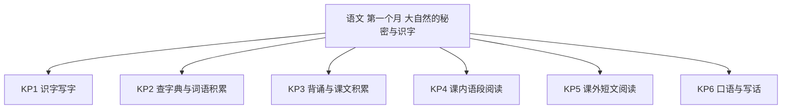
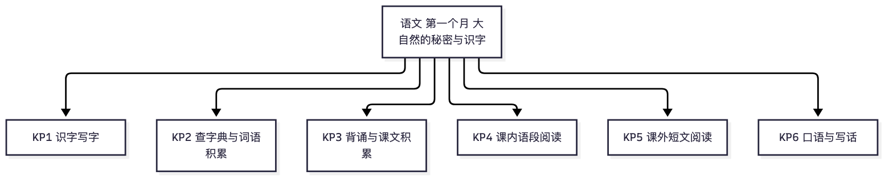

# 语文·二年级上学期第一个月自我检测（教师版）

> 适用：湖南省二年级上学期第 1 个月（2026 年 9 月）｜ 满分 100 分 ｜ 建议用时 40 分钟
> 教材对照：语文统编版（2024 年审定新修订版）第一单元（大自然的秘密 · 课文 1~3）与第二单元（识字 1~4）——2025 年秋起二年级启用新版，市面上旧版教辅的篇目、字表与新版不同（《植物妈妈有办法》新版不要求背诵、园地二日积月累已换成《数九歌》），以孩子手中课本为准。
> 教师版含答案解析、双向细目表（评价接口）与知识框架图；学生用 学生版，家庭用 家长版。
> （注：评价接口第 2 项"各学生学科短板评估"为后续版本预留——本卷 JSON 接口已备好读取入口；教学进度以 §一 4 周速览表承载。）

## 一、本月学什么（教学范围）

第一个月两条线：一条读"大自然的秘密"——小蝌蚪怎么长大、水会变什么戏法、植物靠什么旅行；一条认字——读《场景歌》《树之歌》《拍手歌》《田家四季歌》四篇识字课文，会写第一、二单元的字词，学着用**部首查字法**查不认识的字。背过《树之歌》《田家四季歌》，记下《梅花》《数九歌》。本学期第一、二单元没有写话任务，卷末写话锚定口语交际"有趣的动物"话题，从"说清楚"过渡到"写几句"。

| 周次 | 教学内容（主题级） | 家里能观察到的迹象 |
|---|---|---|
| 第 1 周 | 课文 1~2：《小蝌蚪找妈妈》《我是什么》；多音字随文认读 | 会讲小蝌蚪找妈妈的过程；对"水的变化"好奇 |
| 第 2 周 | 课文 3《植物妈妈有办法》；口语交际"有趣的动物"；语文园地一（含日积月累《梅花》） | 会介绍一种有趣的动物；能背《梅花》 |
| 第 3 周 | 识字单元起始：《场景歌》《树之歌》（要求背诵） | 量词搭配说得顺；《树之歌》背得熟 |
| 第 4 周 | 《拍手歌》《田家四季歌》（要求背诵）；语文园地二：部首查字法、日积月累《数九歌》；月末自检 | 会用部首查字法查生字；能背《田家四季歌》 |

**进度差异说明**：个别学校月末尚未学完第二单元识字——第 3、4、6、9 题可跳过，等级按已做题得分折算后对照。若两个单元都已学完，全部作答。

## 二、试卷

### 一、积累运用（本题 9 小题，共 30 分）

1. 看拼音写词语：hǎi yáng（　　　　）（2分）
2. 看拼音写词语：bàn fǎ（　　　　）（2分）
3. 看拼音写词语：péng you（　　　　）（2分）
4. 看拼音写词语：xīn kǔ（　　　　）（2分）
5. "孩子如果已经长大，就得告别妈妈，四海为家。"这里的"为"应读：A　wéi　B　wèi　C　wěi　D　huì（3分）
6. 选字填空：九月的（　　）花开了，满院子都是香味。A　挂　B　桂　C　娃　D　蛙（3分）
7. 用部首查字法查"诚"字，应先查的部首是：A　成　B　王　C　讠　D　木（3分）
8. 下面哪一组词都是描写天气的？A　海洋、河流、池塘　B　杨树、松柏、桦树　C　拍手、朋友、欢笑　D　晴朗、暴风、霜冻（3分）
9. 按课文内容或日积月累填空（每空2分，共10分）：
（1）遥知不是雪，为有（　　　　）。
（2）一九二九不出手，三九四九（　　　　）。
（3）枫树秋天叶儿红，（　　　）四季披绿装。
（4）一年（　　　）了，大家笑盈盈。
（5）一道小溪，一（　）石桥；一丛翠竹，一（　）飞鸟。

### 二、阅读鉴赏（本题 8 小题，共 40 分）

读课内语段，完成第 10~12 题。

> 石榴妈妈的胆子挺大，她不怕小鸟吃掉娃娃。孩子们在鸟肚子里睡上一觉，就会钻出来落户安家。

10. 这段话写的是哪位"植物妈妈"？她的娃娃最后在哪里"安家"？（4分）
11. 这段话里的"娃娃""孩子们"指的是什么？（4分）
12. 这段话把石榴的种子叫作"娃娃""孩子们"，这样写有趣在哪里？（4分）

读下面的短文，完成第 13~16 题。

> **小蚂蚁搬粮食**
>
> （1）秋天到了，天气慢慢凉了。小蚂蚁们忙着搬粮食，准备过冬。
>
> （2）一只小蚂蚁发现了一粒大豆子。它搬不动，就叫来好朋友一起抬。嘿哟，嘿哟，大豆子终于搬回了家。
>
> （3）蚂蚁们把粮食分开放：干的一堆，湿的一堆。妈妈说："干粮食才放得住。"
>
> （4）冬天来了，外面下着雪。小蚂蚁们在洞里吃着香香的粮食，一点儿也不怕冷。

13. 短文一共有几个自然段？第 2 自然段写了什么？（7分）
14. 蚂蚁们把粮食分成了几堆？为什么要分开堆放？（7分）
15. 用"——"在第 2 自然段里画出能看出蚂蚁们很团结的句子，再说说你觉得它们是一群怎样的蚂蚁。（7分）
16. 冬天到了，小蚂蚁们为什么一点儿也不怕冷？（7分）

### 三、写话（本题 1 小题，共 30 分）

17. 介绍一种你觉得有趣的动物：它长什么样？它会做什么有趣的事？写三到五句话，不会写的字用拼音。（30分）

## 三、参考答案与解析

### 答案速查

```
1. 海洋
2. 办法
3. 朋友
4. 辛苦
5. A
6. B
7. C
8. D
9. 暗香来；冰上走；松柏；农事；座、群
10. 见解析
11. 见解析
12. 见解析
13. 4 个自然段；见解析
14. 两堆；见解析
15. 见解析
16. 见解析
17. 见解析
```

### 逐题解析

1. 海洋——出自《我是什么》；判错点："洋"少写三点水。
2. 办法——出自《植物妈妈有办法》；判错点："办"写成"为"。
3. 朋友——出自《拍手歌》；判错点："友"写成"发"。
4. 辛苦——出自《田家四季歌》；判错点："辛"写成"幸"（辛苦与幸幸不分是本月高频错）。
5. A——"四海为家"是"到处可以当作家"的意思，"为"读 wéi（当作）；"为了"才读 wèi。多音字看意思定音。
6. B——桂花是树开的花，"桂"是木字旁；"挂"是提手旁，表示吊起来。判错点：两字读音相同，靠偏旁分清意思再选。
7. C——部首查字法先查部首："诚"是言字旁（讠），再数"成"以外的笔画。判错点：把右半边"成"当部首。
8. D——晴朗、暴风、霜冻都是天气词（语文园地一识字加油站刚学的这组）；A 是水的家园，B 是树，C 是动作与人。
9. 每空 2 分，写错字该空不得分。（1）暗香来（《梅花》）；（2）冰上走（《数九歌》）；（3）松柏（《树之歌》，必背）；（4）农事（《田家四季歌》，必背）；（5）座、群（《场景歌》量词）。判错点：量词"座"写成"坐"。
10. 石榴妈妈，得 2 分；娃娃（石榴的种子）被小鸟吃进肚子，随着小鸟飞到别的地方，钻出来在那里安家，得 2 分（意思对即可）。
11. 指石榴的种子（石榴籽），得 4 分；答"石榴的娃娃"不给分——要说清它其实是种子。
12. 采分点：说出"把种子当作人来写"得 2 分；说出好处"读起来生动、有趣，一下子就记住石榴是怎么安家的"任一得 2 分。判错点：只答"很可爱"不说清"当作人来写"。
13. 4 个自然段，得 2 分（引导看段首缩两格）；第 2 自然段写小蚂蚁一个人搬不动大豆子，叫来好朋友一起抬回家，得 5 分（说清"搬不动、找帮手、抬回家"任意两点即可）。
14. 两堆（干的一堆、湿的一堆），得 3 分；因为干粮食才放得住（湿的容易坏），得 4 分。
15. 画句 3 分："它搬不动，就叫来好朋友一起抬。"（画第 2 自然段中这句即可）；评价 4 分：团结、齐心、遇到困难会想办法等，说出一点即可。判错点：画成"嘿哟，嘿哟"——那是使劲的声音，不是团结的句子。
16. 因为它们提前准备好了粮食，冬天在洞里吃得饱饱的，得 7 分（说出"提前准备／有粮食吃"即可）；只答"洞里不冷"酌情给 3~4 分。
17. 写话评分（共 30 分）：
　　内容（16 分）：写出动物的名称 4 分；样子写清楚（颜色、大小、身体的特别之处等一两点）6 分；有趣的事写清楚（会做什么、怎么有趣）6 分。
　　条理与通顺（8 分）：句子完整通顺、有几句话就分几句写，8 分；有轻微语病扣 2~4 分。
　　书写与标点（6 分）：字迹端正、会用句号问号，不会写的字用了拼音 6 分。
　　示例：我最喜欢小鹦鹉。它穿着一身绿羽毛，肚皮是黄黄的。它会说"你好"，你一进门，它就大声叫"你好！你好！"，逗得大家哈哈笑。
　　判分底线：能写清"是什么＋哪里有趣"就及格；二年级写话先求"说清楚"，不求好词好句。

## 四、评价接口（双向细目表）

| 题号 | 分值 | 知识点 | 课标锚点（2022版·内容要求摘句） | 难度 | 大纲匹配 |
|---|---|---|---|---|---|
| 1 | 2 | KP1 识字写字 | 识字与写字：能借助汉语拼音认读汉字，按词语表听写 | 易 | 强 |
| 2 | 2 | KP1 识字写字 | 识字与写字：能按笔顺规则用硬笔写字，把字写端正 | 易 | 强 |
| 3 | 2 | KP1 识字写字 | 识字与写字：感受汉字的书写规律，注意间架结构 | 易 | 强 |
| 4 | 2 | KP1 识字写字 | 识字与写字：辨析音近字，把字写正确 | 易 | 强 |
| 5 | 3 | KP1 识字写字 | 识字与写字：能根据字义读准多音字 | 易 | 强 |
| 6 | 3 | KP1 识字写字 | 识字与写字：辨析同音形近字，靠偏旁部首分清字义 | 中 | 强 |
| 7 | 3 | KP2 查字典与词语积累 | 识字与写字：学习独立识字，会用部首查字法查字典 | 中 | 强 |
| 8 | 3 | KP2 查字典与词语积累 | 梳理与探究：按类别积累词语，感知词语的类别 | 易 | 强 |
| 9 | 10 | KP3 背诵与课文积累 | 梳理与探究：背诵优秀诗文，积累课文中的精彩句段 | 中 | 强 |
| 10 | 4 | KP4 课内语段阅读 | 阅读与鉴赏：提取文本明显信息，了解课文内容 | 易 | 强 |
| 11 | 4 | KP4 课内语段阅读 | 阅读与鉴赏：结合上下文了解词语指代的内容 | 易 | 强 |
| 12 | 4 | KP4 课内语段阅读 | 阅读与鉴赏：感受课文语言的生动、有趣 | 中 | 强 |
| 13 | 7 | KP5 课外短文阅读 | 阅读与鉴赏：认识自然段，提取文本明显信息 | 易 | 强 |
| 14 | 7 | KP5 课外短文阅读 | 阅读与鉴赏：提取信息并说出简单的原因 | 中 | 强 |
| 15 | 7 | KP5 课外短文阅读 | 阅读与鉴赏：找出关键语句，说出自己的简单看法 | 较难 | 中 |
| 16 | 7 | KP5 课外短文阅读 | 阅读与鉴赏：联系上下文推想简单的因果 | 易 | 强 |
| 17 | 30 | KP6 口语与写话 | 表达与交流：对写话有兴趣，写自己想说的话 | 较难 | 中 |

```json
{
  "subject": "语文",
  "duration_min": 40,
  "total_score": 100,
  "items": [
    {"no": 1, "score": 2, "kp": "KP1", "difficulty": "易", "match": "强"},
    {"no": 2, "score": 2, "kp": "KP1", "difficulty": "易", "match": "强"},
    {"no": 3, "score": 2, "kp": "KP1", "difficulty": "易", "match": "强"},
    {"no": 4, "score": 2, "kp": "KP1", "difficulty": "易", "match": "强"},
    {"no": 5, "score": 3, "kp": "KP1", "difficulty": "易", "match": "强"},
    {"no": 6, "score": 3, "kp": "KP1", "difficulty": "中", "match": "强"},
    {"no": 7, "score": 3, "kp": "KP2", "difficulty": "中", "match": "强"},
    {"no": 8, "score": 3, "kp": "KP2", "difficulty": "易", "match": "强"},
    {"no": 9, "score": 10, "kp": "KP3", "difficulty": "中", "match": "强"},
    {"no": 10, "score": 4, "kp": "KP4", "difficulty": "易", "match": "强"},
    {"no": 11, "score": 4, "kp": "KP4", "difficulty": "易", "match": "强"},
    {"no": 12, "score": 4, "kp": "KP4", "difficulty": "中", "match": "强"},
    {"no": 13, "score": 7, "kp": "KP5", "difficulty": "易", "match": "强"},
    {"no": 14, "score": 7, "kp": "KP5", "difficulty": "中", "match": "强"},
    {"no": 15, "score": 7, "kp": "KP5", "difficulty": "较难", "match": "中"},
    {"no": 16, "score": 7, "kp": "KP5", "difficulty": "易", "match": "强"},
    {"no": 17, "score": 30, "kp": "KP6", "difficulty": "较难", "match": "中"}
  ]
}
```

## 五、知识体系框架图




（查看器不渲染 mermaid 时看上方 PNG。）

---
*AI 辅助生成，内容仅供参考，请以教材与老师要求为准；使用前请教师/家长抽查核对。hunan-g2-learn / month1-selfcheck · 2026-09*
