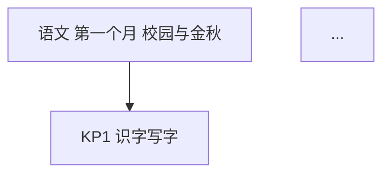

# month1-selfcheck 生成与校验规范（v1 · 三年级）

湖南省小学三年级上学期**第一个月（2026 年 9 月）**三科自我检测包：语文 / 数学 / 英语，每科三版（教师版 / 学生版 / 家长版），共 9 份 markdown。本文件是全部文件的结构契约，`check.py` 按此机检；后续补科、改版先改这里再动手。与 `hunan-g7-learn/month1-selfcheck/_规范.md` 同构（同一交付形态家族），差异仅在科目集、题量结构、页脚仓标识与脚本化产出方式。

## 0. 文件清单与命名

```
hunan-g3-learn/month1-selfcheck/
  {科目}-教师版.md   × 3     科目 ∈ {语文, 数学, 英语}
  {科目}-学生版.md   × 3     （由 build_versions.py 从教师版生成，禁手写）
  {科目}-家长版.md   × 3     （由 build_versions.py 从教师版生成，禁手写）
  figures/{科目}-框架图.png   （由 mermaid 块经 mmdc 离线出图，交付双保险）
  build_versions.py           （教师版 → 学生版/家长版 生成器）
  check.py                    （结构/一致性机检）
  build_html.py                （教师版 → 单文件自测 HTML 生成器，禁手写）
  test_html_core.js            （HTML 判分核 vm 同源测试，node 运行）
  2026-2027上学期第一个月{科目}自测.html ×3（HTML 直发入口，build_html.py 生成，禁手写）
  _规范.md                    （本文件）
```

通用硬规则（全文件生效）：
1. **无外链**：正文不得出现 `http://` 或 `https://`（离线可打印、直发不断链）。
2. **无必需图片**：题目不得依赖图片作答（看拼音写词的拼音用文字注音给出）；唯一例外是教师版框架图的 mermaid 块 + figures PNG。
3. **页脚 AI 标识**：每个文件最后一行为 `*AI 辅助生成，内容仅供参考，请以教材与老师要求为准；使用前请教师/家长抽查核对。hunan-g3-learn / month1-selfcheck · 2026-09*`（前有 `---` 分隔线）。
4. **语言**：题干面向三年级学生，句子短、指令单一；家长版全部用生活语言（如"周长就是沿着边走一圈的长度"），不堆术语。
5. **范围纪律**：只考第一个月范围；进度差异（学校快慢）不在题里体现，由"进度差异说明"列出可跳过题号，等级按已做题换算。
6. **满分 100**，各科建议用时见 §5 表；双减口径：家长版明确"一次一科、不连考"，三年级写话部分可与阅读分开完成（相隔半天内）。
7. **课标口径**：全部题目锚定《义务教育课程标准（2022年版）》第二学段（语文、数学）/ 一级（英语）；教材单元只作主题级对照，各版本教材通用。

## 1. 教师版结构（H2 标题逐字固定）

```markdown
# {科目}·三年级上学期第一个月自我检测（教师版）

> 适用：湖南省三年级上学期第 1 个月（2026 年 9 月）｜ 满分 100 分 ｜ 建议用时 XX 分钟
> 教材对照：{以主题级写明本月在学什么，不锁单元名}；以学校实际用书与进度为准。
> 教师版含答案解析、双向细目表（评价接口）与知识框架图；学生用 学生版，家庭用 家长版。
> （注：评价接口第 2 项"各学生学科短板评估"为后续版本预留——JSON 已备好读取入口。）

## 一、本月学什么（教学范围）
（3~5 行范围说明 + 4 周速览表 + 进度差异说明：若学校未讲到 XX，第 a、b 题可跳过）

## 二、试卷
### 一、{大题名}（本题 n 小题，共 X 分）
1. …（3分）
（小题编号全卷连续 1..N，每小题分值写进题尾"（n分）"）

## 三、参考答案与解析
### 答案速查
```
1. B
2. A
...
N. 见解析
```
（围栏内每行一题，格式严格 `题号. 答案`；客观题只写字母或 对/错；主观题写"见解析"或一行极简答案。学生版/家长版逐字复用本围栏。）

### 逐题解析
（计算题写完整步骤；选择/判断给判错点各一句；主观题给示例答案 + 采分点分步分）

## 四、评价接口（双向细目表）
| 题号 | 分值 | 知识点 | 课标锚点（2022版·内容要求摘句） | 难度 | 大纲匹配 |
|---|---|---|---|---|---|
| 1 | 2 | KP1 … | 识字与写字：… | 易 | 强 |

（随后附 JSON 接口，字段与表格逐行一致，供后续 H5/短板评估程序读取：）
```json
{
  "subject": "语文",
  "duration_min": 40,
  "total_score": 100,
  "items": [
    {"no": 1, "score": 2, "kp": "KP1", "difficulty": "易", "match": "强"}
  ]
}
```

## 五、知识体系框架图


（查看器不渲染 mermaid 时看上方 PNG。）

---
（页脚，同 §0.3）
```

### 评价接口字段
- **难度** ∈ {易, 中, 较难}；全卷分布约 易 40~60%、中 25~45%、较难 10~25%。
- **大纲匹配** ∈ {强, 中, 拓展}：强=本月课标内主干要求；中=课标内综合应用；拓展=跨点综合。
- **知识点** = `KPn 名称`，n 连续 1..k；**三版文件的 KP 集合必须完全一致**。
- JSON `items` 与表格逐行一致（no/score/kp/difficulty/match），`score` 合计 = 100。

## 2. 学生版结构（H2 标题逐字固定；正文由 build_versions.py 生成）

```markdown
# {科目}·三年级上学期第一个月自我检测（学生版）

> 使用说明（先读再动笔）：限时 XX 分钟，独立完成，不翻书不问人；做题时不要往下翻——答案在后面。做完先自己批改，再请家长抽 3 题复核。诚信计分：错了不丢人，漏出来的短板才是我们要找的宝贝。

## 一、试卷
（与教师版"二、试卷"**逐字一致**，含每题分值）

## 二、参考答案
```
（与教师版"答案速查"围栏**逐字一致**）
```

## 三、自评与计分
（怎么算分：客观题对一题得一题分；主观题对照采分点按步给分，宁可少给不高估。等级对照表：）
| 得分 | 等级 | 一句话解读 |
|---|---|---|
| 85~100 | 优 | 本月骨架扎实，保持节奏 |
| 70~84 | 良 | 大盘没问题，个别点要回炉 |
| 60~69 | 合格 | 有明确短板，按下面清单补 |
| 60 以下 | 待加强 | 第一个月很常见！先回课本，不着急刷题报班 |

## 四、短板总结（做完后填写）
### 第 1 步：按知识点登记
| 知识点 | 关联题号 | 我的得分 | 满分 | 结论（扎实 / 需巩固 / 要补） |
|---|---|---|---|---|
| KP1 … | 1, 5 | | | |
（每个 KP 一行，题号预填好，学生只填得分与结论）

### 第 2 步：我的短板清单
- 最先要补的知识点（≤2 个）：＿＿＿
- 具体行动：把课本再读一遍；重做本卷第＿题；把第＿题抄进错题本。
- 约定复测时间：＿＿＿（建议 7~10 天后只重做错题）

---
（页脚，同 §0.3）
```

## 3. 家长版结构（H2 标题逐字固定；正文由 build_versions.py 生成）

```markdown
# {科目}·三年级上学期第一个月自我检测（家长版）

> 这一页写给家长：不讲题，只讲四件事——孩子这个月学了什么、怎么组织这次自检、怎么批改、结果怎么看待。

## 一、进度速览（孩子这个月学了什么）
（4 周速览表 + 每个 KP 一句人话解释："××就是……家里可以……"；末尾附进度差异说明）

## 二、怎么组织这次自检（10 分钟准备）
（打印学生版；一次只测一科；计时；中途不打扰；做完让孩子先自己批改，家长抽 3 题复核——抽到不一致以家长为准，温和指出来。双减提醒：一次一科、不连考。）

## 三、答案速查（家长批改用）
```
（与教师版"答案速查"围栏逐字一致）
```

## 四、怎么解读结果（短板总结）
（等级表同学生版 + 三档话术：85+ 怎么夸、70~84 怎么说、<70 怎么陪；强调第一个月分数≠能力）
### 短板登记表（与孩子一起填）
| 知识点 | 扣分 | 严重度（要补 / 需巩固） | 建议动作（人话） |
|---|---|---|---|
| KP1 … | | | 读课本 + 重做第＿题 |

## 五、常见误区与家庭话术
（本学科家长最常踩的 3~4 个坑；每条配一句可照说的话）
（纸面测不到的能力——语文朗读、英语听力——写明替代小测法）

---
（页脚，同 §0.3）
```

## 4. mermaid 框架图风格（兼容老渲染器，逐条硬性）

1. 只用 `flowchart TD`；节点 ≤ 12 个；`ROOT` + `KP1..KPn` 两层（可加 1 个中间层）。
2. 所有节点标签整体双引号包裹：`KP1["KP1 识字写字"]`。
3. 标签内只允许：汉字、ASCII 字母数字、空格、连字符 `-`。**禁止**全角标点（：、，。（）等）与 `<br/>`、`|`、箭头字符。
4. 不写边标签；回边/自环不出现。
5. 节点 ID 全图唯一（单文件单图，天然满足）。
6. 出图：`bash ~/.zcode/skills/mermaid-md/scripts/gen_mermaid_png.sh <教师版.md> figures/{科目}-框架图.png`（需 /tmp/mmdc 与 macOS 版 /tmp/pptr.json，Chrome 路径 `/Applications/Google Chrome.app/Contents/MacOS/Google Chrome`）。

## 5. 各科题量结构（已定稿，不得改动）

| 科目 | 用时 | 题数 | 结构（题号 × 分值） |
|---|---|---|---|
| 语文 | 40 分钟 | 17 | 积累运用 30：1-4 看拼音写词 ×2 + 5-8 选择 ×3 + 9 按课文内容与古诗填空 10；阅读鉴赏 40：10-12 课内语段 ×4 + 13-16 课外短文 ×7；写话 30：17 微写作二选一 |
| 数学 | 35 分钟 | 27 | 填空 1-6 ×3；判断 7-10 ×2（对/错）；选择 11-14 ×3；口算 15-22 ×2；笔算（带验算）23-24 ×8；解决问题 25-27 ×10 |
| 英语 | 30 分钟 | 23 | 字母 1-6（1-2 写大小写 ×3、3-4 按顺序填空 ×3、5-6 选择 ×6）；词汇 7-12 ×3；情景选择 13-16 ×4；对话匹配 17-21 ×4；书写 22 抄写 ×8 + 23 补全自我介绍 ×14 |

客观题分布规则（check.py 机检）：**选择题**（语文 5-8、数学 11-14、英语 5-16）答案 A~D 每个至少出现 1 次且最多的字母 ≤ 50%；**判断题**（数学 7-10、英语 21-24 无——英语判断在 g4）对/错各 ≥ 30%（即 4 题中各 ≥ 2）。

## 6. 各科范围与知识点框架（2025 年 9 月进度，主题级；以孩子手中课本为准）

- **语文**（统编三上第一、二单元主题：校园生活 · 金秋时节）：KP1 识字写字（看拼音写词、形近字、多音字）；KP2 词语理解与积累（近义词、词语搭配、分类积累）；KP3 古诗默写与积累（《山行》等本单元古诗）；KP4 有新鲜感的词句与理解难懂的词语（本单元语文要素）；KP5 课内语段阅读；KP6 课外短文阅读；KP7 口语与写话（讲清一件事 · 猜猜他是谁 · 写日记）。第一、二单元无文言文，不考。
- **数学**（人教三上第 1~2 单元：时分秒 · 万以内的加法和减法（一））：KP1 时分秒的认识与换算；KP2 经过时间；KP3 两位数加减两位数口算；KP4 几百几十加减几百几十笔算与验算；KP5 估算（够不够 · 大约）；KP6 解决问题（比一个数多或少几 · 连续两问）。第 3 单元测量多数学校 10 月开课，本卷不含测量题，家长版附口头小测法。
- **英语**（湘少版 / 人教PEP 三上 Unit 1~2 通用主题：问候与自我介绍 · 字母 · 课堂用语）：KP1 字母认读与书写（大小写 · 顺序 · 四线三格 · 元音字母）；KP2 主题词汇（文具 · 动物 · 问候语词义）；KP3 问候与自我介绍（Hello / I'm … / What's your name?）；KP4 课堂指令（Stand up · Open your book）；KP5 情景交际应答（致谢 · 告别 · How are you · Nice to meet you）；KP6 书写规范（句首大写 · 抄写）。听力纸面测不到——家长版写明"家长读 5 个词或指令，孩子做动作或指认"的替代小测。

## 7. 生成方自检清单（交付前逐项过）

1. 题数、分值合计 = 100，与 §5 结构一致；
2. 每道客观题答案**亲自再解一遍**，唯一且正确；计算题解析含完整步骤；
3. 客观题字母分布、判断题对错分布合规（§5 规则）；
4. 难度分布合规（§1）；每题在细目表有行且与 JSON 接口逐行一致；
5. 学生版试卷 = 教师版试卷（逐字）；三版答案速查逐字一致；三版 KP 集合一致（build_versions.py 生成 + check.py 双保险）；
6. 无外链、无必需图片、页脚 AI 标识在场；
8. HTML 直发入口三件（§8）经 build_html.py 重建 + check.py 16-18 项 + test_html_core.js 全 PASS。

7. mermaid 块符合 §4 全部条目，且其后紧跟 PNG 引用行，PNG 文件在场且非空白（出图后人工核验四项：文字无截断、术语正确、结构完整、无重叠）。

## 8. HTML 直发入口（2026-09-26 增补，学习 usb-xhci-learn build-standalone 单文件形态）

每科一个**单文件自包含交互 HTML**：`2026-2027上学期第一个月{科目}自测.html`（学年标识写死在 build_html.py 的 ACAD 常量，新学期改它）。学生/家长拿到手直接点开就能做，不再向家庭提供 markdown（三版 md 仍是仓内生成源与教师用卷）。

硬规则：

1. **单源禁手写**：全部内容由 build_html.py 从 {科目}-教师版.md 生成（试卷题块/答案速查/逐题解析/双向细目表逐字取自教师版；家长角文案复用 build_versions.py 配置字典）。
2. **题型推断唯一判据 = 答案速查形态**：单字母且有选项（行内 A-D 或 B 栏）→ 选择按钮；对/错 → 判断按钮；题干含空位括号（（　）内仅空白）且无"见解析" → 填空输入（字母作答的字母题也走此路）；其余 → 纸上作答自评题。check.py 第 18 项按同规则复核。
3. **每空计分**：题干含"每空N分"的填空题按空给分（N×空数必须=题分）；其余多空填空全对才计满分，批改时可手动改分（宁可少给不高估）。
4. **移动端**：viewport 必备；输入框 font-size 16px（防 iOS 聚焦缩放）；触控目标 ≥2.3rem；进度存 localStorage（键 `m1self_g{n}_{科目}`），"清空重做"可复位。
5. **自包含**：无外链、无外部资源、无图片依赖；页脚 AI 标识与 md 同文（去星号）。
6. **跳题折算**："进度差异说明"的可跳题号由 build_html.py 解析（支持"第 4、6 题""第 18~20 题"），页内提供"跳过"开关，等级按已做题折算（85/70/60 分档不变）。
7. **机检**：check.py 第 16-18 项（入口齐备/自包含/内嵌 JSON 与教师版逐字对表/题型与数据自洽/跳题标记一致）；node test_html_core.js 为判分核已知答案测试（全对 100、答错 0、每空部分分、跳题折算、手动改分覆盖、答案归一化）。
8. **成绩单**：批改模式底部实时生成（总分/等级/各 KP 得分条/最需补 ≤2 KP+建议动作/复测提示），供截图回传——对齐 Phase 0"断点即转化"。
