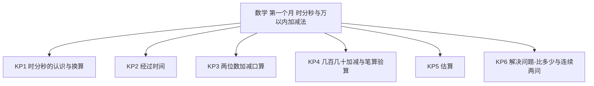
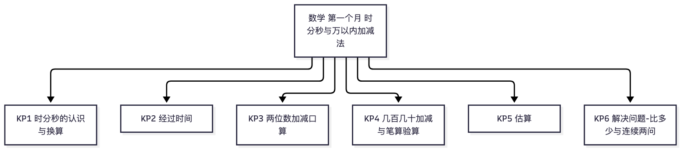

# 数学·三年级上学期第一个月自我检测（教师版）

> 适用：湖南省三年级上学期第 1 个月（2026 年 9 月）｜ 满分 100 分 ｜ 建议用时 35 分钟
> 教材对照：数学人教版第 1~2 单元主题（时、分、秒 · 万以内的加法和减法（一））——人教版为主流，2024 年起新版教材陆续替换；以学校实际用书与进度为准。
> 教师版含答案解析、双向细目表（评价接口）与知识框架图；学生用 学生版，家庭用 家长版。
> （注：评价接口第 2 项"各学生学科短板评估"为后续版本预留——本卷 JSON 接口已备好读取入口；教学进度以 §一 4 周速览表承载。）

## 一、本月学什么（教学范围）

第一个月两条主线：一是"时间感"——认识秒，会算经过时间；二是"计算基本功"——口算两位数加减两位数，笔算几百几十加减几百几十并养成验算习惯，会用估算判断"够不够"。图形与统计本月尚未开始，本卷不涉及。

| 周次 | 教学内容（主题级） | 家里能观察到的迹象 |
|---|---|---|
| 第 1 周 | 时、分、秒：秒的认识，1 分＝60 秒，选合适的时间单位 | 报时间准了；知道一分钟能做什么 |
| 第 2 周 | 经过时间；口算两位数加减两位数（进位、退位）起步 | 能算出从家到学校花了多久；口算变快 |
| 第 3 周 | 几百几十加减几百几十：笔算与验算 | 会列竖式，算完主动验算 |
| 第 4 周 | 估算与解决问题（够不够、比一个数多或少几）；月末自检 | 购物时会说"大约""够不够" |

**进度差异说明**：若班级尚未学到笔算（几百几十加减），第 23、24 题可跳过；尚未讲到估算的，第 26 题可跳过。等级按已做题得分折算后对照。

## 二、试卷

### 一、填空（本题 6 小题，共 18 分）

1. 钟面上有（　　）个大格，秒针走一圈是（　　）秒。（3分）
2. 1 时＝（　　）分；1 分＝（　　）秒。（3分）
3. 小明早上 7 时 30 分到校，8 时上第一节课，中间隔了（　　）分钟。（3分）
4. 口算 36＋28 时，先算 36＋20＝56，再算 56＋（　　）＝（　　）。（3分）
5. 比 250 多 70 的数是（　　）；250 比 70 多（　　）。（3分）
6. 钟面上，分针从 3 走到 6，经过了（　　）分钟。（3分）

### 二、判断（对的画"√"，错的画"×"）（本题 4 小题，共 8 分）

7. 秒针走一圈，分针正好走一小格。（　）（2分）
8. 6 时整，时针和分针重合在一起。（　）（2分）
9. 笔算加减法时，要从高位算起。（　）（2分）
10. 估算时，把 398 看作 400 很方便。（　）（2分）

### 三、选择（本题 4 小题，共 12 分）

11. 跑 50 米大约用多长时间？A　8 秒　B　8 分　C　8 时　D　8 天（3分）
12. 分针走一大格，秒针要走：A　1 圈　B　5 小格　C　60 圈　D　5 圈（3分）
13. 图书馆有 502 本故事书，借出 187 本，还剩多少本？正确的算式是：A　502＋187　B　502×187　C　502－187　D　187＋502（3分）
14. 一部动画片从 8:10 播到 8:55，片长是：A　15 分钟　B　45 分钟　C　65 分钟　D　1 时 55 分（3分）

### 四、口算（本题 8 小题，共 16 分）

15. 26＋30＝（　）（2分）
16. 45＋38＝（　）（2分）
17. 74－16＝（　）（2分）
18. 520＋340＝（　）（2分）
19. 640－280＝（　）（2分）
20. 42－25＝（　）（2分）
21. 370＋480＝（　）（2分）
22. 620－450＝（　）（2分）

### 五、笔算（带验算）（本题 2 小题，共 16 分）

23. 503－286＝（　）（8分）
24. 345＋268＝（　）（8分）

### 六、解决问题（本题 3 小题，共 30 分）

25. 小红 7:45 从家出发，8:05 到学校。她在路上用了多长时间？（先画一画或算一算）（10分）
26. 妈妈带了 200 元，买一个电饭锅要 157 元，再买一个水壶要 48 元。钱够吗？（先估一估，再说理由）（10分）
27. 果园里种了 420 棵梨树，苹果树比梨树多 150 棵，桃树比苹果树少 90 棵。苹果树有多少棵？桃树有多少棵？（10分）

## 三、参考答案与解析

### 答案速查

```
1. 12；60
2. 60；60
3. 30
4. 8；64
5. 320；180
6. 15
7. 对
8. 错
9. 错
10. 对
11. A
12. D
13. C
14. B
15. 56
16. 83
17. 58
18. 860
19. 360
20. 17
21. 850
22. 170
23. 217（验算 217＋286＝503）
24. 613（验算 613－268＝345）
25. 20 分钟
26. 不够
27. 苹果树 570 棵；桃树 480 棵
```

### 逐题解析

1. 钟面 12 个大格、60 个小格；秒针走一圈 60 秒。判错点：大格与小格混淆（12 个大格、60 个小格）。
2. 1 时＝60 分，1 分＝60 秒——时间单位之间的进率是 60，不是 10 或 100。
3. 7:30 到 8:00 走了 30 分钟。判错点：误算成 70（用 80－30 时把 8 时当 80）。
4. 先算 36＋20＝56，再算 56＋8＝64——把两位数拆成"整十数＋几"，新知识变旧知识。
5. 比 250 多 70 用加法：250＋70＝320；250 比 70 多多少，求相差数用减法：250－70＝180。判错点：两问都是"比"，但一问求大数、一问求相差数，方法不同。
6. 分针每走一大格是 5 分钟，从 3 到 6 走了 3 大格：3×5＝15 分钟。
7. 对——秒针走一圈是 60 秒，正好是 1 分钟，分针走一小格。
8. 错——6 时整，时针指着 6、分针指着 12，两针成一条直线；12 时整两针才重合。
9. 错——笔算加减法要**相同数位对齐，从个位算起**。
10. 对——398 接近 400，看作 400 好算，估的结果说明"大约是多少"。
11. A——跑 50 米不到一分钟，用"秒"最合适：8 秒合理；8 分、8 时太长。
12. D——分针走一大格是 5 分钟，秒针 1 分钟走一圈，所以要走 5 圈。
13. C——从总数里去掉借出的，用减法 502－187。判错点：见"借出"就加。
14. B——8:55－8:10＝45 分钟。判错点：误用 85－10。
15. 56。两位数加整十数，先加十位。
16. 83。45＋38：个位 5＋8＝13 满十进一，十位 4＋3＋1＝8。判错点：忘进位得 73。
17. 58。74－16：个位 4 减 6 不够，向十位借一当十，14－6＝8，十位 6－1＝5。判错点：忘退位得 68。
18. 860。52 个十加 34 个十是 86 个十。
19. 360。640－280：十位 4－8 不够退位，64 个十减 28 个十是 36 个十。
20. 17。42－25：个位 2－5 不够，借一当十 12－5＝7，十位 3－2＝1。
21. 850。37 个十加 48 个十是 85 个十。
22. 170。62 个十减 45 个十是 17 个十。
23. 217。完整步骤：个位 3 减 6 不够，向十位借一；十位是 0，再向百位借一当十，个位 13－6＝7，十位 10－1－8＝1，百位 4－2＝2。验算：217＋286＝503 ✓。判错点：中间 0 的连续退位——十位漏借一得 227。
24. 613。个位 5＋8＝13 写 3 进一，十位 4＋6＋1＝11 写 1 进一，百位 3＋2＋1＝6。验算：613－268＝345 ✓。判错点：漏进位得 503。
25. 采分点：画图或列式 4 分（8:05－7:45，或数格子：7:45→8:00 走 15 分，再走 5 分）；结果 20 分钟 4 分；单位写"分钟"2 分。判错点：误算 60 分（用 805－745）。
26. 采分点：估一估 4 分（把 157 看作 160、48 看作 50，160＋50＝210；或 157＋48 精确算得 205）；判断与理由 4 分（210 或 205 都超过 200，所以不够）；表达完整 2 分。判错点：只算精确值不算估——本题要求先估。
27. 采分点：第一问 5 分（420＋150＝570，苹果树 570 棵）；第二问 5 分（570－90＝480，桃树 480 棵）。判错点：第二问误用 420－90——"桃树比苹果树少 90"要比的对象是苹果树 570，不是梨树。

## 四、评价接口（双向细目表）

| 题号 | 分值 | 知识点 | 课标锚点（2022版·内容要求摘句） | 难度 | 大纲匹配 |
|---|---|---|---|---|---|
| 1 | 3 | KP1 时分秒的认识与换算 | 数与运算：认识时、分、秒，知道钟面结构 | 易 | 强 |
| 2 | 3 | KP1 时分秒的认识与换算 | 数与运算：知道时、分、秒之间的关系 | 易 | 强 |
| 3 | 3 | KP2 经过时间 | 数量关系：能解决简单的经过时间问题 | 易 | 强 |
| 4 | 3 | KP3 两位数加减口算 | 数与运算：探索加法算理，把新计算转化为已学计算 | 较难 | 强 |
| 5 | 3 | KP6 解决问题·比多少与连续两问 | 数量关系：求比一个数多（少）几的数 | 中 | 强 |
| 6 | 3 | KP2 经过时间 | 数与运算：结合钟面认识时间单位的关系 | 易 | 强 |
| 7 | 2 | KP1 时分秒的认识与换算 | 数与运算：知道时、分、秒之间的关系 | 易 | 强 |
| 8 | 2 | KP1 时分秒的认识与换算 | 数与运算：结合钟面认识整时与针的位置关系 | 中 | 强 |
| 9 | 2 | KP4 几百几十加减与笔算验算 | 数与运算：掌握笔算加减法的计算方法 | 易 | 强 |
| 10 | 2 | KP5 估算 | 数感：能结合具体情境选择合适的估算策略 | 易 | 强 |
| 11 | 3 | KP1 时分秒的认识与换算 | 量感：结合生活情境选择合适的时间单位 | 易 | 强 |
| 12 | 3 | KP2 经过时间 | 数与运算：理解分与秒的关系（钟面转动） | 较难 | 中 |
| 13 | 3 | KP6 解决问题·比多少与连续两问 | 数量关系：能从题意中选择合适的运算 | 易 | 强 |
| 14 | 3 | KP2 经过时间 | 数量关系：能解决简单的经过时间问题 | 易 | 强 |
| 15 | 2 | KP3 两位数加减口算 | 数与运算：能口算两位数加减整十数 | 易 | 强 |
| 16 | 2 | KP3 两位数加减口算 | 数与运算：能口算两位数加两位数（进位） | 中 | 强 |
| 17 | 2 | KP3 两位数加减口算 | 数与运算：能口算两位数减两位数（退位） | 中 | 强 |
| 18 | 2 | KP4 几百几十加减与笔算验算 | 数与运算：能口算几百几十加减几百几十（不进退位） | 易 | 强 |
| 19 | 2 | KP4 几百几十加减与笔算验算 | 数与运算：能口算几百几十减几百几十（退位） | 中 | 强 |
| 20 | 2 | KP3 两位数加减口算 | 数与运算：能口算两位数减两位数（退位） | 易 | 强 |
| 21 | 2 | KP4 几百几十加减与笔算验算 | 数与运算：能口算几百几十加几百几十（进位） | 中 | 强 |
| 22 | 2 | KP4 几百几十加减与笔算验算 | 数与运算：能口算几百几十减几百几十（退位） | 中 | 强 |
| 23 | 8 | KP4 几百几十加减与笔算验算 | 数与运算：能笔算几百几十减几百几十并能验算 | 中 | 强 |
| 24 | 8 | KP4 几百几十加减与笔算验算 | 数与运算：能笔算几百几十加几百几十并能验算 | 中 | 强 |
| 25 | 10 | KP2 经过时间 | 数量关系：能解决简单的经过时间问题 | 易 | 强 |
| 26 | 10 | KP5 估算 | 数感：在真实情境中估算并作出判断 | 中 | 中 |
| 27 | 10 | KP6 解决问题·比多少与连续两问 | 数量关系：解决需两步的实际问题 | 较难 | 拓展 |

```json
{
  "subject": "数学",
  "duration_min": 35,
  "total_score": 100,
  "items": [
    {"no": 1, "score": 3, "kp": "KP1", "difficulty": "易", "match": "强"},
    {"no": 2, "score": 3, "kp": "KP1", "difficulty": "易", "match": "强"},
    {"no": 3, "score": 3, "kp": "KP2", "difficulty": "易", "match": "强"},
    {"no": 4, "score": 3, "kp": "KP3", "difficulty": "较难", "match": "强"},
    {"no": 5, "score": 3, "kp": "KP6", "difficulty": "中", "match": "强"},
    {"no": 6, "score": 3, "kp": "KP2", "difficulty": "易", "match": "强"},
    {"no": 7, "score": 2, "kp": "KP1", "difficulty": "易", "match": "强"},
    {"no": 8, "score": 2, "kp": "KP1", "difficulty": "中", "match": "强"},
    {"no": 9, "score": 2, "kp": "KP4", "difficulty": "易", "match": "强"},
    {"no": 10, "score": 2, "kp": "KP5", "difficulty": "易", "match": "强"},
    {"no": 11, "score": 3, "kp": "KP1", "difficulty": "易", "match": "强"},
    {"no": 12, "score": 3, "kp": "KP2", "difficulty": "较难", "match": "中"},
    {"no": 13, "score": 3, "kp": "KP6", "difficulty": "易", "match": "强"},
    {"no": 14, "score": 3, "kp": "KP2", "difficulty": "易", "match": "强"},
    {"no": 15, "score": 2, "kp": "KP3", "difficulty": "易", "match": "强"},
    {"no": 16, "score": 2, "kp": "KP3", "difficulty": "中", "match": "强"},
    {"no": 17, "score": 2, "kp": "KP3", "difficulty": "中", "match": "强"},
    {"no": 18, "score": 2, "kp": "KP4", "difficulty": "易", "match": "强"},
    {"no": 19, "score": 2, "kp": "KP4", "difficulty": "中", "match": "强"},
    {"no": 20, "score": 2, "kp": "KP3", "difficulty": "易", "match": "强"},
    {"no": 21, "score": 2, "kp": "KP4", "difficulty": "中", "match": "强"},
    {"no": 22, "score": 2, "kp": "KP4", "difficulty": "中", "match": "强"},
    {"no": 23, "score": 8, "kp": "KP4", "difficulty": "中", "match": "强"},
    {"no": 24, "score": 8, "kp": "KP4", "difficulty": "中", "match": "强"},
    {"no": 25, "score": 10, "kp": "KP2", "difficulty": "易", "match": "强"},
    {"no": 26, "score": 10, "kp": "KP5", "difficulty": "中", "match": "中"},
    {"no": 27, "score": 10, "kp": "KP6", "difficulty": "较难", "match": "拓展"}
  ]
}
```

## 五、知识体系框架图




（查看器不渲染 mermaid 时看上方 PNG。）

---
*AI 辅助生成，内容仅供参考，请以教材与老师要求为准；使用前请教师/家长抽查核对。hunan-g3-learn / month1-selfcheck · 2026-09*
