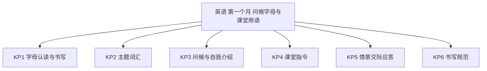
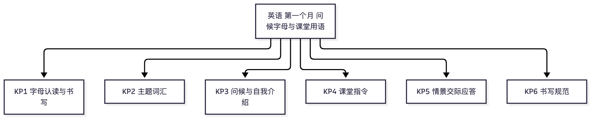

# 英语·三年级上学期第一个月自我检测（教师版）

> 适用：湖南省三年级上学期第 1 个月（2026 年 9 月）｜ 满分 100 分 ｜ 建议用时 30 分钟
> 教材对照：湘少版 / 人教PEP 三年级起点上册 Unit 1~2 通用主题（问候与自我介绍 · 字母 · 课堂用语）——两版本月主题一致；湖南用湘少版的学校居多，以学校实际用书为准。
> 教师版含答案解析、双向细目表（评价接口）与知识框架图；学生用 学生版，家庭用 家长版。
> （注：评价接口第 2 项"各学生学科短板评估"为后续版本预留——本卷 JSON 接口已备好读取入口；教学进度以 §一 4 周速览表承载。听力纸面测不到，家长版附替代小测法。）

## 一、本月学什么（教学范围）

三年级是英语起始学年。第一个月的四件事：会打招呼和告别，会自我介绍并问答名字；认读、书写字母（四线三格占格规矩）；听得懂简单课堂指令；会抄写句子（句首大写）。词汇以文具、动物等主题词起步。不考语法术语、不考写话。

| 周次 | 教学内容（主题级） | 家里能观察到的迹象 |
|---|---|---|
| 第 1 周 | 问候与告别：Hello / Hi / Goodbye；自我介绍 I'm … | 见人会主动打招呼 |
| 第 2 周 | 字母 Aa~Hh：认读与四线三格书写 | 会认会写前几个字母 |
| 第 3 周 | 字母 Ii~Nn；问答名字 What's your name? | 字母认到 N；会问会答名字 |
| 第 4 周 | 课堂指令（Stand up · Open your book）；情景应答；月末自检 | 听懂指令做动作 |

**进度差异说明**：字母教学进度各校不同——若班级尚未学到字母 F，第 4 题可跳过，等级按已做题得分折算后对照。

## 二、试卷

### 一、字母（本题 6 小题，共 24 分）

1. 写出大写字母 B 的小写形式：（　　）（3分）
2. 写出小写字母 e 的大写形式：（　　）（3分）
3. 按字母表顺序填空：a　b　c　（　）　e（3分）
4. 按字母表顺序填空：F　G　（　）　I（3分）
5. 下面哪个是元音字母？A　b　B　e　C　m　D　t（6分）
6. 小写字母 a 在四线三格里占：A　上面两格　B　中间一格　C　下面两格　D　三格全占（6分）

### 二、词汇（本题 6 小题，共 18 分）

7. 选出不同类的一项：A　pen　B　pencil　C　ruler　D　apple（3分）
8. 选出不同类的一项：A　book　B　morning　C　afternoon　D　evening（3分）
9. 老师说 "Stand up, please." 你应该：A　起立　B　坐下　C　开门　D　合上书（3分）
10. "ruler" 的意思是：A　钢笔　B　尺子　C　橡皮　D　书包（3分）
11. "eraser" 的意思是：A　铅笔　B　钢笔　C　橡皮　D　尺子（3分）
12. 老师说 "Open your book." 你应该：A　打开书　B　合上书　C　举手　D　起立（3分）

### 三、情景选择（本题 4 小题，共 16 分）

13. 早上见到老师，应该说：A　Good morning, Miss Li!　B　Good night!　C　Goodbye!　D　Thank you!（4分）
14. 别人问你 "What's your name?"，应回答：A　I'm fine, thanks.　B　My name is Peter.　C　I'm ten.　D　Goodbye!（4分）
15. 放学和同学告别，说：A　Good morning!　B　Hello!　C　Goodbye! See you!　D　Thank you!（4分）
16. 同桌帮你捡起了橡皮，你说：A　You're welcome.　B　I'm fine.　C　Hello!　D　Thank you!（4分）

### 四、对话匹配（从 B 栏中选出 A 栏各句的应答，把字母写在括号里）（本题 5 小题，共 20 分）

17. Hello! I'm Sarah.（　）（4分）
18. How are you?（　）（4分）
19. Goodbye!（　）（4分）
20. Nice to meet you.（　）（4分）
21. What's your name?（　）（4分）

　　B 栏：A．I'm fine, thank you.　　B．Nice to meet you, too.　　C．Hi! I'm Mike.
　　　　　D．You're welcome.　　E．My name is Amy.　　F．Bye-bye!

### 五、书写（本题 2 小题，共 22 分）

22. 把下面的句子抄写正确（注意句首字母大写）：i am nine years old.（8分）
23. 照样子，补全自我介绍并抄写工整：Hello! I'm Peter.（把 Peter 换成你自己的名字）（14分）

## 三、参考答案与解析

### 答案速查

```
1. b
2. E
3. d
4. H
5. B
6. B
7. D
8. A
9. A
10. B
11. C
12. A
13. A
14. B
15. C
16. D
17. C
18. A
19. F
20. B
21. E
22. I am nine years old.（句首 I 大写）
23. 见解析
```

### 逐题解析

1. b——大写 B 的小写是 b；判错点：与 d 认反（b 的"肚子"朝右）。
2. E——小写 e 的大写是 E；判错点：与 F 混。
3. d——a b c d e 顺次；判错点：跳跃填错。
4. H——F G H I 顺次；判错点：与 J 混。
5. B——元音字母五个：a、e、i、o、u；b、m、t 都是辅音字母。
6. B——a、c、e、m、n 这类小写字母安稳住中间一格；b、d、f、h 有"小辫子"占上面两格。
7. D——pen、pencil、ruler 都是文具，apple 是水果。
8. A——morning、afternoon、evening 都是时间问候词，book 是学习用品。
9. A——Stand up 就是"起立"；坐下是 Sit down。
10. B——ruler 是尺子；判错点：与 rubber（橡皮）混。
11. C——eraser 是橡皮。
12. A——Open 是打开，Open your book＝打开书；合上书是 Close your book。
13. A——早上问好用 Good morning；Good night 是睡前道别，Goodbye 是告别，Thank you 是道谢。
14. B——问名字答名字：My name is … 或 I'm …；I'm fine, thanks. 是回答 How are you 的。
15. C——告别用 Goodbye / See you；Hello、Good morning 是见面用语。
16. D——得到帮助说 Thank you!；对方回应 You're welcome.（不客气）——选项 A 是"回应感谢"，不是"感谢"。
17. C——别人说 Hello! I'm Sarah.（我是萨拉），回敬同样自我介绍：Hi! I'm Mike.
18. A——How are you? 问"你好吗"，答 I'm fine, thank you.（我很好，谢谢）。
19. F——Goodbye!（再见）应答 Bye-bye!
20. B——Nice to meet you.（见到你很高兴）应答 Nice to meet you, too.（我也是）——too 不能丢。
21. E——问 What's your name? 答 My name is Amy.（我叫艾米）。
22. 正确抄写：I am nine years old.——句首字母必须大写。采分点：句首 I 大写 4 分；抄写正确、占格工整 4 分。
23. 示例：Hello! I'm Li Ming.——把名字换成自己的。采分点：补全名字（首字母大写）4 分；I'm 大小写正确、撇号不丢 6 分；抄写工整、标点齐全 4 分。判错点：整句小写（hello! i'm …）——句首大写是本月硬规矩。

## 四、评价接口（双向细目表）

| 题号 | 分值 | 知识点 | 课标锚点（2022版·内容要求摘句） | 难度 | 大纲匹配 |
|---|---|---|---|---|---|
| 1 | 3 | KP1 字母认读与书写 | 写：正确书写 26 个字母的大小写 | 易 | 强 |
| 2 | 3 | KP1 字母认读与书写 | 写：正确书写 26 个字母的大小写 | 易 | 强 |
| 3 | 3 | KP1 字母认读与书写 | 语音知识：按顺序认读 26 个字母 | 易 | 强 |
| 4 | 3 | KP1 字母认读与书写 | 语音知识：按顺序认读 26 个字母 | 中 | 强 |
| 5 | 6 | KP1 字母认读与书写 | 语音知识：感知元音字母，正确认读 | 较难 | 强 |
| 6 | 6 | KP1 字母认读与书写 | 写：正确书写字母，知道四线三格占格 | 较难 | 强 |
| 7 | 3 | KP2 主题词汇 | 词汇知识：认读所学单词，按类别归组 | 易 | 强 |
| 8 | 3 | KP2 主题词汇 | 词汇知识：认读所学单词，按类别归组 | 中 | 强 |
| 9 | 3 | KP4 课堂指令 | 语言技能（听）：听懂简单的课堂指令 | 易 | 强 |
| 10 | 3 | KP2 主题词汇 | 词汇知识：知道常见学习用品的词义 | 易 | 强 |
| 11 | 3 | KP2 主题词汇 | 词汇知识：知道常见学习用品的词义 | 易 | 强 |
| 12 | 3 | KP4 课堂指令 | 语言技能（听）：听懂简单的课堂指令 | 中 | 强 |
| 13 | 4 | KP3 问候与自我介绍 | 语用知识：使用问候语问候他人 | 易 | 强 |
| 14 | 4 | KP3 问候与自我介绍 | 语用知识：问答姓名，作出恰当回应 | 中 | 强 |
| 15 | 4 | KP5 情景交际应答 | 语用知识：使用告别语与他人道别 | 易 | 强 |
| 16 | 4 | KP5 情景交际应答 | 语用知识：致谢与回应感谢 | 中 | 强 |
| 17 | 4 | KP3 问候与自我介绍 | 语用知识：问候并作自我介绍 | 易 | 强 |
| 18 | 4 | KP5 情景交际应答 | 语用知识：问候应答 How are you 配套 | 易 | 强 |
| 19 | 4 | KP5 情景交际应答 | 语用知识：告别与应答配套 | 易 | 强 |
| 20 | 4 | KP5 情景交际应答 | 语用知识：初次见面的应答配套（too 不能丢） | 中 | 中 |
| 21 | 4 | KP3 问候与自我介绍 | 语用知识：问答姓名，作出恰当回应 | 中 | 强 |
| 22 | 8 | KP6 书写规范 | 写：正确书写字母与句子，句首大写 | 易 | 强 |
| 23 | 14 | KP6 书写规范 | 写：模仿示例书写简单句子并作自我介绍 | 较难 | 拓展 |

```json
{
  "subject": "英语",
  "duration_min": 30,
  "total_score": 100,
  "items": [
    {"no": 1, "score": 3, "kp": "KP1", "difficulty": "易", "match": "强"},
    {"no": 2, "score": 3, "kp": "KP1", "difficulty": "易", "match": "强"},
    {"no": 3, "score": 3, "kp": "KP1", "difficulty": "易", "match": "强"},
    {"no": 4, "score": 3, "kp": "KP1", "difficulty": "中", "match": "强"},
    {"no": 5, "score": 6, "kp": "KP1", "difficulty": "较难", "match": "强"},
    {"no": 6, "score": 6, "kp": "KP1", "difficulty": "较难", "match": "强"},
    {"no": 7, "score": 3, "kp": "KP2", "difficulty": "易", "match": "强"},
    {"no": 8, "score": 3, "kp": "KP2", "difficulty": "中", "match": "强"},
    {"no": 9, "score": 3, "kp": "KP4", "difficulty": "易", "match": "强"},
    {"no": 10, "score": 3, "kp": "KP2", "difficulty": "易", "match": "强"},
    {"no": 11, "score": 3, "kp": "KP2", "difficulty": "易", "match": "强"},
    {"no": 12, "score": 3, "kp": "KP4", "difficulty": "中", "match": "强"},
    {"no": 13, "score": 4, "kp": "KP3", "difficulty": "易", "match": "强"},
    {"no": 14, "score": 4, "kp": "KP3", "difficulty": "中", "match": "强"},
    {"no": 15, "score": 4, "kp": "KP5", "difficulty": "易", "match": "强"},
    {"no": 16, "score": 4, "kp": "KP5", "difficulty": "中", "match": "强"},
    {"no": 17, "score": 4, "kp": "KP3", "difficulty": "易", "match": "强"},
    {"no": 18, "score": 4, "kp": "KP5", "difficulty": "易", "match": "强"},
    {"no": 19, "score": 4, "kp": "KP5", "difficulty": "易", "match": "强"},
    {"no": 20, "score": 4, "kp": "KP5", "difficulty": "中", "match": "中"},
    {"no": 21, "score": 4, "kp": "KP3", "difficulty": "中", "match": "强"},
    {"no": 22, "score": 8, "kp": "KP6", "difficulty": "易", "match": "强"},
    {"no": 23, "score": 14, "kp": "KP6", "difficulty": "较难", "match": "拓展"}
  ]
}
```

## 五、知识体系框架图




（查看器不渲染 mermaid 时看上方 PNG。）

---
*AI 辅助生成，内容仅供参考，请以教材与老师要求为准；使用前请教师/家长抽查核对。hunan-g3-learn / month1-selfcheck · 2026-09*
