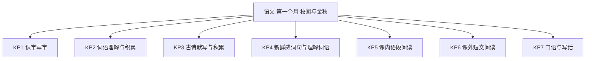
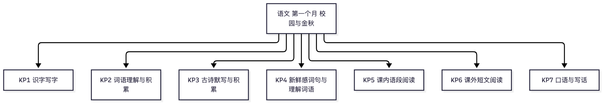

# 语文·三年级上学期第一个月自我检测（教师版）

> 适用：湖南省三年级上学期第 1 个月（2026 年 9 月）｜ 满分 100 分 ｜ 建议用时 40 分钟
> 教材对照：语文统编版第一、二单元主题（校园生活 · 金秋时节）——统编版全国统一，2025 年秋新版教材单元主题延续；单元名与页码以孩子手中课本目录为准。
> 教师版含答案解析、双向细目表（评价接口）与知识框架图；学生用 学生版，家庭用 家长版。
> （注：评价接口第 2 项"各学生学科短板评估"为后续版本预留——本卷 JSON 接口已备好读取入口；教学进度以 §一 4 周速览表承载。）

## 一、本月学什么（教学范围）

第一个月阅读起步是关键：从"朗读"走向"默读"，学会圈画"有新鲜感的词句"，用多种方法理解难懂的词语；识字上巩固"音序、部首两把钥匙"，会写第一、二单元的生字词；表达上从"说清一件事"起步，学写日记。背熟古诗《山行》等本单元古诗。

| 周次 | 教学内容（主题级） | 家里能观察到的迹象 |
|---|---|---|
| 第 1 周 | 校园生活单元起始：朗读成习惯，关注"有新鲜感的词句"；口语交际：我的暑假生活 | 会主动画出新词好句；能把暑假一件事讲完整 |
| 第 2 周 | 校园生活单元收束：习作"猜猜他是谁"（抓特点写人）；查字典两把钥匙巩固 | 写人能抓一两个特点；碰到生字会自己查字典 |
| 第 3 周 | 金秋时节单元：古诗《山行》等三首；用多种方法理解难懂的词语 | 古诗背得顺；懂得先猜再查地解词 |
| 第 4 周 | 金秋时节收束：习作"写日记"（格式起步）；词语分类积累；月末自检 | 日记有日期星期天气；能把词语按类归堆 |

**进度差异说明**：个别学校月末尚未进入"金秋时节"单元——第 9 题（古诗与课文填空）可跳过，等级按已做题得分折算后对照。若已学完两个单元，全部作答。

## 二、试卷

### 一、积累运用（本题 9 小题，共 30 分）

1. 看拼音写词语：zǎo chén（　　　　）（2分）
2. 看拼音写词语：fú zhuāng（　　　　）（2分）
3. 看拼音写词语：tiào wǔ（　　　　）（2分）
4. 看拼音写词语：guī zé（　　　　）（2分）
5. "放假了，真开心！"这里的"假"应读：A　jià　B　jiǎ　C　jiā　D　fá（3分）
6. 选字填空：清晨，同学们穿着鲜艳的（　　）来到学校。A　妆　B　装　C　壮　D　状（3分）
7. 读到"金黄金黄的叶子铺满水泥道"，你不懂"明朗"的意思。下面哪种做法**不对**？A　联系上下文猜一猜　B　查一查字典　C　结合生活经验想一想　D　问同学要答案抄下来，不再想（3分）
8. 下面哪一句是"有新鲜感"的句子（把事物当作人来写，读起来特别生动）？A　今天是星期一。　B　我吃了早饭去上学。　C　湿润的东风走过荒野，在竹林中吹着口哨。　D　他有一支铅笔。（3分）
9. 按课文内容或古诗填空（每空2分，共10分）：
（1）远上寒山石径斜，白云（　　）有人家。
（2）停车（　）爱枫林晚，（　　）红于二月花。
（3）萧萧梧叶送寒声，江上秋风（　　）（填后三字）。
（4）同学们向在校园里欢唱的小鸟打招呼，向敬爱的老师问好，向高高飘扬的国旗（　　）。

### 二、阅读鉴赏（本题 8 小题，共 40 分）

读课内语段，完成第 10~12 题。

> 秋天的雨，是一把钥匙。它带着清凉和温柔，轻轻地，轻轻地，趁你没留意，把秋天的大门打开了。

10. 这段话把秋天的雨当作什么来写？这样写有什么好处？（4分）
11. "趁你没留意"是什么意思？从语段里的哪些词能看出秋天来得悄悄？（4分）
12. 用"——"在语段中画出你觉得有新鲜感的地方，再写一句话说说它新鲜在哪里。（4分）

读下面的短文，完成第 13~16 题。

> **校园里的梧桐树**
>
> （1）我们学校门口有一棵高大的梧桐树，它像一位忠诚的卫士，天天守着校园。
>
> （2）春天，梧桐树抽出新的枝条，长出嫩绿的叶子。夏天，叶子长得密密层层，像撑开了一把绿色的大伞。同学们最喜欢在大树下跳绳、踢毽子。
>
> （3）秋天来了，梧桐树的叶子慢慢变黄。一阵秋风吹过，叶子像一只只金黄的蝴蝶飘落下来，给大地铺上了一层厚厚的地毯。
>
> （4）我爱校园里的梧桐树！

13. 短文一共有几个自然段？第 3 自然段写的是哪个季节的梧桐树？从哪些词看出来的？（7分）
14. 用"——"画出短文中把叶子当作小动物来写的句子，再照样子写一句话，把一样东西当作动物来写。（7分）
15. 第 2 自然段中"密密层层"是什么意思？你是用什么方法理解这个词的？（7分）
16. 短文为什么说梧桐树"像一位忠诚的卫士"？从这里能看出"我"对梧桐树怎样的感情？（7分）

### 三、写话（本题 1 小题，共 30 分）

17. 二选一，写一段话（不会写的字用拼音）。（30分）
　　A．写一则日记：第一行写清日期、星期、天气，再写今天发生的一件小事（三到五句话）。
　　B．介绍你的同桌或好朋友：写出他（她）的一两个特点，让大家读了能猜出是谁。

## 三、参考答案与解析

### 答案速查

```
1. 早晨
2. 服装
3. 跳舞
4. 规则
5. A
6. B
7. D
8. C
9. 生处；坐；霜叶；动客情；敬礼
10. 见解析
11. 见解析
12. 见解析
13. 4 个自然段；见解析
14. 见解析
15. 见解析
16. 见解析
17. 见解析
```

### 逐题解析

1. 早晨——"晨"上面是"日"，与时间有关；判错点：误写成"辰"。
2. 服装——"装"下面是"衣"，与穿着有关；判错点：与"妆"（梳妆）混淆。
3. 跳舞——"舞"笔画多，提醒先中间后两边；判错点：漏写中间四竖。
4. 规则——出自本单元课文《铺满金色巴掌的水泥道》；判错点："则"写成"测"。
5. A——"假期、放假"表示休息的日子，读 jià；"真假"才读 jiǎ。多音字看意思定音。
6. B——"装"下面有"衣"，指穿着打扮，"服装"正确；"妆"多用于"梳妆、化妆"。
7. D——理解难懂的词语，正确做法是先联系上下文猜、再查字典、结合生活想；抄答案不再想等于没学会，方法错了。选"不对"的那一个。
8. C——把东风当作人来写（走过、吹口哨），句子就"活"了；A、B、D 都是普通陈述。
9. 生处（白云生处有人家）；坐；霜叶（"坐"是"因为"的意思，古诗积累不必展开）；动客情（《夜书所见》）；敬礼（《大青树下的小学》）。每空 2 分，写错字该空不得分。
10. 采分点：说出"把秋天的雨当作一把钥匙（当作人一样）来写"得 2 分；说出好处"生动、有趣、有画面感，让人觉得秋天是被轻轻请开门的"任一得 2 分。判错点：只答"比喻"不给满——本语段核心是把物当人写。
11. 采分点："趁你没留意"＝在你没注意的时候（悄悄地）得 2 分；从"轻轻地，轻轻地""趁你没留意"任一处看出秋天来得悄悄得 2 分。
12. 画句 2 分（画出语段中任意一处并合理即可，如"轻轻地，轻轻地"）；说理由 2 分（如"叠词读起来很轻很柔，像秋天踮着脚走来"）。言之有理即可给分。
13. 4 个自然段，得 2 分（数错不给分，引导看段首缩两格）；第 3 自然段写秋天，得 2 分；从"变黄""飘落""金黄的蝴蝶"任一词看出得 3 分（写出两处及以上同样满分）。
14. 画句 3 分："叶子像一只只金黄的蝴蝶飘落下来"（把叶子当作蝴蝶来写）；仿写 4 分：把一样东西当作动物来写即可，如"白云像一只只绵羊在天空散步"。只打比方（"红红的脸像苹果"）不当作动物来写的，酌情给 1~2 分。
15. 意思 4 分：叶子又多又厚、一层挨着一层（"很多很密"即可）；方法 3 分：联系上下文（像大伞）、联系生活（看树叶）说出一种即可。
16. 卫士 4 分：因为它天天守着校园、一年四季都在保护陪伴校园；感情 3 分：喜爱、赞美梧桐树（答出"爱"即可）。
17. 写话评分（A、B 同一量表，共 30 分）：
　　内容（16 分）：A 选——格式三样齐全（日期、星期、天气）6 分；事情写清楚（什么时候、谁、做了什么、结果或心情）10 分。B 选——写出特点 8 分；有具体事例支撑 8 分。
　　条理与通顺（8 分）：句子完整通顺、会用学过的好词 8 分，有轻微语病扣 2~4 分。
　　书写与标点（6 分）：字迹端正、标点基本正确 6 分。
　　示例（A）：9 月 26 日　星期六　晴。今天我和爸爸去河边散步。我捡到一片枫叶，红得像火。我把它夹进了新书里。
　　示例（B）：我的同桌扎着两条小辫子，笑起来眼睛弯弯的。她跳绳全班最快，一分钟能跳一百多下。下课铃一响，操场上总能看到她的影子。你猜出她是谁了吗？
　　判分底线：能把一件事或一个人的特点写明白就及格；不要求辞藻，三年级写话重"写清楚"。

## 四、评价接口（双向细目表）

| 题号 | 分值 | 知识点 | 课标锚点（2022版·内容要求摘句） | 难度 | 大纲匹配 |
|---|---|---|---|---|---|
| 1 | 2 | KP1 识字写字 | 识字与写字：能借助汉语拼音认读汉字，硬笔书写规范、端正、整洁 | 易 | 强 |
| 2 | 2 | KP1 识字写字 | 识字与写字：能按笔顺规则用硬笔写字，注意间架结构 | 易 | 强 |
| 3 | 2 | KP1 识字写字 | 识字与写字：感受汉字的书写规律，把字写端正 | 易 | 强 |
| 4 | 2 | KP1 识字写字 | 识字与写字：能按笔顺规则用硬笔写字，注意间架结构 | 易 | 强 |
| 5 | 3 | KP1 识字写字 | 识字与写字：能按字义读准多音字 | 易 | 强 |
| 6 | 3 | KP1 识字写字 | 识字与写字：辨析形近字，感受汉字构字规律 | 易 | 强 |
| 7 | 3 | KP4 新鲜感词句与理解词语 | 阅读与鉴赏：联系上下文理解词句，借助字典和生活积累理解生词 | 中 | 中 |
| 8 | 3 | KP4 新鲜感词句与理解词语 | 阅读与鉴赏：关注有新鲜感的词句，主动积累优美语言 | 易 | 强 |
| 9 | 10 | KP3 古诗默写与积累 | 梳理与探究：背诵优秀诗文，积累课文中的精彩句段 | 中 | 强 |
| 10 | 4 | KP5 课内语段阅读 | 阅读与鉴赏：体会课文语言之美，感受拟人化表达的生动 | 易 | 强 |
| 11 | 4 | KP5 课内语段阅读 | 阅读与鉴赏：联系上下文理解词句 | 中 | 强 |
| 12 | 4 | KP4 新鲜感词句与理解词语 | 阅读与鉴赏：关注有新鲜感的词句，说出自己的感受 | 中 | 强 |
| 13 | 7 | KP6 课外短文阅读 | 阅读与鉴赏：提取文本明显信息，初步把握内容 | 易 | 强 |
| 14 | 7 | KP6 课外短文阅读 | 表达与交流：仿照例句，不拘形式地写下自己的想象 | 较难 | 拓展 |
| 15 | 7 | KP6 课外短文阅读 | 阅读与鉴赏：联系上下文理解词句，说出理解方法 | 中 | 中 |
| 16 | 7 | KP6 课外短文阅读 | 阅读与鉴赏：体会作者的思想感情 | 中 | 中 |
| 17 | 30 | KP7 口语与写话 | 表达与交流：能不拘形式地写下自己的见闻、感受和想法 | 较难 | 中 |

```json
{
  "subject": "语文",
  "duration_min": 40,
  "total_score": 100,
  "items": [
    {"no": 1, "score": 2, "kp": "KP1", "difficulty": "易", "match": "强"},
    {"no": 2, "score": 2, "kp": "KP1", "difficulty": "易", "match": "强"},
    {"no": 3, "score": 2, "kp": "KP1", "difficulty": "易", "match": "强"},
    {"no": 4, "score": 2, "kp": "KP1", "difficulty": "易", "match": "强"},
    {"no": 5, "score": 3, "kp": "KP1", "difficulty": "易", "match": "强"},
    {"no": 6, "score": 3, "kp": "KP1", "difficulty": "易", "match": "强"},
    {"no": 7, "score": 3, "kp": "KP4", "difficulty": "中", "match": "中"},
    {"no": 8, "score": 3, "kp": "KP4", "difficulty": "易", "match": "强"},
    {"no": 9, "score": 10, "kp": "KP3", "difficulty": "中", "match": "强"},
    {"no": 10, "score": 4, "kp": "KP5", "difficulty": "易", "match": "强"},
    {"no": 11, "score": 4, "kp": "KP5", "difficulty": "中", "match": "强"},
    {"no": 12, "score": 4, "kp": "KP4", "difficulty": "中", "match": "强"},
    {"no": 13, "score": 7, "kp": "KP6", "difficulty": "易", "match": "强"},
    {"no": 14, "score": 7, "kp": "KP6", "difficulty": "较难", "match": "拓展"},
    {"no": 15, "score": 7, "kp": "KP6", "difficulty": "中", "match": "中"},
    {"no": 16, "score": 7, "kp": "KP6", "difficulty": "中", "match": "中"},
    {"no": 17, "score": 30, "kp": "KP7", "difficulty": "较难", "match": "中"}
  ]
}
```

## 五、知识体系框架图




（查看器不渲染 mermaid 时看上方 PNG。）

---
*AI 辅助生成，内容仅供参考，请以教材与老师要求为准；使用前请教师/家长抽查核对。hunan-g3-learn / month1-selfcheck · 2026-09*
