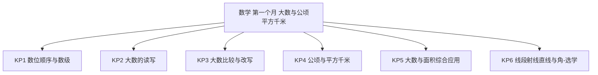
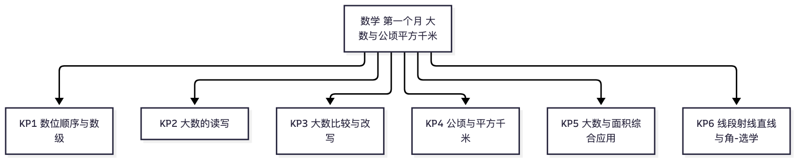

# 数学·四年级上学期第一个月自我检测（教师版）

> 适用：湖南省四年级上学期第 1 个月（2026 年 9 月）｜ 满分 100 分 ｜ 建议用时 40 分钟
> 教材对照：数学人教版第 1~2 单元主题（大数的认识 · 公顷和平方千米）——人教版为主流；第 3 单元"角的度量"多数学校 10 月开课，本卷仅设选学起步题。以学校实际用书与进度为准。
> 教师版含答案解析、双向细目表（评价接口）与知识框架图；学生用 学生版，家庭用 家长版。
> （注：评价接口第 2 项"各学生学科短板评估"为后续版本预留——本卷 JSON 接口已备好读取入口；教学进度以 §一 4 周速览表承载。）

## 一、本月学什么（教学范围）

四年级数学开篇是"数"的升级：从万以内到亿以内——数位顺序表、分级读写、比较大小、改写成"万"、用四舍五入求近似数。同时把面积单位升级到"公顷、平方千米"，建立大土地的量感。"角的度量"是月末起步的选学内容。

| 周次 | 教学内容（主题级） | 家里能观察到的迹象 |
|---|---|---|
| 第 1 周 | 亿以内数的认识：数位顺序表、数级 | 会说"从右起第几位是什么位" |
| 第 2 周 | 大数的读写与比较大小 | 会读会写含万级的大数 |
| 第 3 周 | 改写与近似数（万作单位 · 四舍五入）；公顷和平方千米起始 | 会说"大约多少万"；知道 1 公顷有多大 |
| 第 4 周 | 公顷与平方千米的应用；角的度量起步（选学）；月末自检 | 用公顷说家乡场所的大小 |

**进度差异说明**：若班级尚未学到"公顷和平方千米"，第 4、6、12、20、21 题可跳过；第 10、14 题为"角的度量"选学起步题，未讲到直接跳过。等级按已做题得分折算后对照。

## 二、试卷

### 一、填空（本题 6 小题，共 24 分）

1. 从右边起，第（　　）位是万位，第（　　）位是亿位。（4分）
2. 40500000 读作（　　　　　）。（4分）
3. 八百万零四十 写作（　　　　　）。（4分）
4. 1 公顷＝（　　　）平方米；1 平方千米＝（　　　）公顷。（4分）
5. 在 900999、909090、900909 三个数中，最大的数是（　　　　　）。（4分）
6. 5 公顷＝（　　　）平方米；800 公顷＝（　　　）平方千米。（4分）

### 二、判断（对的画"√"，错的画"×"）（本题 4 小题，共 8 分）

7. 个位、十位、百位、千位……都是数位。（　）（2分）
8. 读 30050000 时，中间的零一个都不用读。（　）（2分）
9. 边长 100 米的正方形土地，面积正好是 1 公顷。（　）（2分）
10. （选学）角的两条边画得越长，角就越大。（　）（2分）

### 三、选择（本题 4 小题，共 16 分）

11. 下面哪个数最接近 1 万？A　9990　B　10001　C　10999　D　9900（4分）
12. 学校操场的面积约 2（　　）。A　平方厘米　B　平方米　C　公顷　D　平方千米（4分）
13. 把 894000 省略万位后面的尾数，约是：A　89 万　B　90 万　C　8 万　D　9 万（4分）
14. （选学）无限长、没有端点的是：A　线段　B　角　C　射线　D　直线（4分）

### 四、读写与整理（本题 4 小题，共 16 分）

15. 读出下面的数：30700000（4分）
16. 写出下面的数：一千零五十万四千（4分）
17. 把 50500、500500、55000、50005 按从大到小的顺序排列。（4分）
18. 把 890000 改写成用"万"作单位的数；再把 694000 省略万位后面的尾数求近似数。（4分）

### 五、解决问题（本题 4 小题，共 36 分）

19. A 体育场能容纳观众 60000 人，B 体育场能容纳观众 91000 人。两个体育场一共能容纳多少人？A 体育场比 B 体育场少容纳多少人？（9分）
20. 一个正方形果园，边长 300 米。它的面积是多少平方米？合多少公顷？（9分）
21. 王爷爷家的果园面积约 3 公顷，李叔叔家的果园面积约 30000 平方米。谁家的果园大？还是一样大？（9分）
22. 一个数由 5 个百万、7 个十万和 8 个千组成。这个数是多少？把它省略万位后面的尾数约是多少？（9分）

## 三、参考答案与解析

### 答案速查

```
1. 5；9
2. 四千零五十万
3. 8000040
4. 10000；100
5. 909090
6. 50000；8
7. 对
8. 错
9. 对
10. 错
11. B
12. C
13. A
14. D
15. 三千零七十万
16. 10504000
17. 500500＞55000＞50500＞50005
18. 89 万；约 69 万
19. 151000 人；31000 人
20. 90000 平方米；9 公顷
21. 一样大
22. 5708000；约 571 万
```

### 逐题解析

1. 从右起：个、十、百、千、万——第 5 位是万位；万、十万、百万、千万、亿——第 9 位是亿位。判错点：忘了数级里还有十万位、百万位、千万位。
2. 40500000：万级是 4050，读"四千零五十万"，个级 4 个 0 不读。判错点：万级里的 0 丢读或全读。
3. 8000040：八百万是 8000000，零四十表示百位、千位、十万位都是 0，十位是 4。判错点：写成 800040 或 8000040 少位。
4. 1 公顷＝10000 平方米（边长 100 米的正方形）；1 平方千米＝100 公顷。
5. 三个数都是六位数，先比十万位（都是 9）和万位（都是 0），再比千位：909090 的千位是 9，另两个的千位都是 0——所以 909090 最大。判错点：只看开头不看中间。
6. 5 公顷＝5 个 10000＝50000 平方米；800 公顷＝800÷100＝8 平方千米。
7. 对——个位、十位、百位、千位、万位……都是数位；"数位"要和"计数单位"（一、十、百、千）区分开。
8. 错——30050000 读作"三千零五十万"，万级中间的 0 要读一个"零"；级末尾的 0 才不读。
9. 对——边长 100 米的正方形面积 100×100＝10000 平方米，正好是 1 公顷。
10. 错（选学）——角的大小看两条边张开的口，与边画多长没有关系。
11. B——和 10000 比：9990 差 10，10001 只差 1，10999 差 999，9900 差 100。判错点：看着 9990"最像"就选它——要算差多少。
12. C——操场是几块大场地，用公顷；平方米太小，平方千米太大（约 140 个操场）。
13. A——894000＝89 万 4 千，千位是 4，四舍，约是 89 万。判错点：见 9 就进位得 90 万——要看的是万位后面的千位。
14. D（选学）——直线无限长、没有端点；射线无限长、只有一个端点；线段有两个端点、有限长。
15. 三千零七十万——万级 3070，个级全 0 不读；判错点：丢"零"读成"三千七十万"。
16. 10504000——一千零五十万是 10500000，再加四千。判错点：写成 10500400（位对错）。
17. 500500＞55000＞50500＞50005——先比位数：500500 六位数最大；剩下三个都是五位数，比万级：55＞50＞50，55 最大；50500 和 50005 比千位（0＝0）再比百位：5＞0。
18. 890000＝89 万（整万数直接改写）；694000：千位是 4，四舍，约是 69 万。
19. 采分点：第一问 4 分（60000＋91000＝151000，一共能容纳 151000 人）；第二问 5 分（91000－60000＝31000，少容纳 31000 人）。判错点：问"少多少"仍用加法。
20. 采分点：算式与面积 5 分（300×300：先算 3×3＝9，两个因数末尾共 4 个 0，得 90000 平方米）；换算 4 分（90000÷10000＝9，合 9 公顷）。判错点：300×300 乘错 0 的个数。
21. 采分点：换算 5 分（3 公顷＝30000 平方米）；比较与结论 4 分（30000＝30000，两家果园一样大）。判错点：只看数字 3 和 30000 就说李叔叔家大——单位不同不能直接比。
22. 采分点：写数 5 分（5 个百万是 5000000，7 个十万是 700000，8 个千是 8000，合起来是 5708000）；求近似数 4 分（省略万位后面的尾数，千位是 8，五入向万位进一，约是 571 万）。判错点：忘进位写成 570 万。

## 四、评价接口（双向细目表）

| 题号 | 分值 | 知识点 | 课标锚点（2022版·内容要求摘句） | 难度 | 大纲匹配 |
|---|---|---|---|---|---|
| 1 | 4 | KP1 数位顺序与数级 | 数与运算：认识万级、亿级的数位顺序 | 易 | 强 |
| 2 | 4 | KP2 大数的读写 | 数与运算：能正确读出亿以内的数 | 中 | 强 |
| 3 | 4 | KP2 大数的读写 | 数与运算：能正确写出亿以内的数 | 较难 | 强 |
| 4 | 4 | KP4 公顷与平方千米 | 图形与几何：认识公顷、平方千米，知道进率 | 易 | 强 |
| 5 | 4 | KP3 大数比较与改写 | 数与运算：能比较亿以内数的大小 | 中 | 强 |
| 6 | 4 | KP4 公顷与平方千米 | 图形与几何：能进行面积单位的换算 | 中 | 强 |
| 7 | 2 | KP1 数位顺序与数级 | 数与运算：区分数位与计数单位 | 易 | 强 |
| 8 | 2 | KP2 大数的读写 | 数与运算：掌握含 0 的数的读法 | 中 | 强 |
| 9 | 2 | KP4 公顷与平方千米 | 图形与几何：理解 1 公顷的实际大小 | 易 | 强 |
| 10 | 2 | KP6 线段射线直线与角 | 图形与几何：知道角的大小与边长无关 | 易 | 强 |
| 11 | 4 | KP5 大数与面积综合应用 | 数感：能在具体情境中比较数的大小与接近程度 | 较难 | 中 |
| 12 | 4 | KP4 公顷与平方千米 | 量感：结合情境选择合适的面积单位 | 易 | 强 |
| 13 | 4 | KP3 大数比较与改写 | 数与运算：会用四舍五入法求近似数 | 中 | 强 |
| 14 | 4 | KP6 线段射线直线与角 | 图形与几何：认识线段、射线、直线的特征 | 易 | 强 |
| 15 | 4 | KP2 大数的读写 | 数与运算：能正确读出亿以内的数 | 易 | 强 |
| 16 | 4 | KP2 大数的读写 | 数与运算：能正确写出亿以内的数 | 中 | 强 |
| 17 | 4 | KP3 大数比较与改写 | 数与运算：能比较多个数的大小并排序 | 中 | 强 |
| 18 | 4 | KP3 大数比较与改写 | 数与运算：改写成万作单位、求近似数 | 中 | 强 |
| 19 | 9 | KP5 大数与面积综合应用 | 数量关系：解决大数的加减实际问题 | 易 | 强 |
| 20 | 9 | KP4 公顷与平方千米 | 图形与几何：计算正方形面积并换算单位 | 中 | 强 |
| 21 | 9 | KP4 公顷与平方千米 | 量感：统一单位后再比较大小 | 易 | 强 |
| 22 | 9 | KP5 大数与面积综合应用 | 数与运算：由计数单位写数并求近似数 | 较难 | 强 |

```json
{
  "subject": "数学",
  "duration_min": 40,
  "total_score": 100,
  "items": [
    {"no": 1, "score": 4, "kp": "KP1", "difficulty": "易", "match": "强"},
    {"no": 2, "score": 4, "kp": "KP2", "difficulty": "中", "match": "强"},
    {"no": 3, "score": 4, "kp": "KP2", "difficulty": "较难", "match": "强"},
    {"no": 4, "score": 4, "kp": "KP4", "difficulty": "易", "match": "强"},
    {"no": 5, "score": 4, "kp": "KP3", "difficulty": "中", "match": "强"},
    {"no": 6, "score": 4, "kp": "KP4", "difficulty": "中", "match": "强"},
    {"no": 7, "score": 2, "kp": "KP1", "difficulty": "易", "match": "强"},
    {"no": 8, "score": 2, "kp": "KP2", "difficulty": "中", "match": "强"},
    {"no": 9, "score": 2, "kp": "KP4", "difficulty": "易", "match": "强"},
    {"no": 10, "score": 2, "kp": "KP6", "difficulty": "易", "match": "强"},
    {"no": 11, "score": 4, "kp": "KP5", "difficulty": "较难", "match": "中"},
    {"no": 12, "score": 4, "kp": "KP4", "difficulty": "易", "match": "强"},
    {"no": 13, "score": 4, "kp": "KP3", "difficulty": "中", "match": "强"},
    {"no": 14, "score": 4, "kp": "KP6", "difficulty": "易", "match": "强"},
    {"no": 15, "score": 4, "kp": "KP2", "difficulty": "易", "match": "强"},
    {"no": 16, "score": 4, "kp": "KP2", "difficulty": "中", "match": "强"},
    {"no": 17, "score": 4, "kp": "KP3", "difficulty": "中", "match": "强"},
    {"no": 18, "score": 4, "kp": "KP3", "difficulty": "中", "match": "强"},
    {"no": 19, "score": 9, "kp": "KP5", "difficulty": "易", "match": "强"},
    {"no": 20, "score": 9, "kp": "KP4", "difficulty": "中", "match": "强"},
    {"no": 21, "score": 9, "kp": "KP4", "difficulty": "易", "match": "强"},
    {"no": 22, "score": 9, "kp": "KP5", "difficulty": "较难", "match": "强"}
  ]
}
```

## 五、知识体系框架图




（查看器不渲染 mermaid 时看上方 PNG。）

---
*AI 辅助生成，内容仅供参考，请以教材与老师要求为准；使用前请教师/家长抽查核对。hunan-g4-learn / month1-selfcheck · 2026-09*
