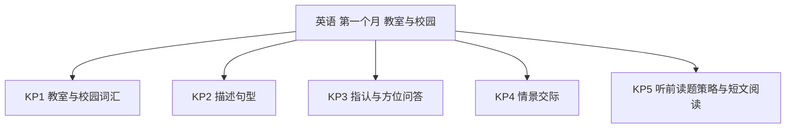
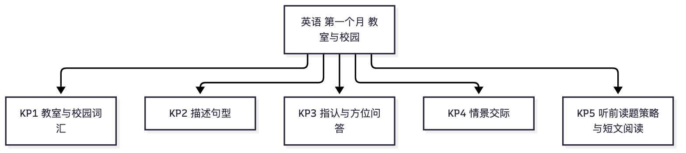

# 英语·四年级上学期第一个月自我检测（教师版）

> 适用：湖南省四年级上学期第 1 个月（2026 年 9 月）｜ 满分 100 分 ｜ 建议用时 30 分钟
> 教材对照：湘少版 / 人教PEP 四年级上册 Unit 1~2 通用主题（教室与校园 · 指认与方位 · 问候复习）——人教版本月为"My classroom"话题，湘少版对照其第一、二课问候与指认主题；以学校实际用书为准。
> 教师版含答案解析、双向细目表（评价接口）与知识框架图；学生用 学生版，家庭用 家长版。
> （注：评价接口第 2 项"各学生学科短板评估"为后续版本预留——本卷 JSON 接口已备好读取入口；教学进度以 §一 4 周速览表承载。听力纸面测不到，家长版附替代小测法。）

## 一、本月学什么（教学范围）

四年级英语第一个月：话题回到校园——会认会说教室物品词，会用 We have… 描述教室；句型上复习并升级"指认与问答"（What's this/that? Where is…? It's in/on/under/near…）；交际上复习问候、学会用 Let's… 提议；听力策略起步"听前读题"。

| 周次 | 教学内容（主题级） | 家里能观察到的迹象 |
|---|---|---|
| 第 1 周 | 开学问候复习（Nice to see you again）；教室物品词 | 会用英语介绍自己的教室 |
| 第 2 周 | 描述教室：We have a new classroom. It's big and clean. | 能说出教室里有什么 |
| 第 3 周 | 指认与方位问答：Where is…? It's in/on/under/near… | 能找到并说出东西的位置 |
| 第 4 周 | Let's… 提议与情景应答；听前读题策略；月末自检 | 听力题会先读选项 |

**进度差异说明**：各校句型进度略有先后——若班级尚未练习"连词成句"，第 18~20 题可跳过；等级按已做题得分折算后对照。

## 二、试卷

### 一、词汇（本题 6 小题，共 18 分）

1. 选出不同类的一项：A　window　B　door　C　desk　D　milk（3分）
2. 选出不同类的一项：A　banana　B　classroom　C　library　D　garden（3分）
3. 选出不同类的一项：A　blackboard　B　light　C　hot dog　D　picture（3分）
4. "computer" 的意思是：A　电灯　B　电脑　C　图片　D　门（3分）
5. "fan" 的意思是：A　墙　B　风扇　C　地板　D　窗户（3分）
6. "teacher's desk" 的意思是：A　讲台　B　学生的桌子　C　老师的家　D　黑板（3分）

### 二、单项选择（本题 6 小题，共 24 分）

7. We ___ a new classroom.　A　has　B　is　C　are　D　have（4分）
8. ___ in the classroom? — Many desks and chairs.　A　Where's　B　What's　C　Who's　D　How's（4分）
9. 指远处的东西，用：A　this　B　that　C　these　D　it（4分）
10. — Where is my seat? — It's ___ the door.（在门附近）A　near　B　on　C　under　D　in（4分）
11. 英语听力播放之前，最好先做什么？A　先快速读一遍选项，猜一猜会考什么　B　先趴一会儿　C　听完再说　D　直接乱选（4分）
12. — Is this your picture? — ___　A　No, it is.　B　Yes, I am.　C　Yes, it is.　D　No, it isn't.（4分）

### 三、对话匹配（从 B 栏中选出 A 栏各句的应答，把字母写在括号里）（本题 5 小题，共 20 分）

13. Nice to see you again!（　）（4分）
14. Where is my English book?（　）（4分）
15. What's in the classroom?（　）（4分）
16. Let's go and have a look.（　）（4分）
17. Thank you so much!（　）（4分）

　　B 栏：A．Many desks and chairs.　　B．Nice to see you, too.　　C．Good idea!
　　　　　D．Look! It's on the teacher's desk.　　E．You're welcome.　　F．Good night!

### 四、连词成句（把单词连成一句话，注意大小写和标点）（本题 3 小题，共 18 分）

18. have, We, a, new, classroom（.）（6分）
19. is, Where, my, chair（?）（6分）
20. is, The, computer, on, the, desk（.）（6分）

### 五、阅读判断（读短文，判断对错，对的画"√"，错的画"×"）（本题 4 小题，共 20 分）

> This is our new classroom. It is big and clean. We have forty desks and chairs. The teacher's desk is near the window. A computer is on it. Look! A picture is on the wall. I like our classroom.

21. Our classroom is big and clean.（　）（5分）
22. We have thirty desks and chairs.（　）（5分）
23. The computer is on the teacher's desk.（　）（5分）
24. A picture is under the wall.（　）（5分）

## 三、参考答案与解析

### 答案速查

```
1. D
2. A
3. C
4. B
5. B
6. A
7. D
8. B
9. B
10. A
11. A
12. C
13. B
14. D
15. A
16. C
17. E
18. We have a new classroom.
19. Where is my chair?
20. The computer is on the desk.
21. 对
22. 错
23. 对
24. 错
```

### 逐题解析

1. D——window、door、desk 都是教室里的东西，milk 是食物。
2. A——classroom、library、garden 都是学校场所，banana 是水果。
3. C——blackboard、light、picture 都是教室物品，hot dog 是食物。
4. B——computer 是电脑；判错点：与 light（电灯）混。
5. B——fan 是风扇；判错点：与 wall（墙）混。
6. A——teacher's desk 是老师的桌子，即讲台。
7. D——have 表示"有"：We have…（我们有……）；has 只用于第三人称单数。
8. B——回答是"许多桌椅"，问"教室里有什么"用 What's in the classroom?
9. B——近处用 this，远处用 that（三年级已学，四年级继续用）。
10. A——"在门附近"用 near；on 在上面、under 在下面、in 在里面。
11. A——听前读题：先扫一遍选项，猜会考什么、抓关键词，听的时候才有目标。这是本月新学的听力策略。
12. C——Is this…? 的一般疑问句要用 it 回答：Yes, it is. / No, it isn't.——A、B 自相矛盾。
13. B——Nice to see you again!（又见到你真高兴）应答 Nice to see you, too.（我也是）——too 不能丢。
14. D——问书在哪儿，答位置：Look! It's on the teacher's desk.
15. A——问"教室里有什么"，答 Many desks and chairs.
16. C——Let's…（我们一起……吧）的应答常用 Good idea!（好主意）。
17. E——感谢的应答是 You're welcome.（不客气）。
18. We have a new classroom.——采分点：词序全对 4 分；W 大写、句号齐全 2 分。
19. Where is my chair?——采分点：疑问词 Where 开头 3 分；is、my、chair 词序正确 2 分；问号 1 分。
20. The computer is on the desk.——采分点：The 开头、computer 与 is 配合 3 分；on the desk 位置正确 2 分；句号 1 分。
21. 对——原文 "It is big and clean."
22. 错——原文是 forty（四十）张桌椅，不是 thirty（三十）；数字细节要回原文核对。
23. 对——原文 "A computer is on it"，it 指前面的 the teacher's desk。
24. 错——原文是 on the wall（在墙上），不是 under（在下面）；方位介词是本月重点。

## 四、评价接口（双向细目表）

| 题号 | 分值 | 知识点 | 课标锚点（2022版·内容要求摘句） | 难度 | 大纲匹配 |
|---|---|---|---|---|---|
| 1 | 3 | KP1 教室与校园词汇 | 词汇知识：认读所学单词，按类别归组 | 易 | 强 |
| 2 | 3 | KP1 教室与校园词汇 | 词汇知识：认读所学单词，按类别归组 | 易 | 强 |
| 3 | 3 | KP1 教室与校园词汇 | 词汇知识：认读所学单词，按类别归组 | 中 | 强 |
| 4 | 3 | KP1 教室与校园词汇 | 词汇知识：知道常见校园物品的词义 | 易 | 强 |
| 5 | 3 | KP1 教室与校园词汇 | 词汇知识：知道常见校园物品的词义 | 易 | 强 |
| 6 | 3 | KP1 教室与校园词汇 | 词汇知识：知道常见校园物品的词义 | 中 | 强 |
| 7 | 4 | KP2 描述句型 | 语法知识：have/has 表示拥有 | 易 | 强 |
| 8 | 4 | KP2 描述句型 | 语法知识：What's in…? 问答配套 | 中 | 强 |
| 9 | 4 | KP3 指认与方位问答 | 语法知识：指示代词 this/that 按远近选用 | 易 | 强 |
| 10 | 4 | KP3 指认与方位问答 | 语法知识：方位介词 in/on/under/near 选用 | 中 | 强 |
| 11 | 4 | KP5 听前读题策略与短文阅读 | 学习策略：听前明确任务，抓关键词 | 中 | 强 |
| 12 | 4 | KP3 指认与方位问答 | 语法知识：Is this…? 问 this 答 it | 中 | 强 |
| 13 | 4 | KP4 情景交际 | 语用知识：问候与应答配套 | 易 | 强 |
| 14 | 4 | KP4 情景交际 | 语用知识：问答位置，作出恰当回应 | 易 | 强 |
| 15 | 4 | KP4 情景交际 | 语用知识：描述存在，作出恰当回应 | 中 | 强 |
| 16 | 4 | KP4 情景交际 | 语用知识：用 Let's… 提议并应答 | 易 | 强 |
| 17 | 4 | KP4 情景交际 | 语用知识：致谢与回应感谢 | 易 | 强 |
| 18 | 6 | KP2 描述句型 | 写：根据示范仿写简单句子 | 易 | 强 |
| 19 | 6 | KP3 指认与方位问答 | 写：连词成句，问句语序与标点 | 中 | 强 |
| 20 | 6 | KP3 指认与方位问答 | 写：连词成句，陈述句语序与标点 | 较难 | 拓展 |
| 21 | 5 | KP5 听前读题策略与短文阅读 | 读：借助图片和上下文读懂短句 | 易 | 强 |
| 22 | 5 | KP5 听前读题策略与短文阅读 | 读：回原文核对细节信息 | 较难 | 中 |
| 23 | 5 | KP5 听前读题策略与短文阅读 | 读：读懂简单句子并指代理解 | 易 | 强 |
| 24 | 5 | KP5 听前读题策略与短文阅读 | 读：核对方位介词细节 | 较难 | 强 |

```json
{
  "subject": "英语",
  "duration_min": 30,
  "total_score": 100,
  "items": [
    {"no": 1, "score": 3, "kp": "KP1", "difficulty": "易", "match": "强"},
    {"no": 2, "score": 3, "kp": "KP1", "difficulty": "易", "match": "强"},
    {"no": 3, "score": 3, "kp": "KP1", "difficulty": "中", "match": "强"},
    {"no": 4, "score": 3, "kp": "KP1", "difficulty": "易", "match": "强"},
    {"no": 5, "score": 3, "kp": "KP1", "difficulty": "易", "match": "强"},
    {"no": 6, "score": 3, "kp": "KP1", "difficulty": "中", "match": "强"},
    {"no": 7, "score": 4, "kp": "KP2", "difficulty": "易", "match": "强"},
    {"no": 8, "score": 4, "kp": "KP2", "difficulty": "中", "match": "强"},
    {"no": 9, "score": 4, "kp": "KP3", "difficulty": "易", "match": "强"},
    {"no": 10, "score": 4, "kp": "KP3", "difficulty": "中", "match": "强"},
    {"no": 11, "score": 4, "kp": "KP5", "difficulty": "中", "match": "强"},
    {"no": 12, "score": 4, "kp": "KP3", "difficulty": "中", "match": "强"},
    {"no": 13, "score": 4, "kp": "KP4", "difficulty": "易", "match": "强"},
    {"no": 14, "score": 4, "kp": "KP4", "difficulty": "易", "match": "强"},
    {"no": 15, "score": 4, "kp": "KP4", "difficulty": "中", "match": "强"},
    {"no": 16, "score": 4, "kp": "KP4", "difficulty": "易", "match": "强"},
    {"no": 17, "score": 4, "kp": "KP4", "difficulty": "易", "match": "强"},
    {"no": 18, "score": 6, "kp": "KP2", "difficulty": "易", "match": "强"},
    {"no": 19, "score": 6, "kp": "KP3", "difficulty": "中", "match": "强"},
    {"no": 20, "score": 6, "kp": "KP3", "difficulty": "较难", "match": "拓展"},
    {"no": 21, "score": 5, "kp": "KP5", "difficulty": "易", "match": "强"},
    {"no": 22, "score": 5, "kp": "KP5", "difficulty": "较难", "match": "中"},
    {"no": 23, "score": 5, "kp": "KP5", "difficulty": "易", "match": "强"},
    {"no": 24, "score": 5, "kp": "KP5", "difficulty": "较难", "match": "强"}
  ]
}
```

## 五、知识体系框架图




（查看器不渲染 mermaid 时看上方 PNG。）

---
*AI 辅助生成，内容仅供参考，请以教材与老师要求为准；使用前请教师/家长抽查核对。hunan-g4-learn / month1-selfcheck · 2026-09*
