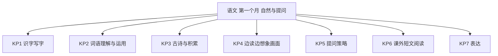
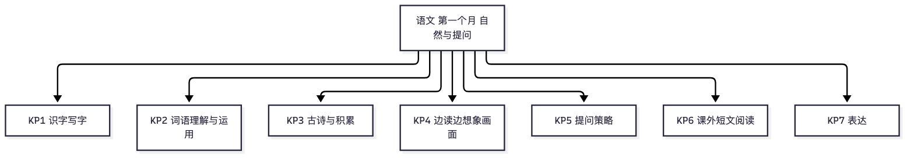

# 语文·四年级上学期第一个月自我检测（教师版）

> 适用：湖南省四年级上学期第 1 个月（2026 年 9 月）｜ 满分 100 分 ｜ 建议用时 50 分钟
> 教材对照：语文统编版第一、二单元主题（自然之美 · 提问策略）——统编版全国统一，单元主题各版延续；单元名与页码以孩子手中课本目录为准。
> 教师版含答案解析、双向细目表（评价接口）与知识框架图；学生用 学生版，家庭用 家长版。
> （注：评价接口第 2 项"各学生学科短板评估"为后续版本预留——本卷 JSON 接口已备好读取入口；教学进度以 §一 4 周速览表承载。）

## 一、本月学什么（教学范围）

四年级第一个月两条阅读主线：一是"边读边想象画面"，读景物的课文能在脑中"放电影"；二是学习"提问策略"——从内容、写法、联系生活等不同角度提出自己的问题。表达上把"按顺序写清楚"立住（推荐一个好地方）；积累上背熟本单元古诗、会写第一二单元生字词。

| 周次 | 教学内容（主题级） | 家里能观察到的迹象 |
|---|---|---|
| 第 1 周 | 自然之美起始：边读边想象画面（《观潮》《走月亮》类课文） | 读写景课文会说"我好像看到了……" |
| 第 2 周 | 识字写字巩固；习作"推荐一个好地方"（按顺序写清楚） | 能按顺序介绍一个地方 |
| 第 3 周 | 提问策略单元：从不同角度提问（针对内容 · 写法 · 联系生活） | 读书时爱问"为什么""为什么这样写" |
| 第 4 周 | 提问实践与交流分享；积累与默写；月末自检 | 能给短文提出自己的问题 |

**进度差异说明**：若班级尚未进入第二单元（提问策略），第 14、15 题与习作 B 可跳过（习作选 A）；等级按已做题得分折算后对照。

## 二、试卷

### 一、积累运用（本题 10 小题，共 30 分）

1. 看拼音写词语：cháo shuǐ（　　　　）（2分）
2. 看拼音写词语：kuān kuò（　　　　）（2分）
3. 看拼音写词语：dùn shí（　　　　）（2分）
4. 看拼音写词语：yán jiū（　　　　）（2分）
5. "夜雾笼罩着江面"的"笼"应读：A　lóng　B　lǒng　C　dǒng　D　tǒng（3分）
6. "堤"和"提"长得像，下面说法对的是：A　"堤"与土有关，"提"与手有关　B　都读 tí　C　意思一样　D　都与水有关（3分）
7. 读到"呼风唤雨的世纪"，你不懂"呼风唤雨"的意思。第一步最好：A　跳过去　B　抄下来　C　联系上下文和生活经验猜一猜　D　只等老师讲（3分）
8. 读《观潮》"浪潮越来越近，犹如千万匹白色战马齐头并进"，脑中该浮现的画面是：A　一群真的马在跑步　B　什么也没想　C　一幅静态的马的图片　D　浪潮像千万匹白色战马一样浩浩荡荡涌来（3分）
9. 默写一首本月学过的古诗（自选）：写出题目与作者，再写全四句诗。（5分）
10. 写出两个描写钱塘江大潮的四字词语（如：人声鼎沸）。（5分）

### 二、阅读鉴赏（本题 7 小题，共 40 分）

读课内语段，完成第 11~12 题。

> 细细的溪水，流着山草和野花的香味，流着月光。灰白色的鹅卵石，布满河床。哟，卵石间有多少可爱的小水塘啊，每个小水塘，都抱着一个月亮！

11. 作者说溪水"流着香味、流着月光"，小水塘"抱着一个月亮"，这样写妙在哪里？（5分）
12. 边读边想象：读了这段话，你的眼前出现了怎样的画面？用两三句话写下来。（5分）

读下面的短文，完成第 13~15 题。

> **我们班的"小问号"**
>
> （1）我们班的林小雨有个外号，叫"小问号"。别的同学下课忙着玩游戏，她总爱拿着本子追着老师问："老师，为什么月亮会跟着我们走？""为什么树叶到了秋天会变黄？"
>
> （2）一次科学课上，老师刚讲完水的浮力，她马上举手："老师，为什么轮船那么重，却能浮在水面上？"老师没有马上回答，而是笑着说："这个问题提得好，答案就藏在你们的书里和实验里。"
>
> （3）林小雨翻书、做实验、查资料，还真把答案找了出来。老师常常说：会提问的孩子，就是在学习的孩子。

13. 短文主要写了林小雨的什么事？用一两句话概括。（6分）
14. 针对短文的内容，提出一个你想探究的问题。（6分）
15. 再从"联系生活"的角度提出一个问题，并写一句：生活中你打算怎么找答案。（6分）

读下面的短文，完成第 16~17 题。

> **江上的傍晚**
>
> （1）傍晚，我陪着奶奶到江边散步。太阳慢慢沉下江面，把江水染成了金色。晚霞像一匹展开的红绸子，铺满了半边天。
>
> （2）江风轻轻抚摸着我的脸，凉凉的，柔柔的。远处，几只归巢的鸟儿掠过江面，翅膀上驮着落日的余晖。奶奶说，一天中最美的时刻，就是这个时候。

16. 画出短文中你一读眼前就出现画面的句子，再写一两句话，说说你"看"到了什么。（6分）
17. 找出短文中把事物当作人来写的一句，抄下来，再说说这样写的好处。（6分）

### 三、习作（本题 1 小题，共 30 分）

18. 二选一，写一篇短文（300 字左右）。（30分）
　　A．推荐一个好地方：写清楚它在哪儿、有什么、为什么值得去，按一定顺序写。
　　B．小小"动物园"：想一想你的家人和哪种动物比较像，写清楚"像在哪里"。

## 三、参考答案与解析

### 答案速查

```
1. 潮水
2. 宽阔
3. 顿时
4. 研究
5. B
6. A
7. C
8. D
9. 见解析
10. 见解析
11. 见解析
12. 见解析
13. 见解析
14. 见解析
15. 见解析
16. 见解析
17. 见解析
18. 见解析
```

### 逐题解析

1. 潮水——"潮"与水有关，是三点水；判错点：误写成"朝水"。
2. 宽阔——"阔"里面是"活"；判错点：门字框里写成"问"。
3. 顿时——本单元高频词；判错点："顿"左边写成"屯"。
4. 研究——第二单元高频词；判错点："究"下面少写"九"。
5. B——"笼罩"是像笼子一样罩住，读 lǒng；"鸟笼、蒸笼"读 lóng。多音字看意思定音。
6. A——抓部件想意思：堤是土字旁（土石筑成），提是提手旁（用手提起）；"堤"读 dī。
7. C——理解难懂词语的标准第一步：先联系上下文和生活经验猜，猜不出再查、再问；跳过和抄答案都不是学习。
8. D——想象画面是"把文字变成脑中电影"：浪潮浩浩荡荡像千万匹白色战马涌来，不是真马也不是图片。
9. 采分点：写出本月所学一首古诗的题目与作者得 1 分；四句每句 1 分，有错字该句不得分。如《鹿柴》（王维）等，以孩子本月课本所学为准。
10. 采分点：每个 2 分，两个都准确且书写无误给满 5 分。参考：人声鼎沸、山崩地裂、风平浪静、齐头并进、浩浩荡荡；课外积累的合理词语同样给分。
11. 采分点：说出"把香味、月光当作能流动的东西，把小水塘当作人来写（抱）"得 3 分（说出其中两处即可）；说出好处"画面一下子活了，读着亲切、有想象力"得 2 分。
12. 采分点：画面合理且来自语段（溪水、月光、鹅卵石、小水塘里的"月亮"任选元素）得 4 分；表达完整通顺得 1 分。示例：我看见月光洒在小溪上，溪水亮闪闪地流，鹅卵石间一个个小水塘，每个都装着一个小月亮。
13. 采分点：说出"林小雨爱提问（小问号）+ 自己翻书做实验找答案"两层意思即可得满 6 分；只写"她爱问问题"得 3 分。
14. 采分点：提出的问题与短文内容相关、真实可探究即得 6 分（如"老师为什么让她自己去书里找答案？"）。照抄短文里的原句不算提问。
15. 采分点：问题能联系生活经验得 4 分（如"生活中遇到不懂的事，我该向谁请教、去哪里查？"）；写出一句话的打算得 2 分。
16. 采分点：画句 2 分（任一句合理即可，如"晚霞像一匹展开的红绸子"）；画面描写 4 分（与句子对应、具体可感）。
17. 采分点：抄句 2 分（"江风轻轻抚摸着我的脸"——把江风当人来写；写"鸟儿翅膀上驮着余晖"亦可）；好处 4 分（生动、有感情、让景物活起来，答出一点并结合句子说即可）。
18. 习作评分（A、B 同一量表，共 30 分）：
　　内容（16 分）：A——写清地点、亮点、理由 8 分；按一定顺序（方位或游览顺序）8 分。B——"像"点抓得准 8 分；有具体事例支撑 8 分。
　　条理与通顺（8 分）：分段或句群清楚、语句通顺 8 分；轻微语病酌扣 2~4 分。
　　书写与标点（6 分）：字迹端正、标点基本正确 6 分。
　　示例（A 开头）：我要推荐的地方是湘江边的风筝广场。它就在我们小区往东五百米……
　　示例（B 开头）：我家是个小小"动物园"：爸爸是大狮子，一说话整个楼道都听得见……
　　判分底线：内容清楚、有条理即及格；四年级重在"写清楚"，不苛求文采。

## 四、评价接口（双向细目表）

| 题号 | 分值 | 知识点 | 课标锚点（2022版·内容要求摘句） | 难度 | 大纲匹配 |
|---|---|---|---|---|---|
| 1 | 2 | KP1 识字写字 | 识字与写字：能借助语境认读汉字，硬笔书写规范端正 | 易 | 强 |
| 2 | 2 | KP1 识字写字 | 识字与写字：能按笔顺规则用硬笔写字，注意间架结构 | 易 | 强 |
| 3 | 2 | KP1 识字写字 | 识字与写字：感受汉字的书写规律，把字写端正 | 易 | 强 |
| 4 | 2 | KP1 识字写字 | 识字与写字：能按笔顺规则用硬笔写字，注意间架结构 | 易 | 强 |
| 5 | 3 | KP1 识字写字 | 识字与写字：能按字义读准多音字 | 易 | 强 |
| 6 | 3 | KP1 识字写字 | 识字与写字：辨析形近字，感受汉字构字规律 | 易 | 强 |
| 7 | 3 | KP2 词语理解与运用 | 阅读与鉴赏：联系上下文理解词句，借助生活积累理解生词 | 易 | 强 |
| 8 | 3 | KP4 边读边想象画面 | 阅读与鉴赏：边读边想象画面，感受自然之美 | 中 | 强 |
| 9 | 5 | KP3 古诗与积累 | 梳理与探究：背诵优秀诗文，默写所学古诗 | 中 | 强 |
| 10 | 5 | KP2 词语理解与运用 | 梳理与探究：分类积累课文中的四字词语 | 中 | 强 |
| 11 | 5 | KP4 边读边想象画面 | 阅读与鉴赏：体会拟人化表达，感受课文语言之美 | 中 | 强 |
| 12 | 5 | KP4 边读边想象画面 | 阅读与鉴赏：边读边想象画面，说出自己的感受 | 中 | 中 |
| 13 | 6 | KP6 课外短文阅读 | 阅读与鉴赏：初步把握文章的主要内容 | 中 | 强 |
| 14 | 6 | KP5 提问策略 | 阅读与鉴赏：从不同角度提出自己的问题 | 中 | 强 |
| 15 | 6 | KP5 提问策略 | 阅读与鉴赏：联系生活经验提问并尝试解决 | 较难 | 拓展 |
| 16 | 6 | KP6 课外短文阅读 | 阅读与鉴赏：边读边想象画面，提取文本信息 | 易 | 强 |
| 17 | 6 | KP6 课外短文阅读 | 阅读与鉴赏：体会拟人化表达的好处 | 中 | 中 |
| 18 | 30 | KP7 表达 | 表达与交流：按一定顺序把内容写清楚，写得具体 | 较难 | 强 |

```json
{
  "subject": "语文",
  "duration_min": 50,
  "total_score": 100,
  "items": [
    {"no": 1, "score": 2, "kp": "KP1", "difficulty": "易", "match": "强"},
    {"no": 2, "score": 2, "kp": "KP1", "difficulty": "易", "match": "强"},
    {"no": 3, "score": 2, "kp": "KP1", "difficulty": "易", "match": "强"},
    {"no": 4, "score": 2, "kp": "KP1", "difficulty": "易", "match": "强"},
    {"no": 5, "score": 3, "kp": "KP1", "difficulty": "易", "match": "强"},
    {"no": 6, "score": 3, "kp": "KP1", "difficulty": "易", "match": "强"},
    {"no": 7, "score": 3, "kp": "KP2", "difficulty": "易", "match": "强"},
    {"no": 8, "score": 3, "kp": "KP4", "difficulty": "中", "match": "强"},
    {"no": 9, "score": 5, "kp": "KP3", "difficulty": "中", "match": "强"},
    {"no": 10, "score": 5, "kp": "KP2", "difficulty": "中", "match": "强"},
    {"no": 11, "score": 5, "kp": "KP4", "difficulty": "中", "match": "强"},
    {"no": 12, "score": 5, "kp": "KP4", "difficulty": "中", "match": "中"},
    {"no": 13, "score": 6, "kp": "KP6", "difficulty": "中", "match": "强"},
    {"no": 14, "score": 6, "kp": "KP5", "difficulty": "中", "match": "强"},
    {"no": 15, "score": 6, "kp": "KP5", "difficulty": "较难", "match": "拓展"},
    {"no": 16, "score": 6, "kp": "KP6", "difficulty": "易", "match": "强"},
    {"no": 17, "score": 6, "kp": "KP6", "difficulty": "中", "match": "中"},
    {"no": 18, "score": 30, "kp": "KP7", "difficulty": "较难", "match": "强"}
  ]
}
```

## 五、知识体系框架图




（查看器不渲染 mermaid 时看上方 PNG。）

---
*AI 辅助生成，内容仅供参考，请以教材与老师要求为准；使用前请教师/家长抽查核对。hunan-g4-learn / month1-selfcheck · 2026-09*
