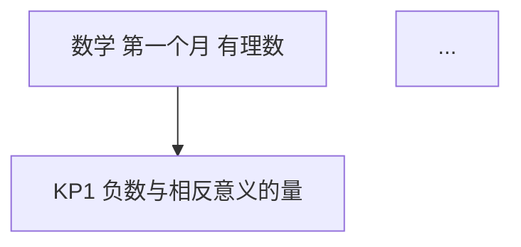

# month1-selfcheck 生成与校验规范（v1）

湖南省初一（七年级）上学期**第一个月（2026 年 9 月）**七科自我检测包：语文 / 数学 / 英语 / 历史 / 地理 / 生物 / 道德与法治，每科三版（教师版 / 学生版 / 家长版），共 21 份 markdown。本文件是全部文件的结构契约，`check.py` 按此机检；后续补科、改版先改这里再动手。

## 0. 文件清单与命名

```
hunan-g7-learn/month1-selfcheck/
  {科目}-教师版.md   × 7     科目 ∈ {语文, 数学, 英语, 历史, 地理, 生物, 道德与法治}
  {科目}-学生版.md   × 7
  {科目}-家长版.md   × 7
  figures/{科目}-框架图.png   （由 mermaid 块离线出图，交付双保险）
  check.py                    （结构/一致性机检，md 层）
  build_html.py               （md 单源 → html/ 交付层生成器，2026-09-26 起）
  check_html.py               （html/ 交付层机检）
  test_html_score.js          （评分核心纯函数 node 测试）
  html/                       （P0 直发交付层，21 份自包含 HTML，命名见 §8）
  _规范.md                    （本文件）
```

**分层关系（2026-09-26 起）**：md 是唯一源（教师版手写主文件，学生/家长版由其派生），`html/` 是家庭直发交付层——由 `build_html.py` 从 md 全量生成，**禁止手改 html/**；改内容先改 md，再 `python3 build_html.py` 重新生成。家庭与学生只拿 HTML（双击即用），md 不再作为交付物直发。

通用硬规则（全文件生效）：
1. **无外链**：正文不得出现 `http://` 或 `https://`（离线可打印、直发不断链）。
2. **无必需图片**：题目不得依赖图片作答（经纬网等用文字坐标描述）；唯一例外是教师版框架图的 mermaid 块 + figures PNG。
3. **页脚 AI 标识**：每个文件最后一行为 `*AI 辅助生成，内容仅供参考，请以教材与老师要求为准；使用前请教师/家长抽查核对。hunan-g7-learn / month1-selfcheck · 2026-09*`（前有 `---` 分隔线）。
4. **语言**：题干面向初一学生，句子短；家长版全部用生活语言（如"绝对值就是数轴上到原点的距离"），不堆术语。
5. **范围纪律**：只考第一个月范围；进度差异（学校快慢）不在题里体现，由"进度差异说明"列出可跳过题号，等级按已做题换算。
6. **满分 100**，各科建议用时见 §5 表；双减口径：家长版明确"一次一科、不连考"。

## 1. 教师版结构（H2 标题逐字固定）

```markdown
# {科目}·七年级上学期第一个月自我检测（教师版）

> 适用：湖南省初一上学期第 1 个月（2026 年 9 月）｜ 满分 100 分 ｜ 建议用时 XX 分钟
> 教材对照：{版本 A 对应章节}；{版本 B 对应章节}。以学校实际用书与进度为准。
> 教师版含答案解析、双向细目表（评价接口）与知识框架图；学生用 学生版，家庭用 家长版。

## 一、本月学什么（教学范围）
（3~5 行范围说明 + 4 周速览表 + 进度差异说明：若学校未讲到 XX，第 a、b 题可跳过）

## 二、试卷
### 一、{大题名}（本题 n 小题，共 X 分）
1. …（3分）
（小题编号全卷连续 1..N，每小题分值写进题尾"（n分）"）

## 三、参考答案与解析
### 答案速查
```
1. B
2. A
...
N. 见解析
```
（围栏内每行一题，格式严格 `题号. 答案`；客观题只写字母或 对/错；主观题写"见解析"或一行极简答案。学生版/家长版逐字复用本围栏。）

### 逐题解析
（计算题写完整步骤；选择/判断给判错点各一句；主观题给示例答案 + 采分点分步分）

## 四、评价接口（双向细目表）
| 题号 | 分值 | 知识点 | 课标锚点（2022版·内容要求摘句） | 难度 | 大纲匹配 |
|---|---|---|---|---|---|
| 1 | 3 | KP1 负数与相反意义的量 | 数与代数：… | 易 | 强 |

（随后附 JSON 接口，字段与表格逐行一致，供后续 H5/短板评估程序读取：）
```json
{
  "subject": "数学",
  "duration_min": 45,
  "total_score": 100,
  "items": [
    {"no": 1, "score": 3, "kp": "KP1", "difficulty": "易", "match": "强"}
  ]
}
```

## 五、知识体系框架图


（查看器不渲染 mermaid 时看上方 PNG。）

---
*AI 辅助生成，内容仅供参考，请以教材与老师要求为准；使用前请教师/家长抽查核对。hunan-g7-learn / month1-selfcheck · 2026-09*
```

### 评价接口字段
- **难度** ∈ {易, 中, 较难}；全卷分布约 易 40~60%、中 25~45%、较难 10~25%。
- **大纲匹配** ∈ {强, 中, 拓展}：强=本月课标内主干要求；中=课标内综合应用；拓展=跨点综合（如数形结合、规律探索）。
- **知识点** = `KPn 名称`，n 连续 1..k；**三版文件的 KP 集合必须完全一致**。
- JSON `items` 与表格逐行一致（no/score/kp/difficulty/match），`score` 合计 = 100。

## 2. 学生版结构（H2 标题逐字固定）

```markdown
# {科目}·七年级上学期第一个月自我检测（学生版）

> 使用说明（先读再动笔）：限时 XX 分钟，独立完成，不翻书不问人；做题时不要往下翻——答案在后面。做完先自己批改，再请家长抽 3 题复核。诚信计分：错了不丢人，漏出来的短板才是我们要找的宝贝。

## 一、试卷
（与教师版"二、试卷"**逐字一致**，含每题分值）

## 二、参考答案
```
（与教师版"答案速查"围栏**逐字一致**）
```

## 三、自评与计分
（怎么算分：客观题对一题得一题分；主观题对照采分点按步给分，宁可少给不高估。等级对照表：）
| 得分 | 等级 | 一句话解读 |
|---|---|---|
| 85~100 | 优 | 本月骨架扎实，保持节奏 |
| 70~84 | 良 | 大盘没问题，个别点要回炉 |
| 60~69 | 合格 | 有明确短板，按下面清单补 |
| 60 以下 | 待加强 | 第一个月很常见！先回课本，不着急刷题报班 |

## 四、短板总结（做完后填写）
### 第 1 步：按知识点登记
| 知识点 | 关联题号 | 我的得分 | 满分 | 结论（扎实 / 需巩固 / 要补） |
|---|---|---|---|---|
| KP1 … | 1, 5 | | | |
（每个 KP 一行，题号预填好，学生只填得分与结论）

### 第 2 步：我的短板清单
- 最先要补的知识点（≤2 个）：＿＿＿
- 具体行动：把课本第＿章再读一遍；重做本卷第＿题；把第＿题抄进错题本。
- 约定复测时间：＿＿＿（建议 7~10 天后只重做错题）

---
（页脚，同 §0.3）
```

## 3. 家长版结构（H2 标题逐字固定）

```markdown
# {科目}·七年级上学期第一个月自我检测（家长版）

> 这一页写给家长：不讲题，只讲四件事——孩子这个月学了什么、怎么组织这次自检、怎么批改、结果怎么看待。

## 一、进度速览（孩子这个月学了什么）
（4 周速览表 + 每个 KP 一句人话解释："××就是……家里可以……"；末尾附进度差异说明）

## 二、怎么组织这次自检（10 分钟准备）
（打印学生版；一次只测一科；计时；中途不打扰；做完让孩子先自己批改，家长抽 3 题复核——抽到不一致以家长为准，温和指出来）

## 三、答案速查（家长批改用）
```
（与教师版"答案速查"围栏逐字一致）
```

## 四、怎么解读结果（短板总结）
（等级表同学生版 + 三档话术：85+ 怎么夸、70~84 怎么说、<70 怎么陪；强调第一个月分数≠能力）
### 短板登记表（与孩子一起填）
| 知识点 | 扣分 | 严重度（要补 / 需巩固） | 建议动作（人话） |
|---|---|---|---|
| KP1 … | | | 读课本第＿章 + 重做第＿题 |

## 五、常见误区与家庭话术
（本学科家长最常踩的 3~4 个坑：如"一看就会一做就废""只盯分数不盯错因"；每条配一句可照说的话）
（若有听力/实验等纸面测不到的能力，写明替代小测法）

---
（页脚，同 §0.3）
```

## 4. mermaid 框架图风格（兼容老渲染器，逐条硬性）

1. 只用 `flowchart TD`；节点 ≤ 12 个；`ROOT` + `KP1..KPn` 两层（可加 1 个中间层）。
2. 所有节点标签整体双引号包裹：`KP1["KP1 负数与相反意义的量"]`。
3. 标签内只允许：汉字、ASCII 字母数字、空格、连字符 `-`。**禁止**全角标点（：、，。（）等）与 `<br/>`、`|`、箭头字符。
4. 不写边标签；回边/自环不出现。
5. 节点 ID 全图唯一（单文件单图，天然满足）。

## 5. 各科题量结构（已定稿，不得改动）

| 科目 | 用时 | 题数 | 结构（题号 × 分值） |
|---|---|---|---|
| 语文 | 60 分钟 | 21 | 积累运用 26：1-8 默写×2 + 9-12 语段综合(2/2/2/4)；阅读鉴赏 44：13-14 古诗赏析 4+4，15-17 课内写景散文 6×3，18-20 课外语段 6×3；写作 30：21 微写作二选一 |
| 数学 | 45 分钟 | 20 | 选择 1-10 每题 4 分（40）；填空 11-15×4（20）；解答 40：16/17 计算各 8，18 数轴与绝对值 8，19 应用 8，20 规律探索 8 |
| 英语 | 45 分钟 | 31 | 单选 1-10×3；完形 11-20×2；阅读 21-30×3（A 篇 4 题 + B 篇 6 题）；书面表达 31（20 分，50~60 词） |
| 历史 | 40 分钟 | 22 | 选择 1-20×3；材料解析 21（3 小问 20 分）、22（3 小问 20 分） |
| 地理 | 40 分钟 | 22 | 选择 1-20×3；综合题 21 经纬网定位（3 小问 20 分）、22 地球形状与生活应用（3 小问 20 分） |
| 生物 | 40 分钟 | 27 | 选择 1-15×2（30）；判断 16-25×1（10，对/错）；综合 26 情境归类（3 小问共 30 分）、27 显微镜使用（3 小问共 30 分） |
| 道德与法治 | 40 分钟 | 28 | 判断 1-10×1（对/错）；选择 11-25×3；情境分析 26/27/28（各 2 小问 15 分） |

客观题字母分布规则（check.py 机检）：选择题答案 A~D 每个至少出现 1 次且最多的字母 ≤ 50%（语文无选择题不适用）；判断题 对/错 各 ≥ 30%。

## 6. 各科范围与知识点框架（2024 新教材 9 月进度，已核实）

- **语文**（统编 2024 第一单元：《春》《济南的冬天》《雨的四季》《古代诗歌四首》+ 写作·学会观察）：KP1 字音字形；KP2 词语理解与运用；KP3 古诗默写（四首内）；KP4 古诗赏析；KP5 写景散文阅读（含朗读重音停连设计 1 小题）；KP6 修辞辨析与仿写；KP7 微写作。第一单元无文言文，不考。
- **数学**（湘教 2024 第 1 章至 1.4 加减 / 人教 2024 第一章 + 第二章加减法，两版本月均到"有理数加减法"；乘除乘方不考）：KP1 负数与相反意义的量；KP2 有理数分类；KP3 数轴；KP4 相反数；KP5 绝对值；KP6 有理数大小比较；KP7 有理数加减运算；KP8 数形结合与规律探索。湖南情境优先：湘江水位、长沙昼夜温差、橘子洲海拔等（数字须真实合理）。
- **英语**（人教 2024 Starters 1-3 + Unit 1 You and Me；仁爱版学校对照其 Unit 1 问候与介绍）：KP1 问候与自我介绍；KP2 人称代词与 be 动词；KP3 指示代词 this/that；KP4 冠词 a/an；KP5 名词单复数；KP6 数词与年龄；KP7 情景交际；KP8 阅读理解；KP9 书面表达。听力纸面测不到——家长版写明"家长读 5 个四会词孩子拼写"的替代小测。
- **历史**（统编 2024 第一单元 史前时期：第 1 课 远古时期的人类活动 / 第 2 课 原始农业与史前社会 / 第 3 课 中华文明的起源）：KP1 我国境内早期人类；KP2 原始农业与史前定居生活；KP3 炎黄传说与华夏形成；KP4 中华文明起源特征（多元一体·考古实证）；KP5 传说与史实的区分。史实硬底线：元谋人约 170 万年前；北京人约 70 万~20 万年前、用天然火；河姆渡约 7000 年前长江流域干栏式房屋种水稻；半坡约 6000 年前黄河流域半地穴房屋种粟；良渚古城约 5300~4300 年前。
- **地理**（湘教 2024 第一章 + 第二章前半 / 人教 2024 第一章 地球，共同考点为课标"地理工具"）：KP1 身边的地理与学习方法；KP2 地图三要素；KP3 地球形状与大小（平均半径 6371 km、赤道周长约 4 万 km）；KP4 地球仪与经纬网；KP5 半球划分与高、中、低纬（20°W、160°E；0°/30°/60°）；KP6 地球自转与昼夜交替（进度差异项，题中标"选学"）。无图化：经纬网全部用文字坐标描述。
- **生物**（人教 2024 第一单元前两章：认识生物 / 认识使用显微镜）：KP1 生物的基本特征；KP2 生物与环境的关系；KP3 科学观察与调查方法；KP4 显微镜的结构与使用（对光、物像倒立、偏哪往哪移）；KP5 生命现象综合判断。进度差异说明写清"未到显微镜的学校跳过相关题"。
- **道德与法治**（统编 2024 第一单元 少年有梦：第一课 开启初中生活 / 第二课 正确认识自我 / 第三课 梦想始于当下）：KP1 中学生活新起点；KP2 规划初中生活；KP3 认识自己的内容与途径；KP4 做更好的自己；KP5 少年有梦；KP6 学习成就梦想。情境优先用湖南素材：袁隆平与杂交水稻（梦想）、岳麓山研学、雷锋家乡学雷锋。

## 7. 生成方自检清单（交付前逐项过）

> 维护提醒（2026-09-26 两处实锤后补）：§5 各科分值合计必须 = 100（改结构先求和自检，v1 曾把数学写成 90、生物写成 80，逼子代理自行改结构）；check.py 的 H2/分值常量与本文件模板逐字同步（改模板必改常量），校验器期望值禁止凭记忆手抄。

1. 题数、分值合计 = 100，与 §5 结构一致；
2. 每道客观题答案**亲自再解一遍**，唯一且正确；计算题解析含完整步骤；
3. 客观题字母分布、判断题对错分布合规（§5 规则）；
4. 难度分布合规（§1）；每题在细目表有行且与 JSON 接口逐行一致；
5. 学生版试卷 = 教师版试卷（逐字）；三版答案速查逐字一致；三版 KP 集合一致；
6. 无外链、无必需图片、页脚 AI 标识在场；
7. mermaid 块符合 §4 全部条目，且其后紧跟 PNG 引用行；
8. （2026-09-26 起）`python3 build_html.py` 生成 `html/` 全 21 份成功且生成器零警告；`python3 check_html.py` 全 PASS；`node test_html_score.js` 全 PASS；`python3 check.py` 21 份 md 仍 PASS（改 md 或生成器后四件全跑）。

## 8. HTML 交付层（P0 直发口径，2026-09-26 起）

家庭与学生只拿 `html/` 下的 HTML（双击即用、可微信直发），md 不再直发。

### 8.1 文件命名

```
html/2026-2027上学期第一个月{科目}自测.html            学生版（家庭直发名，无版别后缀）
html/2026-2027上学期第一个月{科目}自测-教师版.html
html/2026-2027上学期第一个月{科目}自测-家长版.html
```

### 8.2 生成纪律

`build_html.py` 从 md 单源生成，**禁止手改 html/**；改内容先改 md，再重新生成。生成器 fail-loud：试卷题号/答案速查/JSON/逐题解析任一不完整或格式异常即报错退出，不得静默跳过或降级。

### 8.3 三版形态

- **学生版 = 交互卷**：试卷逐字渲染；题型组件——选择=A~D 按钮、判断=对/错按钮、填空=可选"我的答案"输入框（纸上作答也行）、主观=注明草稿纸完成；交卷批改：客观题自动判分，填空/主观对照参考答案+采分点自评给分；家长抽复核可**改判**（翻转该题判定）；每题可勾"未讲到，跳过"；结果区自动给出总分/已做题折算/等级 + KP 登记汇总 + 短板清单 + 复测约定 + **成绩单摘要**（截图保存或发老师/家长）；建议用时计时；进度 localStorage 尽力保存（不支持时提示"一次做完再退出"）；可打印（打印态隐藏交互件）。
- **家长版 = 静态可读渲染**：答案速查渲染为逐题查分卡（手机扫读友好），其余全文渲染。
- **教师版 = 静态渲染**：全文 + JSON 接口保留；mermaid 源码收进折叠块 + 框架图 PNG 以 base64 内嵌。

### 8.4 评分口径（机检与测试钉死，与 md 计分文字一致）

1. **题型判据 = check.py CFG**：choice/judge 区间内为客观题，其余（填空/主观/写作）为自评题；不解析选项文本，题干逐字渲染后按题型附加作答组件。
2. **客观题**自动判分：对=满分，错或漏做=0；家长复核后可改判翻转。
3. **自评题**：0..满分整数给分，对照参考答案与采分点，**宁可少给不高估**；各科细则以学生版"怎么算分"原文为准（如数学填空第 11、12、13、15 题每空 2 分）。
4. **跳过题**：得分与满分都不计入；折算 = 已做题得分 ÷ 已做题满分 × 100；全部跳过时不评级、只提示。
5. **等级阈值**（与学生版等级表一致）：≥85 优、70~84 良、60~69 合格、<60 待加强。
6. **KP 结论阈值**：得分率 ≥80% 扎实、50~79% 需巩固、<50% 要补；短板清单 = 得分率最低且 <80% 的 ≤2 个 KP，行动建议带关联题号。
7. **KP 归属**：细目表 kp_cell 允许 1..k 个 KP 令牌（跨知识点综合题，JSON 接口同形 `+` 连接，如 `KP1+KP2`）。HTML 的 KP 汇总按 JSON 接口**题级归属**计分，跨 KP 题的满分与得分计入其标注的**每个 KP**（各 KP 得分率内部自洽）；纸面登记表按小问拆 KP 的写法（如地理 21(3)→KP5）只在 md 层，两处 KP 集合必须一致（check.py 同口径）。

### 8.5 自包含硬规则（P0 直发）

无 `http://`/`https://` 外链；无外部 `<script src>`/`<link>`/`@import`；图片仅 `data:` URL（教师版框架图）；localStorage 键一律 `g7m1-` 前缀；页脚 AI 标识在场（文案同 §0.3）；`@media print` 可打印。

### 8.6 机检与测试

- `check_html.py`：21 份全检——命名、无外链、自包含、页脚、`data-no` 题号覆盖与题型/分值对表、内嵌 DATA 与 md（速查+JSON）逐字段一致、试卷逐字、等级/KP 阈值在场、交互件（跳过/改判/清空/打印/摘要）在场、教师版 base64 PNG、家长版查分卡题数。
- `test_html_score.js`：从 build_html.py 提取 `SCORE-CORE` 标记块跑 node 纯函数测试——满分、跳过换算、自评半对、改判、漏做、未判、全跳守卫、等级与 KP 阈值边界。

### 8.7 交付口径（对表 P0）

微信直发只发 `html/` 文件（文件名即用途说明，无需解释 md）；打开兜底指引见 `hunan-g7-learn/README.md`；学生版断点 = 成绩单摘要截图；遵守双减：一次一科提示在页内与 README 双承载。
