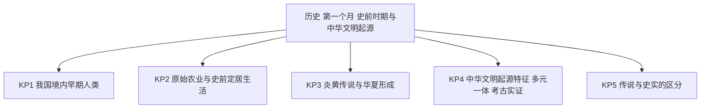
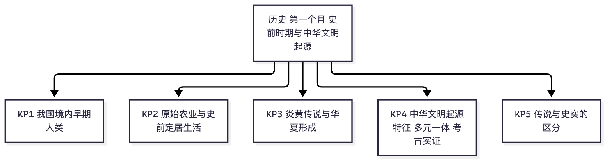

# 历史·七年级上学期第一个月自我检测（教师版）

> 适用：湖南省初一上学期第 1 个月（2026 年 9 月）｜ 满分 100 分 ｜ 建议用时 40 分钟
> 教材对照：统编 2024 版七年级上册第一单元"史前时期：原始社会与中华文明的起源"（第 1 课 远古时期的人类活动；第 2 课 原始农业与史前社会；第 3 课 中华文明的起源）；使用其他版本教材的学校对照本单元三课课题。以学校实际用书与进度为准。
> 教师版含答案解析、双向细目表（评价接口）与知识框架图；学生用 学生版，家庭用 家长版。

## 一、本月学什么（教学范围）

本月为统编 2024 版七年级上册第一单元"史前时期：原始社会与中华文明的起源"，共 3 课：第 1 课 远古时期的人类活动（元谋人、北京人、山顶洞人）；第 2 课 原始农业与史前社会（河姆渡居民、半坡居民与原始农业的兴起）；第 3 课 中华文明的起源（良渚古城等考古实证、炎黄传说与华夏形成）。全卷只考本单元，不涉及夏商周及以后内容。
全卷围绕 5 个知识点（KP1~KP5）设计，与双向细目表、知识框架图一致。

| 周次 | 教学进度（第一单元） | 对应考点 |
|---|---|---|
| 第 1 周 | 第 1 课 远古时期的人类活动 | 元谋人、北京人、山顶洞人（KP1） |
| 第 2 周 | 第 2 课 原始农业与史前社会（河姆渡部分） | 河姆渡居民与稻作农业（KP2） |
| 第 3 周 | 第 2 课（半坡部分、原始农业的意义）+ 第 3 课开篇 | 半坡居民、原始农业、良渚古城（KP2、KP4） |
| 第 4 周 | 第 3 课 中华文明的起源 | 炎黄传说、华夏形成、文明起源特征（KP3、KP4、KP5） |

进度差异说明：若学校进度较慢、第 3 课尚未讲完，第 11~17、19、20 题与第 22 题可跳过（共 47 分），只做其余 12 题（满分 53 分），等级换算 = 实际得分 ÷ 53 × 100，再对照学生版等级表；若已讲完三课（本月正常进度），全卷作答。

## 二、试卷

### 一、选择题（本题 20 小题，每小题 3 分，共 60 分。在每小题给出的四个选项中，只有一项是符合题目要求的。）

1. 我国境内目前已知最早的古人类之一，是距今约 170 万年的元谋人。元谋人遗址位于今天的（3分）
A. 北京市周口店
B. 陕西省西安市
C. 云南省元谋县
D. 浙江省余姚市

2. 下列关于北京人的叙述，正确的是（3分）
A. 使用打制石器
B. 已经种植水稻
C. 会建造干栏式房屋
D. 普遍使用磨制石器

3. 在北京人遗址（距今约 70 万~20 万年）中，考古学家发现了厚厚的灰烬层。这说明北京人（3分）
A. 已经会烧制陶器
B. 已经开始种植农作物
C. 已经掌握人工取火技术
D. 已经会使用天然火并会保存火种

4. 山顶洞人遗址出土了一枚骨针，针眼很小。这说明山顶洞人（3分）
A. 已经掌握磨光和钻孔技术
B. 完全不会制作工具
C. 已经学会种植水稻
D. 已经住上干栏式房屋

5. 距今约 7000 年，生活在长江流域、住干栏式房屋、种植水稻的原始居民是（3分）
A. 半坡居民
B. 河姆渡居民
C. 北京人
D. 山顶洞人

6. 半坡居民生活在黄河流域。他们种植的主要粮食作物是（3分）
A. 水稻
B. 小麦
C. 粟
D. 大豆

7. 河姆渡居民的干栏式房屋，人住在上面，下面架空。这种建筑方式主要是为了（3分）
A. 防潮通风，适应长江流域温暖湿润的气候
B. 让屋里冬暖夏凉，适应北方气候
C. 节省木材
D. 方便随时搬迁

8. 半坡居民的半地穴式房屋，一半在地下。这种房屋主要是为了适应（3分）
A. 长江流域潮湿闷热的气候
B. 河网密布的水乡环境
C. 黄河流域寒冷干燥的气候
D. 山地崎岖的地形

9. 原始农业兴起和发展的重要标志是（3分）
A. 打制石器的广泛使用
B. 采集和狩猎仍是唯一食物来源
C. 居无定所、经常迁徙
D. 农作物种植、家畜饲养的出现以及聚落、磨制石器的发展

10. 在河姆渡遗址和半坡遗址中，考古学家分别出土的农作物应该是（3分）
A. 粟、水稻
B. 水稻、粟
C. 水稻、玉米
D. 粟、小麦

11. 传说中，教人们开垦耕种、种植五谷，被后世尊为"神农氏"的是（3分）
A. 黄帝
B. 蚩尤
C. 仓颉
D. 炎帝

12. 相传建造宫室、制作衣裳、挖掘水井、制造船只，为后世衣食住行奠定基础的传说人物是（3分）
A. 炎帝
B. 蚩尤
C. 黄帝
D. 仓颉

13. 海内外华人常自豪地自称"炎黄子孙"。这一称呼直接来源于（3分）
A. 炎帝、黄帝部落结成联盟并逐渐形成华夏族的传说
B. 河姆渡人最早住进干栏式房屋的传说
C. 仓颉发明文字的传说
D. 北京人保存火种的传说

14. 下列各项中，不属于传说中黄帝发明创造的是（3分）
A. 建造宫室
B. 挖掘水井
C. 制作衣裳
D. 尝遍百草、为民找药

15. 良渚古城遗址位于长江下游，距今约 5300~4300 年。考古发现证实，良渚古城所在的地区当时（3分）
A. 还没有出现农业生产
B. 已经出现早期国家，进入文明社会
C. 居民仍住在天然山洞里
D. 是黄河流域的中心城市

16. 良渚古城的贵族墓葬与平民墓葬，随葬品差别悬殊。这说明当时（3分）
A. 社会已经出现明显的阶级分化
B. 贫富差别还没有出现
C. 居民刚学会打制石器
D. 还没有出现农业

17. 中华文明的起源具有"多元一体"的特征。其中"多元"指的是（3分）
A. 中华文明由多个国家共同创造
B. 一个民族使用多种语言文字
C. 史前文化起源有多个中心，如黄河流域、长江流域，各具特色
D. 一年之中有多个重要节日

18. 下列材料中，属于考古发现（实物证据）的是（3分）
A. 神农尝百草的故事
B. 河姆渡遗址出土的骨耜
C. 老人讲述的远古传说
D. 纪录片复原的原始村落画面

19. 对于炎帝、黄帝这样的远古传说，下列认识正确的是（3分）
A. 传说毫无价值，应当全部抛弃
B. 传说蕴含一定的历史信息，但需要考古发现来印证
C. 传说代代相传，都可直接当作史实
D. 传说情节越精彩，可信度就越高

20. 某考古队在长江下游发掘出一处距今约 5000 年的遗址：有古城墙、宫殿基址、大片炭化稻谷和成组玉器。要论证"这里已出现早期国家、进入文明社会"，最有力的依据是（3分）
A. 上述考古实证
B. 当地流传的民歌
C. 一位游客的大胆想象
D. 网络论坛上的争论

### 二、材料解析题（本题 2 小题，共 40 分。阅读材料，结合所学知识回答问题。）

21. 阅读下列材料，回答问题。（20分）

材料一 距今约 7000 年的河姆渡遗址位于长江中下游地区。这里的房屋先打入木桩作地基，上面架设木板、搭建房间，人住在上层，下面架空，可以堆放杂物。遗址中出土了大量人工栽培水稻的谷壳、稻秆，还有翻土用的骨耜。

材料二 距今约 6000 年的半坡遗址位于黄河流域。这里的房屋一半挖进地下，以坑壁作墙壁，屋顶用草泥搭盖，屋里还有取暖的火塘。遗址中发现了成堆的粟粒和储存粮食的窖穴，以及绘有鱼纹等图案的彩陶。

（1）根据材料一，写出河姆渡居民房屋的样式和他们种植的农作物，并指出河姆渡遗址所在的流域。（6分）
（2）根据材料二，写出半坡居民房屋的样式和他们种植的主要粮食作物，并指出半坡遗址所在的流域。（6分）
（3）对比两则材料并结合所学知识，说说我国史前居民的生产生活与自然环境之间有什么关系？（8分）

22. 阅读下列材料，回答问题。（20分）

材料一 相传，距今约四五千年，炎帝部落和黄帝部落生活在黄河流域。炎帝教人们开垦耕种、亲尝百草为人找药；黄帝建造宫室、制作衣裳、挖掘水井。两大部落联合击败蚩尤后结成联盟，逐渐形成华夏族，后人尊崇炎帝和黄帝为人文初祖。

材料二 良渚古城遗址（距今约 5300~4300 年）位于长江下游，有规模宏大的城址、复杂的水利系统，出土了大量精美玉器，贵族墓葬与平民墓葬的随葬品差别明显。考古发现证实，距今约 5000 年，长江下游地区已经出现早期国家，进入了文明社会。

（1）材料一讲述的内容属于传说还是考古发现？这类材料对认识远古历史有什么价值？（6分）
（2）材料二属于哪一类史料？它对认识中华文明的起源有什么作用？（6分）
（3）综合两则材料并结合所学知识，指出中华文明起源具有的特征，并说说我们应当怎样对待传说与考古发现。（8分）

## 三、参考答案与解析

### 答案速查
```
1. C
2. A
3. D
4. A
5. B
6. C
7. A
8. C
9. D
10. B
11. D
12. C
13. A
14. D
15. B
16. A
17. C
18. B
19. B
20. A
21. 见解析
22. 见解析
```

### 逐题解析

**选择题（每小题 3 分，给判错点各一句）**

1. **C**　元谋人（距今约 170 万年）遗址在云南省元谋县，是我国境内已知最早的古人类之一。排除：A 周口店是北京人、山顶洞人遗址；B 西安是半坡遗址所在地；D 余姚是河姆渡遗址所在地。
2. **A**　北京人使用打制石器，属旧石器时代。排除：B 水稻是河姆渡居民种植的；C 干栏式房屋是河姆渡居民建造的；D 磨制石器到半坡、河姆渡所处的新石器时代才普遍使用。
3. **D**　灰烬层说明北京人已会使用天然火并能保存火种。排除：C 人工取火是山顶洞人可能已掌握的技术，北京人尚未掌握；A 陶器是新石器时代才出现的；B 北京人不会种植农作物。
4. **A**　针眼很小的骨针说明山顶洞人已掌握磨光和钻孔技术（可用骨针缝制衣物）。排除：B 与事实相反，骨针本身就是制作工具的证据；C、D 都是河姆渡居民的成就。
5. **B**　河姆渡居民的四大特征：约 7000 年前、长江流域、干栏式房屋、水稻。排除：A 半坡居民在黄河流域、住半地穴式房屋、种粟；C、D 是旧石器时代人类，不会农耕建房。
6. **C**　半坡居民种粟（小米）。排除：A 水稻是河姆渡居民（长江流域）种植的；B、D 均非半坡居民培育的主要粮食作物。
7. **A**　干栏式房屋通风防潮，适应长江流域温暖湿润的气候。排除：B "冬暖夏凉"是半坡半地穴式房屋的特点，属张冠李戴；C 干栏式建筑用木较多，并不省材；D 河姆渡人已定居，无需搬迁。
8. **C**　半地穴式房屋一半在地下，冬暖夏凉，适应黄河流域寒冷干燥的气候。排除：A、B 是长江流域的环境特点；D 与半坡所在的平原地形不符。
9. **D**　农作物种植、家畜饲养的出现以及聚落、磨制石器的发展，是原始农业兴起和发展的重要标志。排除：A、B、C 恰是原始农业出现之前的状态，方向相反。
10. **B**　河姆渡种水稻、半坡种粟。排除：A 将两者对调；C 玉米、D 小麦均非这两种先民培育的作物。
11. **D**　炎帝教民开垦耕种、种植五谷，故被尊为"神农氏"。排除：A 黄帝的传说是宫室、衣裳、水井、船只；B 蚩尤是被击败的部落首领；C 仓颉的传说是发明文字。
12. **C**　传说中黄帝建造宫室、制作衣裳、挖掘水井、制造船只，为后世衣食住行奠定基础。排除：A 炎帝的贡献侧重农耕与医药；B 蚩尤无此类传说；D 仓颉的传说是造字。
13. **A**　"炎黄子孙"直接来源于炎帝、黄帝部落结成联盟并逐渐形成华夏族的传说。排除：B 干栏式房屋是河姆渡人住的，张冠李戴；C、D 与这一称呼无直接关系。
14. **D**　"尝遍百草、为民找药"是炎帝（神农氏）的传说，不属于黄帝。排除：A、B、C 恰是传说中黄帝的贡献，本题为选非题。
15. **B**　良渚考古实证：距今约 5000 年，长江下游地区已经出现早期国家，进入文明社会。排除：A 良渚稻作农业发达；C 良渚建有宏大古城，不住山洞；D 良渚在长江流域，不在黄河流域。
16. **A**　墓葬随葬品差别悬殊，说明当时社会已出现明显的阶级分化。排除：B 与材料信息相反；C 良渚属新石器时代，磨制石器早已使用；D 良渚有炭化稻谷，农业发达。
17. **C**　"多元"指史前文化起源有多个中心（黄河流域、长江流域等），各具特色。排除：A "多个国家"曲解了概念；B 语言文字与文明起源中心无关；D 节日与文明起源无关。
18. **B**　骨耜是从遗址出土的实物，属考古发现。排除：A、C 都是口耳相传的故事传说；D 是现代人的复原创作，不是当时的遗存。
19. **B**　传说蕴含一定的历史信息，但需要考古发现来印证——既不抹杀传说的价值，也不把传说直接当史实。排除：A 全盘否定传说的价值；C、D 都把传说直接等同于史实。
20. **A**　论证历史结论最有力的依据是考古实证本身（第一手证据）。排除：B、C、D 都不是第一手证据，无法证明"早期国家"的存在。

**材料解析题（示例答案 + 采分点分步分）**

21.（20 分）
（1）房屋样式：干栏式房屋（2 分）；农作物：水稻（2 分）；流域：长江流域（2 分）。
（2）房屋样式：半地穴式房屋（2 分）；主要粮食作物：粟（2 分）；流域：黄河流域（2 分）。
（3）示例答案：长江流域温暖湿润、河网密布，所以河姆渡人住通风防潮的干栏式房屋、种喜水的水稻；黄河流域冬季寒冷干燥，所以半坡人住保暖的半地穴式房屋、种耐旱的粟（4 分，两个流域各 2 分）。这说明史前居民能够因地制宜，让房屋样式和种植的作物与当地自然环境相适应（2 分）；生产发展使人们过上定居生活，促进了原始农业的兴起（2 分）。

22.（20 分）
（1）属于传说（2 分）。价值：传说中蕴含着一定的历史信息（2 分）；传说可以与考古发现相互印证，帮助我们从侧面了解还没有文字记载的远古历史（2 分）。
（2）属于考古发现（实物史料）（2 分）。作用：考古实证能直接证实当时的历史，是最可靠的依据（2 分）；良渚的考古发现证实了距今约 5000 年长江下游地区已经出现早期国家、进入文明社会（2 分）。
（3）特征：中华文明的起源具有"多元一体"的特征——黄河流域（炎黄传说）、长江流域（良渚古城）等多个中心各具特色，又逐渐交流融合，汇成一体（4 分：点出"多元一体"2 分，展开"多中心、相交融"2 分）。态度：传说不能直接当作史实，要用考古发现加以印证（2 分）；同时珍视传说中蕴含的历史信息，把传说与考古证据结合起来认识中华文明的起源（2 分）。

## 四、评价接口（双向细目表）

| 题号 | 分值 | 知识点 | 课标锚点（2022版·内容要求摘句） | 难度 | 大纲匹配 |
|---|---|---|---|---|---|
| 1 | 3 | KP1 我国境内早期人类 | 了解元谋人、北京人、山顶洞人等旧石器时代的人类及其文化遗存 | 易 | 强 |
| 2 | 3 | KP1 我国境内早期人类 | 了解元谋人、北京人、山顶洞人等旧石器时代的人类及其文化遗存 | 易 | 强 |
| 3 | 3 | KP1 我国境内早期人类 | 了解元谋人、北京人、山顶洞人等旧石器时代的人类及其文化遗存 | 易 | 强 |
| 4 | 3 | KP1 我国境内早期人类 | 了解元谋人、北京人、山顶洞人等旧石器时代的人类及其文化遗存 | 中 | 中 |
| 5 | 3 | KP2 原始农业与史前定居生活 | 通过河姆渡、半坡等新石器时代文化遗存，知道原始农业的兴起及其重要意义 | 易 | 强 |
| 6 | 3 | KP2 原始农业与史前定居生活 | 通过河姆渡、半坡等新石器时代文化遗存，知道原始农业的兴起及其重要意义 | 易 | 强 |
| 7 | 3 | KP2 原始农业与史前定居生活 | 通过河姆渡、半坡等新石器时代文化遗存，知道原始农业的兴起及其重要意义 | 中 | 中 |
| 8 | 3 | KP2 原始农业与史前定居生活 | 通过河姆渡、半坡等新石器时代文化遗存，知道原始农业的兴起及其重要意义 | 易 | 强 |
| 9 | 3 | KP2 原始农业与史前定居生活 | 通过河姆渡、半坡等新石器时代文化遗存，知道原始农业的兴起及其重要意义 | 中 | 中 |
| 10 | 3 | KP2 原始农业与史前定居生活 | 通过河姆渡、半坡等新石器时代文化遗存，知道原始农业的兴起及其重要意义 | 易 | 强 |
| 11 | 3 | KP3 炎黄传说与华夏形成 | 通过古代文献中记述的炎帝、黄帝等传说，了解人文初祖与华夏族的形成 | 易 | 强 |
| 12 | 3 | KP3 炎黄传说与华夏形成 | 通过古代文献中记述的炎帝、黄帝等传说，了解人文初祖与华夏族的形成 | 易 | 强 |
| 13 | 3 | KP3 炎黄传说与华夏形成 | 通过古代文献中记述的炎帝、黄帝等传说，了解人文初祖与华夏族的形成 | 中 | 中 |
| 14 | 3 | KP3 炎黄传说与华夏形成 | 通过古代文献中记述的炎帝、黄帝等传说，了解人文初祖与华夏族的形成 | 易 | 强 |
| 15 | 3 | KP4 中华文明起源特征（多元一体·考古实证） | 通过良渚古城等考古发现，知道中华文明起源具有多元一体的特征 | 中 | 中 |
| 16 | 3 | KP4 中华文明起源特征（多元一体·考古实证） | 通过良渚古城等考古发现，知道中华文明起源具有多元一体的特征 | 中 | 中 |
| 17 | 3 | KP4 中华文明起源特征（多元一体·考古实证） | 通过良渚古城等考古发现，知道中华文明起源具有多元一体的特征 | 易 | 强 |
| 18 | 3 | KP5 传说与史实的区分 | 结合考古发现与文献传说，了解传说与史实的区别，知道考古发现是了解史前历史的重要依据 | 易 | 强 |
| 19 | 3 | KP5 传说与史实的区分 | 结合考古发现与文献传说，了解传说与史实的区别，知道考古发现是了解史前历史的重要依据 | 较难 | 中 |
| 20 | 3 | KP5 传说与史实的区分 | 结合考古发现与文献传说，了解传说与史实的区别，知道考古发现是了解史前历史的重要依据 | 较难 | 拓展 |
| 21 | 20 | KP2 原始农业与史前定居生活 | 通过河姆渡、半坡等新石器时代文化遗存，知道原始农业的兴起及其重要意义 | 中 | 中 |
| 22 | 20 | KP5 传说与史实的区分 | 结合考古发现与文献传说，了解传说与史实的区别 | 较难 | 拓展 |

```json
{
  "subject": "历史",
  "duration_min": 40,
  "total_score": 100,
  "items": [
    {"no": 1, "score": 3, "kp": "KP1", "difficulty": "易", "match": "强"},
    {"no": 2, "score": 3, "kp": "KP1", "difficulty": "易", "match": "强"},
    {"no": 3, "score": 3, "kp": "KP1", "difficulty": "易", "match": "强"},
    {"no": 4, "score": 3, "kp": "KP1", "difficulty": "中", "match": "中"},
    {"no": 5, "score": 3, "kp": "KP2", "difficulty": "易", "match": "强"},
    {"no": 6, "score": 3, "kp": "KP2", "difficulty": "易", "match": "强"},
    {"no": 7, "score": 3, "kp": "KP2", "difficulty": "中", "match": "中"},
    {"no": 8, "score": 3, "kp": "KP2", "difficulty": "易", "match": "强"},
    {"no": 9, "score": 3, "kp": "KP2", "difficulty": "中", "match": "中"},
    {"no": 10, "score": 3, "kp": "KP2", "difficulty": "易", "match": "强"},
    {"no": 11, "score": 3, "kp": "KP3", "difficulty": "易", "match": "强"},
    {"no": 12, "score": 3, "kp": "KP3", "difficulty": "易", "match": "强"},
    {"no": 13, "score": 3, "kp": "KP3", "difficulty": "中", "match": "中"},
    {"no": 14, "score": 3, "kp": "KP3", "difficulty": "易", "match": "强"},
    {"no": 15, "score": 3, "kp": "KP4", "difficulty": "中", "match": "中"},
    {"no": 16, "score": 3, "kp": "KP4", "difficulty": "中", "match": "中"},
    {"no": 17, "score": 3, "kp": "KP4", "difficulty": "易", "match": "强"},
    {"no": 18, "score": 3, "kp": "KP5", "difficulty": "易", "match": "强"},
    {"no": 19, "score": 3, "kp": "KP5", "difficulty": "较难", "match": "中"},
    {"no": 20, "score": 3, "kp": "KP5", "difficulty": "较难", "match": "拓展"},
    {"no": 21, "score": 20, "kp": "KP2", "difficulty": "中", "match": "中"},
    {"no": 22, "score": 20, "kp": "KP5", "difficulty": "较难", "match": "拓展"}
  ]
}
```

## 五、知识体系框架图



（查看器不渲染 mermaid 时看上方 PNG。）

---
*AI 辅助生成，内容仅供参考，请以教材与老师要求为准；使用前请教师/家长抽查核对。hunan-g7-learn / month1-selfcheck · 2026-09*
