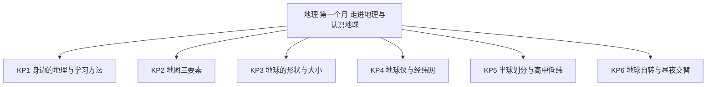
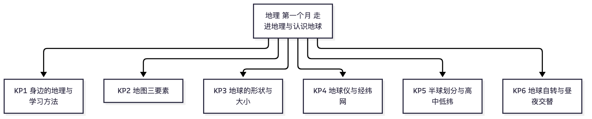

# 地理·七年级上学期第一个月自我检测（教师版）

> 适用：湖南省初一上学期第 1 个月（2026 年 9 月）｜ 满分 100 分 ｜ 建议用时 40 分钟
> 教材对照：湘教版第一章"让我们走进地理"＋第二章"认识地球"前半（地球的形状与大小、地球仪与经纬网）；人教版第一章"地球"（宇宙环境、地球与地球仪）。以学校实际用书与进度为准。
> 教师版含答案解析、双向细目表（评价接口）与知识框架图；学生用 学生版，家庭用 家长版。

## 一、本月学什么（教学范围）

本月是初中地理的起始月。湘教版学第一章"让我们走进地理"和第二章"认识地球"前半；人教版学第一章"地球"（宇宙环境、地球与地球仪）。两版本月共同考点是课标"地理工具与地理实践"：身边的地理与学习方法、地图三要素、地球的形状与大小、地球仪与经纬网、半球划分与高、中、低纬（五带只考名称与分界）。"地球自转与昼夜交替"在两版教材中编排位置不一，属进度差异内容，进度慢的学校可能 10 月才讲。

| 周次 | 学习内容 | 对应知识点 | 本卷题号 |
|---|---|---|---|
| 第 1 周 | 走进地理：身边的地理现象、怎样学地理 | KP1 | 1、2 |
| 第 2 周 | 地图三要素：比例尺、方向、图例与注记 | KP2 | 3、4、5 |
| 第 3 周 | 地球的形状与大小、地球仪、经线与纬线、经纬度 | KP3、KP4 | 6~14、22 |
| 第 4 周 | 半球划分、低中高纬与五带名称；（地球的自转与昼夜交替——进度差异项） | KP5、KP6 | 15~21 |

**进度差异说明**：若学校尚未讲到"地球的自转"（湘教第二章相应节 / 人教第一章第三节"地球的运动"），第 18 题（3 分）与第 22 题第(3)小问（7 分）可跳过，共 10 分；等级按已做题换算：折算分 = 实际得分 ÷ 90 × 100，再对照等级表（77 分及以上为优，63~76 为良，54~62 为合格，54 以下为待加强）。

## 二、试卷

### 一、选择题（本题 20 小题，共 60 分）

1. 下列四位同学的日记中，内容与地理知识直接相关的一项是（　　）
A. 小湘：今天我用方程解出了一道数学难题。
B. 小沙：天气预报说明天长沙有雨，出门要记得带伞。
C. 小岭：我今天又记住了十个英语单词。
D. 小麓：这首古诗我已经能完整背诵了。（3分）

2. 学习地理要讲究方法。下列做法中，最值得提倡的一项是（　　）
A. 把所有地名和物产都背下来，不做观察。
B. 只做练习题，不阅读课本。
C. 从不看地图，全靠想象。
D. 结合生活观察学地理，比如连续观察校园里一天中影子方向的变化。（3分）

3. 小明想在地图上找到长沙市内岳麓山的具体位置。手头有两幅图幅大小相同的地图：①长沙市交通旅游图，②湖南省政区图。他应该选用哪一幅？理由是什么？（　　）
A. 选①，因为①的比例尺较大，表示的内容更详细。
B. 选②，因为②的比例尺较大，表示的范围更大。
C. 选①，因为①的比例尺较小，表示的范围较大。
D. 选②，因为②的比例尺较小，表示的内容更详细。（3分）

4. 在一幅按"上北下南、左西右东"绘制的校园平面图上，教学楼画在操场的正下方。教学楼位于操场的（　　）方向。
A. 正北
B. 正东
C. 正南
D. 正西（3分）

5. 关于地图三要素（比例尺、方向、图例和注记），下列说法正确的是（　　）
A. 比例尺表示图上距离比实地距离缩小的程度。
B. 地图上的指向标一般指向正南方向。
C. 图例是地图上表示地理事物的文字和数字。
D. 注记是地图上表示各种地理事物的符号。（3分）

6. 下列现象中，不能说明地球是球体的一项是（　　）
A. 麦哲伦船队一直向西航行，最终回到了出发地。
B. 站得越高，看到的地面范围越大。
C. 月食时，地球投在月亮上的影子边缘总是圆弧形。
D. 太阳每天从东边升起、西边落下。（3分）

7. 1519—1522 年，麦哲伦船队从西班牙出发，大致朝一个方向航行，穿越大西洋、太平洋和印度洋，最终回到出发地，第一次用实践证明了地球是球体。他们大致的航行方向是（　　）
A. 一直向东
B. 一直向西
C. 一直向北
D. 一直向南（3分）

8. 关于地球的大小，下列说法正确的是（　　）
A. 地球的平均半径约 6371 千米。
B. 地球的平均半径约 4 万千米。
C. 地球的赤道周长约 5.1 亿千米。
D. 地球的表面积约 6371 平方千米。（3分）

9. 在海边观察远处驶来的帆船，总是先看到桅杆（船帆的顶端），再看到船身。这一现象说明（　　）
A. 海水是流动的。
B. 桅杆会自动长高。
C. 地球的表面是曲面，地球是一个球体。
D. 帆船开得特别快。（3分）

10. 关于经线和纬线，下列说法正确的是（　　）
A. 经线指示南北方向。
B. 经线指示东西方向。
C. 纬线指示南北方向。
D. 经线的长度从赤道向两极逐渐缩短。（3分）

11. 关于纬线的特点，下列说法正确的是（　　）
A. 纬线都是半圆。
B. 纬线圈的长度从赤道向两极逐渐缩短。
C. 所有纬线圈的长度都相等。
D. 纬线指示南北方向。（3分）

12. 本初子午线是指（　　）
A. 0° 纬线（赤道）。
B. 180° 经线。
C. 0° 经线。
D. 20°W 经线。（3分）

13. 关于经度和纬度的划分，下列说法正确的是（　　）
A. 从本初子午线（0° 经线）向东、向西各分成 180°，0° 经线以东为东经（E），以西为西经（W）。
B. 赤道以北为南纬（S），赤道以南为北纬（N）。
C. 东经的度数越往东越大，最大可以到 360°。
D. 北纬的度数越往北越小。（3分）

14. 已知某地位于（40°N，90°E）。下列判断正确的是（　　）
A. 该地位于南半球、东半球。
B. 该地位于南半球、西半球。
C. 该地位于北半球、东半球。
D. 该地位于北半球、西半球。（3分）

15. 长沙市的经纬度约为（28°N，113°E）。关于长沙市的位置，下列判断完全正确的一项是（　　）
A. 北半球、西半球、低纬度。
B. 北半球、东半球、低纬度。
C. 南半球、东半球、中纬度。
D. 北半球、东半球、高纬度。（3分）

16. 南北半球的分界线是（　　）
A. 赤道（0° 纬线）。
B. 本初子午线（0° 经线）。
C. 20°W 经线。
D. 160°E 经线。（3分）

17. 东西半球的分界线是（　　）
A. 0° 经线和 180° 经线组成的经线圈。
B. 赤道。
C. 北极圈和南极圈。
D. 20°W 和 160°E 组成的经线圈。（3分）

18.（选学）关于地球的自转，下列说法正确的是（　　）
A. 地球自转的方向是自西向东，产生了昼夜交替现象。
B. 地球自转的方向是自东向西，产生了四季变化。
C. 地球自转的方向是自西向东，产生了四季变化。
D. 地球自转的方向是自东向西，产生了昼夜交替现象。（3分）

19. 下列四个地点中，位于高纬度的是（　　）
A. （20°S，100°W）
B. （70°N，40°E）
C. （45°N，120°E）
D. （10°N，50°W）（3分）

20. 地球表面划分为热带、北温带、南温带、北寒带、南寒带五个温度带。其中热带与北温带的分界线是（　　）
A. 赤道。
B. 北极圈。
C. 北回归线。
D. 南极圈。（3分）

### 二、综合题（本题 2 小题，共 40 分）

21. 经纬网定位。（20分）
本大题不需要看图，直接根据文字坐标判断。坐标写法：（纬度，经度）；N 表示北纬、S 表示南纬，E 表示东经、W 表示西经。
已知四个地点：A 地（20°N，110°E），大约在海南岛附近；B 地（40°S，60°W）；C 地（40°N，170°E）；D 地（0°，30°E）。
(1) 按南北半球划分，请把四个地点归类：位于北半球的地点有＿＿＿；位于南半球的地点有＿＿＿；位于南北半球分界线（赤道）上的地点有＿＿＿。（6分）
(2) 按东西半球划分：A、B、C 三地各位于东半球还是西半球？并写出东西半球的分界线。（7分）
(3) 按高、中、低纬度划分：位于低纬度的地点有＿＿＿；位于中纬度的地点有＿＿＿。（4分）小畅家住在长沙市（约 28°N，113°E）：长沙属于＿＿＿纬度带、＿＿＿半球（南北）、＿＿＿半球（东西）。（3分）

22. 地球的形状与生活应用。（20分）
(1) 人类认识地球形状的过程经历了漫长的岁月。请把下面四个证据按人类认识的先后顺序排列（只写序号），并指出其中最直观、最能直接证明地球是一个球体的证据。（6分）
① 麦哲伦船队环球航行成功
② 人造卫星拍摄的地球照片
③ 古人凭直觉提出"天圆如张盖，地方如棋局"
④ 月食时，地球投在月亮上的影子总是圆弧形
正确顺序：＿＿→＿＿→＿＿→＿＿；最直观、最科学的证据是：＿＿。
(2) 毛泽东有诗句"坐地日行八万里，巡天遥看一千河"。（提示：1 千米 = 2 里）（7分）
① 诗中的"八万里"大约合多少千米？（2分）
② "坐地日行"说的是人随地球自转，一天正好绕地球一圈。要"日行八万里"，人应坐在地球的哪条纬线上？（2分）
③ 这条纬线的周长约是多少千米？它的长度与地球上其他纬线圈相比有什么特点？（3分）
(3)（选学）地球的自转与我们的生活息息相关。（7分）
① 白天和黑夜总是不断地交替出现，这与地球的哪种运动有关？（2分）
② 地球这种运动的方向是怎样的？（2分）
③ 地球自转一周大约需要多长时间？（3分）

## 三、参考答案与解析

### 答案速查

```
1. B
2. D
3. A
4. C
5. A
6. D
7. B
8. A
9. C
10. A
11. B
12. C
13. A
14. C
15. B
16. A
17. D
18. A
19. B
20. C
21. 见解析
22. 见解析
```

### 逐题解析

1. **B**。天气、气候是典型的地理问题，看天气预报安排出行正是"生活中的地理"；A、C、D 分别是数学、英语、语文的内容。
2. **D**。学地理的好方法：联系生活、实地观察、多看地图、多问"为什么"；A 死记硬背、B 脱离课本、C 不用地图，都是低效方法。
3. **A**。图幅相同时，范围越小的地图比例尺越大、内容越详细：找一座山的具体位置，要选大比例尺的长沙市交通旅游图；B、C、D 把比例尺大小与范围、详略的对应关系说反了。
4. **C**。按"上北下南、左西右东"，平面图上"正下方"就是正南方向，教学楼在操场正南。
5. **A**。比例尺 = 图上距离 ÷ 实地距离，表示缩小的程度；指向标指向正北（B 错）；图例是符号、注记是文字和数字（C、D 恰好说反）。
6. **D**。太阳东升西落是地球自转产生的现象，即使地面是平的也会有，因此不能证明地球是球体；A、B、C 都是球体的经典证据。
7. **B**。麦哲伦船队 1519 年从西班牙出发，大致一直向西航行，1522 年回到出发地，用实践证明了地球是球体。
8. **A**。三个数据配对记忆：平均半径约 6371 千米；赤道周长约 4 万千米；表面积约 5.1 亿平方千米。B 用了周长的数，C 用了表面积的数还改了单位，D 用了半径的数还改了单位。
9. **C**。远处驶来的帆船先露桅杆、后露船身，说明海面是曲面，地球是球体；A、B、D 与证明形状无关。
10. **A**。经线连接南北两极，指示南北方向，所有经线长度相等；B、C 方向说反；D 是纬线的长度变化规律。
11. **B**。纬线是圆圈（不是半圆，A 错），长度从赤道向两极逐渐缩短；所有纬线并不等长（C 错）；纬线指示东西方向（D 错）。
12. **C**。本初子午线就是 0° 经线，是东西经度的分界和起点；赤道是 0° 纬线；180° 经线大致与日界线重合；20°W 是东西半球分界线之一。
13. **A**。以 0° 经线为界，以东为东经（E）、以西为西经（W），各到 180°；B 把南北纬说反；C 经度最大 180°；D 北纬度数越往北越大。
14. **C**。40°N 是北纬，在赤道以北，属北半球；90°E 位于 20°W 向东至 160°E 之间，属东半球。
15. **B**。28°N 在赤道以北属北半球；113°E 在 20°W—160°E 之间属东半球；28° 小于 30°，属低纬度。判错点：凭感觉把 28° 当成中纬度——中纬度从 30° 才开始。
16. **A**。南北半球以赤道（0° 纬线）为界；B、C、D 都是经线，经线只能用来划分东西半球，不能分南北半球。
17. **D**。东西半球的分界线是 20°W 与 160°E 组成的经线圈；不用 0° 和 180° 划分，是为了尽量少把陆地上的国家分在两个半球。判错点：A 是最常见误选。
18. **A**。地球自转方向自西向东，周期约一天，产生昼夜交替；四季变化是地球公转产生的，与自转无关（B、C 错）。
19. **B**。0°~30° 为低纬度，30°~60° 为中纬度，60°~90° 为高纬度：70°N 属高纬度；20°S、10°N 属低纬度；45°N 属中纬度。
20. **C**。热带与北温带的分界线是北回归线；北极圈是北温带与北寒带的分界线；赤道从热带中间穿过，不是温带的界线。
21. 采分点：
    (1) 北半球：A、C（2 分，答对一个给 1 分）；南半球：B（2 分）；赤道上：D（2 分）。判读依据：北纬（N）在赤道以北，南纬（S）在赤道以南，0° 就是赤道本身。
    (2) A 地东半球（2 分）；B 地西半球（2 分）；C 地西半球（2 分）；分界线：20°W 与 160°E 组成的经线圈（1 分）。C 地判读依据：东半球是 20°W 向东到 160°E 的范围，160°E 向东到 20°W 为西半球；170°E 位于 160°E 以东，故属西半球。判错点：见到"E"就判东半球。
    (3) 低纬度：A、D（2 分，答对一个给 1 分）；中纬度：B、C（2 分，答对一个给 1 分）；长沙：低纬度（1 分）、北半球（1 分）、东半球（1 分）。判读依据：0°~30° 低纬、30°~60° 中纬、60°~90° 高纬；长沙 28°N 小于 30° 属低纬度，113°E 属东半球，28°N 属北半球。
22. 采分点：
    (1) 顺序 ③→④→①→②（4 分，全对才给 4 分）；最直观、最科学的证据：②人造卫星拍摄的地球照片（2 分）。排序依据：凭直觉猜想（天圆地方）→ 根据天象推测（月食影子）→ 实践验证（麦哲伦环球航行）→ 直接观测（卫星照片）。
    (2) ① 4 万千米（2 分，8 万里 ÷ 2 = 4 万千米）；② 赤道（0° 纬线）（2 分）；③ 赤道周长约 4 万千米（1 分）；赤道是地球上最大的纬线圈，纬线圈长度从赤道向两极逐渐缩短，所以坐在赤道上随地球转一圈走得最远（2 分）。
    (3) ① 与地球的自转有关（2 分）；② 自西向东（2 分）；③ 约 24 小时，即一天（3 分）。

## 四、评价接口（双向细目表）

| 题号 | 分值 | 知识点 | 课标锚点（2022版·内容要求摘句） | 难度 | 大纲匹配 |
|---|---|---|---|---|---|
| 1 | 3 | KP1 身边的地理与学习方法 | 联系生活实例，感受地理与生活密切相关 | 易 | 强 |
| 2 | 3 | KP1 身边的地理与学习方法 | 学会用观察、读图等方法学习地理 | 易 | 强 |
| 3 | 3 | KP2 地图三要素 | 结合实例，说明比例尺大小与表示范围、内容详略的关系 | 中 | 强 |
| 4 | 3 | KP2 地图三要素 | 在地图上辨别方向 | 易 | 强 |
| 5 | 3 | KP2 地图三要素 | 说明比例尺、方向、图例对阅读和使用地图的重要性 | 易 | 强 |
| 6 | 3 | KP3 地球的形状与大小 | 了解人类认识地球形状的过程 | 中 | 强 |
| 7 | 3 | KP3 地球的形状与大小 | 了解人类认识地球形状的过程 | 易 | 强 |
| 8 | 3 | KP3 地球的形状与大小 | 用平均半径、赤道周长、表面积等数据说明地球的大小 | 易 | 强 |
| 9 | 3 | KP3 地球的形状与大小 | 结合生活现象，说出证明地球形状的证据 | 易 | 强 |
| 10 | 3 | KP4 地球仪与经纬网 | 观察地球仪，比较经线与纬线的特点 | 易 | 强 |
| 11 | 3 | KP4 地球仪与经纬网 | 观察地球仪，比较经线与纬线的特点 | 易 | 强 |
| 12 | 3 | KP4 地球仪与经纬网 | 说出本初子午线与经度的划分 | 易 | 强 |
| 13 | 3 | KP4 地球仪与经纬网 | 说明经度与纬度的划分及表示方法 | 中 | 强 |
| 14 | 3 | KP4 地球仪与经纬网 | 在经纬网上判读某点的半球位置 | 中 | 中 |
| 15 | 3 | KP5 半球划分与高、中、低纬 | 结合家乡位置判读半球与纬度带 | 较难 | 拓展 |
| 16 | 3 | KP5 半球划分与高、中、低纬 | 说出南北半球的划分界线 | 易 | 强 |
| 17 | 3 | KP5 半球划分与高、中、低纬 | 说出东西半球的划分界线 | 中 | 强 |
| 18 | 3 | KP6 地球自转与昼夜交替 | 说出地球自转的方向、周期与昼夜交替现象 | 中 | 强 |
| 19 | 3 | KP5 半球划分与高、中、低纬 | 划分低、中、高纬度并判读某点所属纬度带 | 中 | 中 |
| 20 | 3 | KP5 半球划分与高、中、低纬 | 说出五带的名称与分界线 | 中 | 强 |
| 21 | 20 | KP4 地球仪与经纬网 | 依据经纬度判读位置，判别半球与纬度带 | 较难 | 拓展 |
| 22 | 20 | KP3 地球的形状与大小 | 了解认识地球形状的过程，用数据说明地球大小，说明自转与昼夜交替 | 较难 | 中 |

JSON 接口（与上表逐行一致，供后续 H5/短板评估程序读取）：

```json
{
  "subject": "地理",
  "duration_min": 40,
  "total_score": 100,
  "items": [
    {"no": 1, "score": 3, "kp": "KP1", "difficulty": "易", "match": "强"},
    {"no": 2, "score": 3, "kp": "KP1", "difficulty": "易", "match": "强"},
    {"no": 3, "score": 3, "kp": "KP2", "difficulty": "中", "match": "强"},
    {"no": 4, "score": 3, "kp": "KP2", "difficulty": "易", "match": "强"},
    {"no": 5, "score": 3, "kp": "KP2", "difficulty": "易", "match": "强"},
    {"no": 6, "score": 3, "kp": "KP3", "difficulty": "中", "match": "强"},
    {"no": 7, "score": 3, "kp": "KP3", "difficulty": "易", "match": "强"},
    {"no": 8, "score": 3, "kp": "KP3", "difficulty": "易", "match": "强"},
    {"no": 9, "score": 3, "kp": "KP3", "difficulty": "易", "match": "强"},
    {"no": 10, "score": 3, "kp": "KP4", "difficulty": "易", "match": "强"},
    {"no": 11, "score": 3, "kp": "KP4", "difficulty": "易", "match": "强"},
    {"no": 12, "score": 3, "kp": "KP4", "difficulty": "易", "match": "强"},
    {"no": 13, "score": 3, "kp": "KP4", "difficulty": "中", "match": "强"},
    {"no": 14, "score": 3, "kp": "KP4", "difficulty": "中", "match": "中"},
    {"no": 15, "score": 3, "kp": "KP5", "difficulty": "较难", "match": "拓展"},
    {"no": 16, "score": 3, "kp": "KP5", "difficulty": "易", "match": "强"},
    {"no": 17, "score": 3, "kp": "KP5", "difficulty": "中", "match": "强"},
    {"no": 18, "score": 3, "kp": "KP6", "difficulty": "中", "match": "强"},
    {"no": 19, "score": 3, "kp": "KP5", "difficulty": "中", "match": "中"},
    {"no": 20, "score": 3, "kp": "KP5", "difficulty": "中", "match": "强"},
    {"no": 21, "score": 20, "kp": "KP4", "difficulty": "较难", "match": "拓展"},
    {"no": 22, "score": 20, "kp": "KP3", "difficulty": "较难", "match": "中"}
  ]
}
```

## 五、知识体系框架图




（查看器不渲染 mermaid 时看上方 PNG。）

---
*AI 辅助生成，内容仅供参考，请以教材与老师要求为准；使用前请教师/家长抽查核对。hunan-g7-learn / month1-selfcheck · 2026-09*
