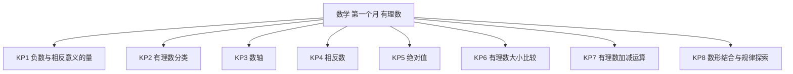
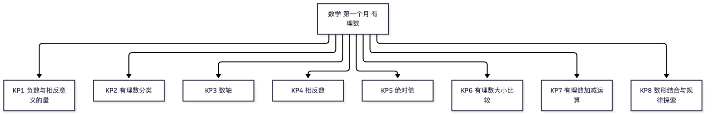

# 数学·七年级上学期第一个月自我检测（教师版）

> 适用：湖南省初一上学期第 1 个月（2026 年 9 月）｜ 满分 100 分 ｜ 建议用时 45 分钟
> 教材对照：湘教版 2024 第 1 章“有理数”（1.1 认识负数 至 1.4 有理数的加法和减法）；人教版 2024 第一章“有理数”+第二章“有理数的运算”（加减法部分）。以学校实际用书与进度为准。
> 教师版含答案解析、双向细目表（评价接口）与知识框架图；学生用 学生版，家庭用 家长版。

## 一、本月学什么（教学范围）

- 本月只考“有理数”前半章：认识负数与相反意义的量、有理数分类、数轴、相反数、绝对值、有理数大小比较、有理数的加法和减法。
- **乘除法与乘方不在本卷范围**：全卷运算只涉及加减法与绝对值化简。
- 加减运算是本月主干：第 16、17、19 题共 24 分直接考；数轴与数形结合（KP3、KP8）贯穿全卷。
- 湖南情境：湘江长沙段水位记录（第 1、2、19 题）等素材全部用文字呈现，题目不依赖任何图片。

### 4 周速览

| 周次 | 教学内容（湘教版 / 人教版对照） | 对应知识点 |
|---|---|---|
| 第 1 周 | 1.1 认识负数 / 1.1 正数和负数 | KP1 负数与相反意义的量 |
| 第 2 周 | 1.2 数轴、相反数与绝对值 / 1.2 有理数（数轴、相反数、绝对值） | KP3 数轴，KP4 相反数，KP5 绝对值 |
| 第 3 周 | 1.3 有理数大小的比较 / 1.3 有理数的大小 | KP2 有理数分类，KP6 有理数大小比较 |
| 第 4 周 | 1.4 有理数的加法和减法 / 第二章 2.1 加法与减法 | KP7 有理数加减运算，KP8 数形结合与规律探索 |

**进度差异说明**：两版本教材本月均只讲到“有理数加减法”。个别学校进度快、已讲到乘除法，相关题可自行加练，但本卷不涉及乘除与乘方，无需跳题；若学校进度较慢、尚未讲到加减法，第 16、17、19 题可暂缓作答，等级按已做题换算（已做题得分 ÷ 已做题满分 × 100 再对照等级表）。

## 二、试卷

### 一、选择题（本题 10 小题，每小题 4 分，共 40 分）

1. 湘江长沙段某日水位比基准水位高出 0.4 米，记作 +0.4 米；另一日比基准水位低 0.3 米，应记作（　　）
   A. +0.3 米　B. -0.3 米　C. +0.4 米　D. -0.4 米（4分）
2. 下列各组量中，不具有相反意义的是（　　）
   A. 收入 200 元与支出 150 元　B. 向东走 5 米与向西走 3 米　C. 水位上升 0.4 米与下降 0.6 米　D. 长沙到株洲 60 千米与跑步锻炼 30 分钟（4分）
3. 在 -3，1/2，-2.5，0，7 这五个数中，负分数有（　　）
   A. 1 个　B. 2 个　C. 3 个　D. 4 个（4分）
4. 下列说法正确的是（　　）
   A. 0 既不是正数，也不是负数，但 0 是整数　B. 一个有理数不是正数就是负数　C. 正数和负数统称有理数　D. 0 是最小的正整数（4分）
5. 下列关于数轴的说法，正确的是（　　）
   A. 任意一条直线都是数轴　B. 数轴上，右边的点表示的数总比左边的点表示的数大　C. 画数轴时，单位长度的大小必须与别的数轴相同　D. 数轴上只能表示正数（4分）
6. 在数轴上，点 P 到表示 -1 的点的距离是 2 个单位长度，且点 P 在原点的右侧，则点 P 表示的数是（　　）
   A. 1　B. -3　C. 1 或 -3　D. 3（4分）
7. -6 的相反数是（　　）
   A. -6　B. 6　C. 1/6　D. -1/6（4分）
8. 下列各对数中，互为相反数的是（　　）
   A. +（-2）与 -2　B. -（-6）与 6　C. -（-7）与 -7　D. -3 与 +（-3）（4分）
9. 一个数的绝对值是 3，这个数是（　　）
   A. 3　B. -3　C. ±3　D. 1/3（4分）
10. 大于 -2 且小于 3 的整数共有（　　）
   A. 4 个　B. 5 个　C. 6 个　D. 7 个（4分）

### 二、填空题（本题 5 小题，每小题 4 分，共 20 分）

11. 在 -0.8，5，-4，2/3，0 中，属于分数的是＿＿＿＿，属于负整数的是＿＿＿＿。（4分）
12. -7 的相反数是＿＿＿＿；相反数等于它本身的数是＿＿＿＿。（4分）
13. 绝对值等于 5 的数是＿＿＿＿；绝对值小于 3 的整数有＿＿＿＿。（4分）
14. 比较大小：-2/3＿＿＿＿-0.7（填“>”“<”或“=”）。（4分）
15. 若 |x-2| + |y+3| = 0，则 x =＿＿＿＿，y =＿＿＿＿。（4分）

### 三、解答题（本题 5 小题，共 40 分）

16. 计算下列各题（每小题 2 分，共 8 分）：
（1）（-3）+（-9）
（2）15+（-22）
（3）0-（-7）
（4）（-8）+6-（-10）

17. 计算下列各题（每小题 4 分，共 8 分）：
（1）（-1/2）+（-1/3）-（-5/6）
（2）（-7）-|-4|+（-6）

18. 已知数轴上点 A 表示 -3，点 B 表示 1，点 C 表示 4。（本题 8 分，每小问 2 分）
（1）画一条数轴，并在数轴上标出点 A、B、C；
（2）用“<”把 -3、1、4 连接起来；
（3）点 A 与点 C 之间的距离是多少个单位长度？
（4）数轴上有一点 D，它表示的数与点 A 表示的数互为相反数：点 D 表示什么数？它到原点的距离是多少个单位长度？

19. 湘江长沙段某水文站以 30 米为基准记录水位：比基准高出记为正，比基准低记为负。9 月 1 日至 9 月 5 日的记录如下表。（本题 8 分，每小问 2 分）

| 日期 | 9月1日 | 9月2日 | 9月3日 | 9月4日 | 9月5日 |
|---|---|---|---|---|---|
| 水位记录（米） | +0.6 | -0.3 | +0.5 | -0.5 | +0.2 |

（1）9 月 2 日的实际水位是多少米？
（2）这 5 天中，哪一天水位最高？哪一天水位最低？
（3）水位最高的一天比最低的一天高多少米？
（4）把 5 天的水位记录相加，和是多少？和为正数，说明这 5 天水位总体比基准高还是低？

20. 电子跳蚤在数轴上跳动：从原点出发，第 1 次向左跳 1 个单位长度，落在表示 -1 的点上；第 2 次向右跳 2 个单位长度，落在表示 1 的点上；第 3 次向左跳 3 个单位长度，落在表示 -2 的点上；第 4 次向右跳 4 个单位长度，落在表示 2 的点上；……按这个规律继续跳下去。（本题 8 分）
（1）第 6 次跳动后，跳蚤落在表示什么数的点上？（2 分）
（2）第 100 次跳动后，跳蚤落在表示什么数的点上？写出你的思考过程。（3 分）
（3）第 2025 次跳动后，跳蚤落在表示什么数的点上？（3 分）

## 三、参考答案与解析

### 答案速查

```
1. B
2. D
3. A
4. A
5. B
6. A
7. B
8. C
9. C
10. A
11. 分数：-0.8、2/3；负整数：-4
12. 7；0
13. ±5；-2、-1、0、1、2
14. >
15. x=2；y=-3
16. 见解析
17. 见解析
18. 见解析
19. 见解析
20. 见解析
```

### 逐题解析

**选择题（每题 4 分）**

**1. B。** 比基准低记为负，低于 0.3 米记作 -0.3 米。判错点：把“低于”误记为正，或照抄题干里的 0.4。

**2. D。** “长沙到株洲的路程”与“跑步的时间”不是同一类量，谈不上相反意义；A 收与支、B 东与西、C 升与降都是相反意义的量。判错点：只看数字不看量的种类。

**3. A。** 五个数中只有 -2.5 是负分数（有限小数是分数）；-3 是负整数，1/2 是正分数，0 和 7 是整数。判错点：不知道有限小数属于分数，或误把 -3 当负分数。

**4. A。** 0 既不是正数也不是负数，但它是整数。B 忘了 0 也是有理数；C 应为“整数和分数统称有理数”；D 最小的正整数是 1。判错点：以为“不是正数就是负数”。

**5. B。** 数轴上右边的点表示的数总比左边的点表示的数大。A 缺“原点、正方向、单位长度”三要素；C 单位长度可以自定；D 负数同样能在数轴上表示。判错点：以为画一条直线就是数轴。

**6. A。** 到 -1 距离为 2 个单位长度的点表示 -3 或 1；又要求点 P 在原点右侧，所以是 1。判错点：没看清“原点右侧”这一条件而选 C。

**7. B。** 只有符号不同的两个数互为相反数，-6 的相反数是 6。判错点：与倒数混淆而选 C。

**8. C。** 先化简再判断：-（-7）= 7，与 -7 互为相反数。A 化简得 -2 与 -2（相等），B 化简得 6 与 6（相等），D 化简得 -3 与 -3（相等）。判错点：双重符号化简出错。

**9. C。** |3| = |-3| = 3，绝对值等于 3 的数是 3 或 -3。判错点：漏掉负数解。

**10. A。** 大于 -2 且小于 3 的整数是 -1、0、1、2，共 4 个。判错点：把端点 -2 或 3 也算进去，或漏掉 0。

**填空题（每题 4 分）**

**11.** 分数：-0.8、2/3；负整数：-4。判错点：忘记有限小数属于分数；把 0 归入正数。

**12.** 7；0。判错点：相反数等于它本身的数只有 0，答“没有”或“任何数”都错。

**13.** ±5；-2、-1、0、1、2。判错点：绝对值等于 5 漏掉 -5；“绝对值小于 3”漏掉 0 或负数。

**14. >。** 2/3 ≈ 0.67 < 0.7；两个负数比大小，绝对值大的反而小，所以 -2/3 > -0.7。判错点：误以为 2/3 > 0.7 而填“<”。

**15.** x = 2，y = -3。绝对值不小于 0，两个非负数相加等于 0，只能每一项都为 0：x-2 = 0 且 y+3 = 0。判错点：想不到“非负数之和为 0，则每一项都为 0”。

**解答题**

**16.**（每小题 2 分）
（1）（-3）+（-9）
同号两数相加，取相同的符号，并把绝对值相加：
3 + 9 = 12
所以（-3）+（-9）= -12

（2）15+（-22）
异号两数相加，取绝对值较大的加数的符号（负），再用较大的绝对值减去较小的绝对值：
22 - 15 = 7
所以 15+（-22）= -7

（3）0-（-7）
减去一个数，等于加上这个数的相反数：
0-（-7）= 0+7
= 7

（4）（-8）+6-（-10）
先化减为加：（-8）+6+10
= [（-8）+6]+10
= -2+10
= 8

**17.**（每小题 4 分）
（1）（-1/2）+（-1/3）-（-5/6）
第一步，化减为加：原式 =（-1/2）+（-1/3）+（+5/6）
第二步，通分（分母统一为 6）：=（-3/6）+（-2/6）+（+5/6）
第三步，从左往右加：=（-5/6）+（+5/6）
第四步，互为相反数相加得 0：= 0

（2）（-7）-|-4|+（-6）
第一步，先算绝对值：|-4| = 4
原式 =（-7）-4+（-6）
第二步，化减为加：=（-7）+（-4）+（-6）
第三步，同号相加：= -（7+4+6）
= -17

**18.**（每小问 2 分）
（1）画图要点：画一条直线，定出原点 O、正方向（向右）、单位长度三要素；从原点向左 3 个单位标点 A，向右 1 个单位标点 B，向右 4 个单位标点 C。画出规范数轴得 1 分，三点位置全对再得 1 分。
（2）-3 < 1 < 4（数轴上右边的数总比左边的大）。全对得 2 分。
（3）点 A 与点 C 之间的距离 = 4-（-3）= 4+3 = 7（个单位长度）。列式正确得 1 分，结果正确得 1 分。
（4）点 A 表示 -3，-3 的相反数是 3，所以点 D 表示 3；点 D 到原点的距离是 |3| = 3（个单位长度）。求出点 D 表示 3 得 1 分，答出距离 3 得 1 分。

**19.**（每小问 2 分）
（1）30+（-0.3）= 29.7（米），9 月 2 日实际水位 29.7 米。列式 1 分，结果 1 分。
（2）记录中 +0.6 最大、-0.5 最小：9 月 1 日水位最高，9 月 4 日水位最低。两天各 1 分。
（3）0.6-（-0.5）= 0.6+0.5 = 1.1（米）。列式 1 分，结果 1 分。
（4）（+0.6）+（-0.3）+（+0.5）+（-0.5）+（+0.2）
按顺序计算：
0.6-0.3 = 0.3
0.3+0.5 = 0.8
0.8-0.5 = 0.3
0.3+0.2 = 0.5
和为 +0.5 米；和为正数，说明这 5 天水位总体比基准高（累计高出 0.5 米）。求和正确 1 分，答出“高于基准”1 分。

**20.**
（1）（2 分）前 6 次跳动的位置：0-1+2-3+4-5+6
=（-1+2）+（-3+4）+（-5+6）
= 1+1+1
= 3
跳蚤落在表示 3 的点上。
（2）（3 分）每两次为一组：向左跳 1 再向右跳 2，每跳完一组，位置向右前进 1 个单位长度。100 次正好是 50 组，共向右 50 个单位长度，落在表示 50 的点上。说出“每两次一组、每组向右 1”得 2 分，结果 50 得 1 分。
（3）（3 分）先看偶数次：第 2 次后落在 1，第 4 次后落在 2，第 6 次后落在 3，即第 n 次偶数跳动后落在表示“次数的一半”的点上。2024 的一半是 1012，所以第 2024 次后落在表示 1012 的点；第 2025 次向左跳 2025 个单位长度：1012-2025 = -1013。落在表示 -1013 的点上。求出中间量 1012 得 1 分，算出 -1013 得 2 分。

## 四、评价接口（双向细目表）

| 题号 | 分值 | 知识点 | 课标锚点（2022版·内容要求摘句） | 难度 | 大纲匹配 |
|---|---|---|---|---|---|
| 1 | 4 | KP1 负数与相反意义的量 | 数与代数：结合具体情境理解负数的意义 | 易 | 强 |
| 2 | 4 | KP1 负数与相反意义的量 | 数与代数：用正负数表示相反意义的量 | 易 | 强 |
| 3 | 4 | KP2 有理数分类 | 数与代数：理解有理数的意义，会按整数与分数分类 | 中 | 强 |
| 4 | 4 | KP2 有理数分类 | 数与代数：理解有理数的意义（0 的归属） | 中 | 强 |
| 5 | 4 | KP3 数轴 | 数与代数：知道数轴三要素，能用数轴上的点表示有理数 | 易 | 强 |
| 6 | 4 | KP3 数轴 | 数与代数：能用数轴上的点表示有理数，体会数形对应 | 中 | 强 |
| 7 | 4 | KP4 相反数 | 数与代数：借助数轴理解相反数的意义 | 易 | 强 |
| 8 | 4 | KP4 相反数 | 数与代数：借助数轴理解相反数的意义，会化简双重符号 | 中 | 中 |
| 9 | 4 | KP5 绝对值 | 数与代数：知道绝对值的意义 | 易 | 强 |
| 10 | 4 | KP6 有理数大小比较 | 数与代数：会比较有理数的大小 | 易 | 中 |
| 11 | 4 | KP2 有理数分类 | 数与代数：理解有理数的意义，会按整数与分数分类 | 易 | 强 |
| 12 | 4 | KP4 相反数 | 数与代数：知道相反数的含义 | 易 | 强 |
| 13 | 4 | KP5 绝对值 | 数与代数：知道绝对值的意义（双解与范围） | 中 | 中 |
| 14 | 4 | KP6 有理数大小比较 | 数与代数：会比较有理数的大小（负分数与负小数） | 中 | 中 |
| 15 | 4 | KP8 数形结合与规律探索 | 数与代数：知道绝对值的意义（非负性综合应用） | 较难 | 拓展 |
| 16 | 8 | KP7 有理数加减运算 | 数与代数：能进行有理数的加减运算 | 易 | 强 |
| 17 | 8 | KP7 有理数加减运算 | 数与代数：能进行有理数的加减混合运算 | 中 | 中 |
| 18 | 8 | KP3 数轴 | 数与代数：能用数轴上的点表示有理数并比较大小、求距离 | 中 | 中 |
| 19 | 8 | KP7 有理数加减运算 | 数与代数：能用正负数表示相反意义的量并进行加减运算 | 中 | 中 |
| 20 | 8 | KP8 数形结合与规律探索 | 数与代数：探索简单数的变化规律 | 较难 | 拓展 |

分值合计：10×4 + 5×4 + 8×5 = 100 分。难度分布：易 9 题（45%）、中 9 题（45%）、较难 2 题（10%）。

JSON 接口（与上表逐行一致，供后续 H5/短板评估程序读取）：

```json
{
  "subject": "数学",
  "duration_min": 45,
  "total_score": 100,
  "items": [
    {"no": 1, "score": 4, "kp": "KP1", "difficulty": "易", "match": "强"},
    {"no": 2, "score": 4, "kp": "KP1", "difficulty": "易", "match": "强"},
    {"no": 3, "score": 4, "kp": "KP2", "difficulty": "中", "match": "强"},
    {"no": 4, "score": 4, "kp": "KP2", "difficulty": "中", "match": "强"},
    {"no": 5, "score": 4, "kp": "KP3", "difficulty": "易", "match": "强"},
    {"no": 6, "score": 4, "kp": "KP3", "difficulty": "中", "match": "强"},
    {"no": 7, "score": 4, "kp": "KP4", "difficulty": "易", "match": "强"},
    {"no": 8, "score": 4, "kp": "KP4", "difficulty": "中", "match": "中"},
    {"no": 9, "score": 4, "kp": "KP5", "difficulty": "易", "match": "强"},
    {"no": 10, "score": 4, "kp": "KP6", "difficulty": "易", "match": "中"},
    {"no": 11, "score": 4, "kp": "KP2", "difficulty": "易", "match": "强"},
    {"no": 12, "score": 4, "kp": "KP4", "difficulty": "易", "match": "强"},
    {"no": 13, "score": 4, "kp": "KP5", "difficulty": "中", "match": "中"},
    {"no": 14, "score": 4, "kp": "KP6", "difficulty": "中", "match": "中"},
    {"no": 15, "score": 4, "kp": "KP8", "difficulty": "较难", "match": "拓展"},
    {"no": 16, "score": 8, "kp": "KP7", "difficulty": "易", "match": "强"},
    {"no": 17, "score": 8, "kp": "KP7", "difficulty": "中", "match": "中"},
    {"no": 18, "score": 8, "kp": "KP3", "difficulty": "中", "match": "中"},
    {"no": 19, "score": 8, "kp": "KP7", "difficulty": "中", "match": "中"},
    {"no": 20, "score": 8, "kp": "KP8", "difficulty": "较难", "match": "拓展"}
  ]
}
```

## 五、知识体系框架图





（查看器不渲染 mermaid 时看上方 PNG。）

---

*AI 辅助生成，内容仅供参考，请以教材与老师要求为准；使用前请教师/家长抽查核对。hunan-g7-learn / month1-selfcheck · 2026-09*
