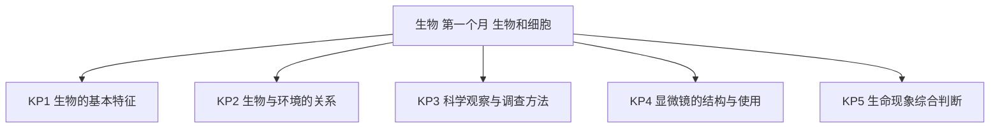
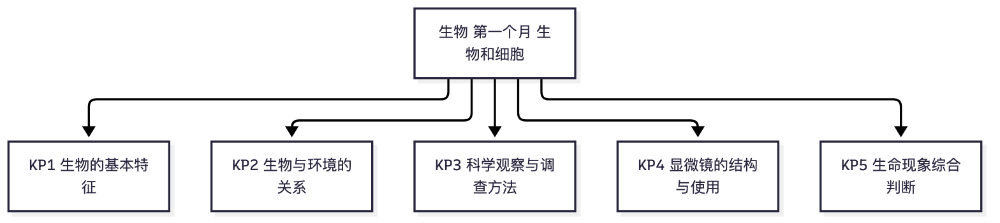

# 生物·七年级上学期第一个月自我检测（教师版）

> 适用：湖南省初一上学期第 1 个月（2026 年 9 月）｜ 满分 100 分 ｜ 建议用时 40 分钟
> 教材对照：人教版 2024 第一单元"生物和细胞"——第一章 认识生物（生物的特征、调查身边的生物），第二章 认识使用显微镜；其他版本对照"生物的特征与调查、显微镜的使用"相应章节。以学校实际用书与进度为准。
> 教师版含答案解析、双向细目表（评价接口）与知识框架图；学生用 学生版，家庭用 家长版。

## 一、本月学什么（教学范围）

本月只考两块：一是第一章"认识生物"——生物的共同特征、生物与环境的关系、调查身边的生物；二是第二章"认识使用显微镜"——显微镜的基本结构与对光、观察流程。核心是两件事：能判断"什么是生物"，能把显微镜用对。检测范围与人教版 2024 教材一致，不涉及细胞结构、生态系统等后续内容。

| 周次 | 时间 | 教学内容 | 对应知识点 |
|---|---|---|---|
| 第 1 周 | 9.1～9.6 | 第一章 认识生物：生物的特征，区分生物与非生物 | KP1 |
| 第 2 周 | 9.7～9.13 | 生物与环境的关系：环境影响生物，生物适应并影响环境 | KP2 |
| 第 3 周 | 9.14～9.20 | 调查身边的生物：全面调查与抽样调查、调查记录表；第一章小结 | KP3 |
| 第 4 周 | 9.21～9.30 | 第二章 认识使用显微镜：结构与取送、对光与观察、物像与放大倍数 | KP4、KP5 |

进度差异说明：湖南多数学校 9 月底能讲到第二章；若学校本月未讲到显微镜，跳过第 13～15 题、第 23～25 题和第 27 题，其余照做。计分折算：实得分 ÷ 已做题满分 × 100，再对照等级表。全卷以学校实际进度为准。

## 二、试卷

### 一、选择题（本题 15 小题，共 30 分）

1. 下列各项中，属于生物的是（　）（2分）  
A. 湘江中游动的青鱼  
B. 河滩上的鹅卵石  
C. 公园里的石头假山  
D. 路边停放的共享单车

2. 张家界景区的猕猴听到饲养员的哨声，很快从山上跑下来取食。这主要说明生物（　）（2分）  
A. 能生长和繁殖  
B. 能排出身体内产生的废物  
C. 需要不断进行呼吸  
D. 能对外界刺激作出反应

3. 下列各项中，不属于生物共同特征的是（　）（2分）  
A. 生物的生活需要营养  
B. 生物能生长和繁殖  
C. 生物都能快速运动  
D. 生物能对外界刺激作出反应

4. 运动会上，小宇跑完 1000 米满头大汗，汗液还带走了体内产生的一部分废物。这说明生物能（　）（2分）  
A. 排出身体内产生的废物  
B. 从外界获取营养  
C. 进行呼吸  
D. 生长和繁殖

5. 下列现象中，能说明生物正在进行呼吸的是（　）（2分）  
A. 洞庭湖里的江豚不时浮出水面，呼出雾气团  
B. 田鼠在田埂上打洞  
C. 春天校园里的樟树抽出新叶  
D. 爬山虎的卷须缠绕在墙上

6. 耕牛吃草，樟树从土壤中吸收水分和无机盐。这说明（　）（2分）  
A. 生物都能自由运动  
B. 生物的生活需要营养  
C. 生物都能开花结果  
D. 生物都用肺呼吸

7. 一粒杂交水稻种子播种后萌发出苗、拔节长高，秋天抽穗结出许多稻谷。这组现象主要说明生物能（　）（2分）  
A. 进行呼吸  
B. 排出身体内产生的废物  
C. 生长和繁殖  
D. 适应环境

8. 同一段湘江大堤上，向阳一侧的草长得茂密，背阴一侧的草稀疏矮小。影响草生长的主要非生物因素是（　）（2分）  
A. 温度  
B. 阳光  
C. 空气  
D. 坡度

9. 湖南稻田里的青蛙背部体色青绿，与秧苗、水田的颜色相近，不易被天敌发现。这主要体现生物（　）（2分）  
A. 能影响环境  
B. 能适应环境  
C. 能快速运动逃避天敌  
D. 有繁殖现象

10. 湘江边栽种的大片护堤柳树，根系盘结抓住泥土，减轻了江水对堤岸的冲刷。这主要体现（　）（2分）  
A. 环境影响生物  
B. 生物适应环境  
C. 生物影响环境  
D. 生物的应激性

11. 要了解湘江长沙段鱼类的种类和数量，比较科学可行的做法是（　）（2分）  
A. 把江水抽干后逐一清点  
B. 在几个有代表性的江段设点调查，再估算整体情况  
C. 随手捞几条鱼看看就下结论  
D. 只去水产市场统计卖出的鱼

12. 关于科学观察，下列说法正确的是（　）（2分）  
A. 观察就是随便看看，不需要目的  
B. 观察要有明确的目的，并如实做好记录  
C. 观察只能用肉眼，不能借助放大镜等工具  
D. 观察结果记不记录都无所谓

13. 转动粗准焦螺旋使镜筒缓缓下降时，眼睛一定要从侧面注视（　）（2分）  
A. 目镜  
B. 物镜  
C. 反光镜  
D. 载物台

14. 用显微镜观察时，若发现视野偏暗，应选用的组合是（　）（2分）  
A. 平面镜和小光圈  
B. 平面镜和大光圈  
C. 凹面镜和小光圈  
D. 凹面镜和大光圈

15. 显微镜的目镜是 10×，物镜是 40×，物体被放大的倍数是（　）（2分）  
A. 4 倍  
B. 50 倍  
C. 400 倍  
D. 4000 倍

### 二、判断题（本题 10 小题，共 10 分。正确的写"对"，错误的写"错"）

16. 凡是能运动的物体都是生物。（1分）

17. 病毒没有细胞结构，所以病毒不属于生物。（1分）

18. 向日葵的花盘能随着太阳转动，说明植物也能对外界刺激作出反应。（1分）

19. 生物只有在幼小的时候才需要从外界获取营养，长大以后就不需要了。（1分）

20. 调查时必须把范围内的对象一个一个全部登记，才算完成调查。（1分）

21. 观察和调查都是科学探究的常用方法。（1分）

22. 判断一个物体是不是生物，关键是看它有没有生物的基本特征，而不是只看它会不会动。（1分）

23. 对光时，应转动转换器让高倍物镜对准通光孔。（1分）

24. 从目镜内看到的物像是倒像：玻片上写"p"，视野中看到的物像是"d"。（1分）

25. 取送显微镜时，应一手握住镜臂，另一手托住镜座。（1分）

### 三、综合题（本题 2 小题，共 60 分）

26.（30分）阅读下面六个生活情境，完成（1）～（3）小题。

① 深秋的橘子洲头，桂花满枝、香气四溢；花谢后枝头结出桂树种子，种子落进湿润的泥土里，能萌发长出新桂树。  
② 湘江岸边，一只白鹭猛地俯冲入水，叼起一条小鱼吞进肚里。  
③ 轻轻触碰含羞草，它的小叶片很快合拢，叶柄随之下垂。  
④ 校园里的香樟幼苗一年年长高，树干越来越粗。  
⑤ 运动会上跑完 1000 米，同学们满头大汗，汗液把体内产生的一部分废物带出体外。  
⑥ 洞庭湖里的鱼不时张口吞水，随后水从鳃孔流出来。

（1）（10分）营养、呼吸、排出废物、应激性、生长、繁殖——这六种特征各对应哪个情境？把情境序号填在横线上（每个序号只用一次，每空 1 分，共 6 分）：营养——＿＿；呼吸——＿＿；排出废物——＿＿；应激性——＿＿；生长——＿＿；繁殖——＿＿。再写一句话：判断这六个情境都属于"生命现象"的共同依据是什么？（4 分）

（2）（10分）请分别说明情境②和情境③体现了生物的什么特征，并各用一句话写出你的判断理由。（每个情境 5 分：特征 2 分，理由 3 分）

（3）（10分）张家界黄龙洞里的钟乳石会慢慢"长大"，电动汽车通上电就能跑、会转向。它们是生物吗？请分别作出判断（每个判断 1 分，共 2 分），并说明理由（5 分）；再写一句话总结：判断生物与非生物的正确思路是什么？（3 分）

27.（30分）实验课上，小林练习使用显微镜观察一张写有字母"p"的透明玻片。他的操作过程如下，完成（1）～（3）小题。

第一步 对光：他眼睛盯着镜筒外的物镜，转动了反光镜，可怎么也找不到明亮的视野。  
第二步 观察：物像终于出现了，却落在视野的右上方。小林想把物像移到视野中央，就把玻片朝左下方移动，结果物像跑出了视野。  
最后他说："目镜是 5×，物镜是 10×，这台显微镜把物体放大了 15 倍。"

（1）（10分）第一步"对光"中，小林错在哪里？（3 分）正确的做法是什么？（4 分）对光时应让低倍物镜还是高倍物镜对准通光孔？（3 分）

（2）（10分）第二步中，小林移动玻片的方向错在哪里？（3 分）正确的做法是什么？（4 分）这样做的依据是什么？（3 分）

（3）（10分）小林说"放大 15 倍"，对吗？（2 分）这台显微镜实际的放大倍数是多少？请写出算式（4 分）。他在视野中看到的物像是什么样子？为什么？（4 分）

## 三、参考答案与解析

### 答案速查

```
1. A
2. D
3. C
4. A
5. A
6. B
7. C
8. B
9. B
10. C
11. B
12. B
13. B
14. D
15. C
16. 错
17. 错
18. 对
19. 错
20. 错
21. 对
22. 对
23. 错
24. 对
25. 对
26. 见解析
27. 见解析
```

### 逐题解析

**选择题（每题给判断依据一句，括号内为常见判错点）**

1. A——鱼具备营养、呼吸、生长繁殖等基本特征，是生物；鹅卵石、假山、共享单车都不具备。（判错点：把"会动"当成生物标准。）
2. D——哨声是外界刺激，猕猴听到哨声跑来，是对刺激作出反应（应激性）。（判错点：见"取食"就往营养上想，但题干强调的是"听到哨声跑来"。）
3. C——植物一般不能运动，"都能快速运动"不是生物的共同特征；A、B、D 都是共同特征。（判错点：把动物的特征当成所有生物的特征。）
4. A——汗液把体内产生的废物带出体外，属于排出废物；吃饭才是获取营养，喘气才是呼吸。
5. A——江豚浮出水面换气，是在呼吸（吸入氧气、呼出气体）；打洞体现影响环境，新叶是生长现象。（判错点：把打洞当呼吸。）
6. B——牛吃草、樟树吸收水和无机盐，都说明生物的生活需要营养；牛不开花结果，植物不用肺呼吸。
7. C——萌发出苗、拔节长高是生长，抽穗结出稻谷是繁殖，合起来说明生物能生长和繁殖。（判错点：题干没有体现"适应环境"的意思。）
8. B——向阳与背阴的主要差别是光照（阳光），说明环境影响生物；两地空气、坡度基本相同。（判错点：选温度——向阳坡虽有温差，但"向阳、背阴"指向的是光。）
9. B——体色与环境相近、不易被天敌发现，是生物适应环境的表现；青蛙没有改变环境。
10. C——柳树根系固土护堤，是生物影响环境；注意与第 8 题方向相反。（判错点：方向感颠倒，选成"环境影响生物"。）
11. B——范围大、对象多时用抽样调查：选代表性江段设点调查，再估算整体；抽干江水做不到，随手捞几条和市场统计都不科学。
12. B——观察要有明确目的、如实记录，必要时可以借助放大镜、显微镜等器具；A、C、D 都违反观察要求。
13. B——下降镜筒时眼睛从侧面注视物镜，防止物镜压碎玻片、损伤镜头。（判错点：凭感觉选目镜。）
14. D——视野偏暗要用凹面镜（聚光）和大光圈（进光多）；平面镜和小光圈是光线太强时用的。（判错点：凹面镜、平面镜与光圈大小配错组。）
15. C——显微镜的放大倍数 = 目镜放大倍数 × 物镜放大倍数 = 10 × 40 = 400（倍）；不是相加，也不是按面积算。

**判断题（每题给判错点一句）**

16. 错——汽车、机器狗能运动但不是生物；判断生物要看基本特征，不能只看会不会动。
17. 错——病毒没有细胞结构，但能繁殖后代，属于生物；准确说法是"除病毒外，生物都由细胞构成"。
18. 对——向日葵花盘随太阳转动，是植物对光刺激作出的反应，说明植物也有应激性。
19. 错——生物的一生都需要不断从外界获取营养，不是只在幼小时需要。
20. 错——调查分全面调查和抽样调查；范围太大、对象太多时可以抽样，不必一一登记。
21. 对——观察、调查、收集和分析资料都是科学探究的常用方法。
22. 对——判断生物的标准是看它是否具备生物的基本特征（营养、呼吸、排废、应激、生长繁殖等）。
23. 错——对光时要用低倍物镜对准通光孔；高倍物镜视野窄、亮度低，不适合对光。
24. 对——显微镜成倒像，上下、左右都颠倒（相当于把原物旋转 180 度），"p"看到的就是"d"。
25. 对——取送显微镜要一手握镜臂、一手托镜座，防止镜头和反光镜滑落损坏。

**26.（30分）情境归类——示例答案与采分点**

（1）营养——②；呼吸——⑥；排出废物——⑤；应激性——③；生长——④；繁殖——①（每空 1 分，共 6 分）。共同依据：它们都体现了生物的基本特征（生命特征），所以都属于生命现象（4 分，意思对即可给分）。
（2）情境②：特征是生物的生活需要营养（2 分）；理由：白鹭捕食小鱼，是在从外界获取营养物质（3 分）。情境③：特征是生物能对外界刺激作出反应（应激性）（2 分）；理由：触碰是外界刺激，叶片合拢、叶柄下垂是含羞草对刺激作出的反应（3 分）。
（3）钟乳石不是生物（1 分）；电动汽车不是生物（1 分）。理由：它们不具备生物的基本特征——不能自己获取营养、不能进行呼吸、不能繁殖后代；钟乳石的"长大"只是矿物质的堆积，汽车的"跑动、转向"靠电能驱动，都不是生命活动（5 分，答出任意两点即给满分）。总结思路：判断是不是生物，要看它是否具备生物的基本特征，不能只看会不会动、会不会"长大"（3 分）。

**27.（30分）显微镜使用排错——示例答案与采分点**

（1）错误：对光时眼睛盯着镜筒外的物镜，没有通过目镜观察（3 分）。正确做法：一只眼注视目镜内（另一只眼睁开），同时转动反光镜，让光线反射进镜筒，直到看到白亮的圆形视野（4 分）。应让低倍物镜对准通光孔（3 分；高倍物镜视野窄、亮度低，不适合对光）。
（2）错误：物像在视野右上方，却把玻片向左下方移动（3 分）。正确做法：应把玻片向右上方移动——物像偏向视野的哪个方向，玻片就往哪个方向移（4 分）。依据：显微镜成的是倒像，物像移动的方向与玻片移动的方向正好相反；物像要退回中央（向左下方回移），玻片就必须向右上方移（3 分）。
（3）不对（2 分）。放大倍数 = 目镜放大倍数 × 物镜放大倍数 = 5 × 10 = 50（倍）（4 分：算式 2 分，结果 2 分）。他看到的是倒像——上下、左右都颠倒，字母"p"看起来是"d"（4 分：答出看到"d"给 2 分，再说出"因为显微镜成倒像"给 2 分）。

## 四、评价接口（双向细目表）

| 题号 | 分值 | 知识点 | 课标锚点（2022版·内容要求摘句） | 难度 | 大纲匹配 |
|---|---|---|---|---|---|
| 1 | 2 | KP1 生物的基本特征 | 生物的特征：区分生物与非生物 | 易 | 强 |
| 2 | 2 | KP1 生物的基本特征 | 生物能对外界刺激作出反应 | 易 | 强 |
| 3 | 2 | KP1 生物的基本特征 | 生物共同特征的辨析 | 中 | 中 |
| 4 | 2 | KP1 生物的基本特征 | 生物能排出身体内产生的废物 | 易 | 强 |
| 5 | 2 | KP1 生物的基本特征 | 生物能进行呼吸 | 易 | 强 |
| 6 | 2 | KP1 生物的基本特征 | 生物的生活需要营养 | 易 | 强 |
| 7 | 2 | KP1 生物的基本特征 | 生物能生长和繁殖 | 中 | 强 |
| 8 | 2 | KP2 生物与环境的关系 | 环境影响生物：非生物因素（阳光） | 中 | 强 |
| 9 | 2 | KP2 生物与环境的关系 | 生物适应环境的典型表现 | 中 | 强 |
| 10 | 2 | KP2 生物与环境的关系 | 生物影响环境 | 中 | 强 |
| 11 | 2 | KP3 科学观察与调查方法 | 调查：全面调查与抽样调查 | 中 | 中 |
| 12 | 2 | KP3 科学观察与调查方法 | 科学观察：有目的、如实记录 | 易 | 强 |
| 13 | 2 | KP4 显微镜的结构与使用 | 显微镜操作：下降镜筒的安全要领 | 中 | 强 |
| 14 | 2 | KP4 显微镜的结构与使用 | 显微镜对光：反光镜与光圈的选择 | 较难 | 强 |
| 15 | 2 | KP4 显微镜的结构与使用 | 显微镜放大倍数 = 目镜 × 物镜 | 中 | 强 |
| 16 | 1 | KP1 生物的基本特征 | 生物与非生物的区分 | 易 | 强 |
| 17 | 1 | KP1 生物的基本特征 | 病毒无细胞结构但属于生物 | 中 | 强 |
| 18 | 1 | KP1 生物的基本特征 | 植物对外界刺激的反应 | 易 | 强 |
| 19 | 1 | KP1 生物的基本特征 | 生物一生都需要营养 | 易 | 强 |
| 20 | 1 | KP3 科学观察与调查方法 | 抽样调查的适用情形 | 中 | 中 |
| 21 | 1 | KP3 科学观察与调查方法 | 科学探究的常用方法：观察与调查 | 易 | 强 |
| 22 | 1 | KP5 生命现象综合判断 | 判断生物的依据是基本特征 | 易 | 强 |
| 23 | 1 | KP4 显微镜的结构与使用 | 对光时用低倍物镜 | 易 | 强 |
| 24 | 1 | KP4 显微镜的结构与使用 | 显微镜成倒像 | 较难 | 中 |
| 25 | 1 | KP4 显微镜的结构与使用 | 显微镜的取送与安放 | 易 | 强 |
| 26 | 30 | KP5 生命现象综合判断 | 综合运用生物特征解释生活情境 | 中 | 中 |
| 27 | 30 | KP4 显微镜的结构与使用 | 显微镜使用流程的规范与排错 | 较难 | 拓展 |

```json
{
  "subject": "生物",
  "duration_min": 40,
  "total_score": 100,
  "items": [
    {"no": 1, "score": 2, "kp": "KP1", "difficulty": "易", "match": "强"},
    {"no": 2, "score": 2, "kp": "KP1", "difficulty": "易", "match": "强"},
    {"no": 3, "score": 2, "kp": "KP1", "difficulty": "中", "match": "中"},
    {"no": 4, "score": 2, "kp": "KP1", "difficulty": "易", "match": "强"},
    {"no": 5, "score": 2, "kp": "KP1", "difficulty": "易", "match": "强"},
    {"no": 6, "score": 2, "kp": "KP1", "difficulty": "易", "match": "强"},
    {"no": 7, "score": 2, "kp": "KP1", "difficulty": "中", "match": "强"},
    {"no": 8, "score": 2, "kp": "KP2", "difficulty": "中", "match": "强"},
    {"no": 9, "score": 2, "kp": "KP2", "difficulty": "中", "match": "强"},
    {"no": 10, "score": 2, "kp": "KP2", "difficulty": "中", "match": "强"},
    {"no": 11, "score": 2, "kp": "KP3", "difficulty": "中", "match": "中"},
    {"no": 12, "score": 2, "kp": "KP3", "difficulty": "易", "match": "强"},
    {"no": 13, "score": 2, "kp": "KP4", "difficulty": "中", "match": "强"},
    {"no": 14, "score": 2, "kp": "KP4", "difficulty": "较难", "match": "强"},
    {"no": 15, "score": 2, "kp": "KP4", "difficulty": "中", "match": "强"},
    {"no": 16, "score": 1, "kp": "KP1", "difficulty": "易", "match": "强"},
    {"no": 17, "score": 1, "kp": "KP1", "difficulty": "中", "match": "强"},
    {"no": 18, "score": 1, "kp": "KP1", "difficulty": "易", "match": "强"},
    {"no": 19, "score": 1, "kp": "KP1", "difficulty": "易", "match": "强"},
    {"no": 20, "score": 1, "kp": "KP3", "difficulty": "中", "match": "中"},
    {"no": 21, "score": 1, "kp": "KP3", "difficulty": "易", "match": "强"},
    {"no": 22, "score": 1, "kp": "KP5", "difficulty": "易", "match": "强"},
    {"no": 23, "score": 1, "kp": "KP4", "difficulty": "易", "match": "强"},
    {"no": 24, "score": 1, "kp": "KP4", "difficulty": "较难", "match": "中"},
    {"no": 25, "score": 1, "kp": "KP4", "difficulty": "易", "match": "强"},
    {"no": 26, "score": 30, "kp": "KP5", "difficulty": "中", "match": "中"},
    {"no": 27, "score": 30, "kp": "KP4", "difficulty": "较难", "match": "拓展"}
  ]
}
```

## 五、知识体系框架图




（查看器不渲染 mermaid 时看上方 PNG。）

---
*AI 辅助生成，内容仅供参考，请以教材与老师要求为准；使用前请教师/家长抽查核对。hunan-g7-learn / month1-selfcheck · 2026-09*
