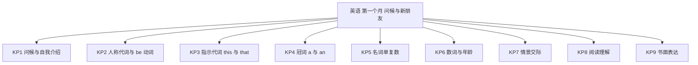
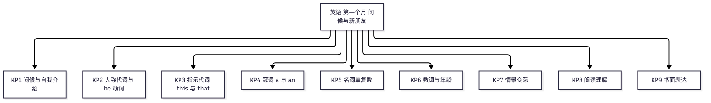

# 英语·七年级上学期第一个月自我检测（教师版）

> 适用：湖南省初一上学期第 1 个月（2026 年 9 月）｜ 满分 100 分 ｜ 建议用时 45 分钟
> 教材对照：人教版 2024 Starter Units 1-3（Hello! / Keep Tidy! / Welcome!）与 Unit 1 You and Me；仁爱版对应其 Unit 1 问候与介绍主题，可直接使用本卷。以学校实际用书与进度为准。
> 教师版含答案解析、双向细目表（评价接口）与知识框架图；学生用 学生版，家庭用 家长版。

## 一、本月学什么（教学范围）

本月是初中英语起步月，主题是"打招呼、介绍自己、认识新朋友"，只考以下内容，不出超出进度的题：

- 教材进度：人教 2024 版 Starter Unit 1 Hello! → Starter Unit 2 Keep Tidy! → Starter Unit 3 Welcome! → Unit 1 You and Me；
- 仁爱版学校：本月内容对应其 Unit 1 问候与介绍主题，可直接使用本卷；
- 核心语言点：问候、告别与自我介绍；人称代词与 be 动词（am/is/are）搭配；指示代词 this/that；冠词 a/an（按读音判别）；名词单复数；数词 0~100 与年龄表达；
- 听力纸面测不到，家长版末尾附"家长读 5 个四会词孩子拼写"的替代小测（10 分，另记）。

4 周速览：

| 周次 | 单元/主题 | 核心内容 | 对应题号 |
|---|---|---|---|
| 第 1 周 | Starter Unit 1 Hello! | 问候、告别、自我介绍 | 1、3、20、31 |
| 第 2 周 | Starter Unit 2 Keep Tidy! | 学习用品、this/that、a/an、名词单复数 | 4、7、8、12、18 |
| 第 3 周 | Starter Unit 3 Welcome! | 欢迎与介绍他人、情景应答 | 2、17 |
| 第 4 周 | Unit 1 You and Me | 交新朋友：姓名、年龄、班级、爱好；be 动词 | 5、6、9~16、19、21~30 |

进度差异说明：各校 9 月进度快慢不一。若学校本月刚讲到 Starter Units（尚未进入 Unit 1），可只做第 1~20 题（覆盖问候告别、a/an、名词单复数、this/that、be 动词主干），第 21~31 题选做；只做 1~20 题时满分 50 分，等级按比例换算：43 分及以上为优，35~42 为良，30~34 为合格，29 及以下为待加强。进度差异不影响题目本身，等级只按已做题计。

## 二、试卷

### 一、单项选择（本题 10 小题，共 30 分）

从 A、B、C、D 四个选项中，选出可以填入空白处的最佳答案。

1. — Good afternoon, Miss Yang!
   — ＿＿＿, Dale！（3分）
   A. Good morning　B. Good afternoon　C. Good evening　D. Good night

2. — Hi, Emma! How are you?
   — ＿＿＿（3分）
   A. I'm thirteen.　B. Yes, I am.　C. I'm fine, thanks.　D. How old are you?

3. — It's time for class. Goodbye, Miss Gao!
   — ＿＿＿, class.（3分）
   A. Good morning　B. Goodbye　C. Good night　D. Thank you

4. — What's this in English?
   — It's ＿＿＿ orange.（3分）
   A. a　B. the　C. an　D. 不填

5. My name ＿＿＿ Gao Yan, and I ＿＿＿ from Changsha.（3分）
   A. is; am　B. am; is　C. are; is　D. is; are

6. This is Mr. Green and that is Miss Black. ＿＿＿ are my teachers.（3分）
   A. He　B. She　C. It　D. They

7. — Mum, ＿＿＿ is my friend, Peter.
   — Good morning, Peter!（3分）
   A. that　B. those　C. it　D. this

8. Emma has two ＿＿＿ and three ＿＿＿ in her schoolbag.（3分）
   A. pen; pencil　B. pens; pencil　C. pen; pencils　D. pens; pencils

9. — ＿＿＿ is your sister?
   — She is five.（3分）
   A. How many　B. How old　C. How　D. Who

10. — What's five and eight?
    — It's ＿＿＿.（3分）
    A. thirty　B. thirteen　C. fourteen　D. forty

### 二、完形填空（本题 10 小题，共 20 分）

先通读短文掌握大意，再从各小题的 A、B、C、D 四个选项中选出最佳答案，把短文补充完整。（短文约 110 词，讲一位新同学的自我介绍。）

My name ⑪ Eric Green. Eric is my first name, and Green is my family name. I am ⑫ English boy. I am thirteen ⑬ old. Now I am a new student in No. 1 Middle School. I am in Class Three, ⑭ Seven. My school is big and nice. This is my friend Gina. ⑮ is twelve. ⑯ family name is Brown. We are in different classes, ⑰ we are good friends. Look at my room in the photo. It is tidy. In my schoolbag, I have three ⑱ and two pencils. My telephone number ⑲ 886-2157. Please call me. The class is over now. I say "Goodbye" to Gina, and she says "⑳" to me.

11. A. am　B. is　C. are　D. be（2分）
12. A. a　B. the　C. an　D. one（2分）
13. A. years　B. year　C. year's　D. a year（2分）
14. A. Class　B. Grade　C. School　D. Team（2分）
15. A. He　B. It　C. She　D. They（2分）
16. A. She　B. He　C. His　D. Her（2分）
17. A. and　B. so　C. or　D. but（2分）
18. A. book　B. bookes　C. books　D. book's（2分）
19. A. am　B. are　C. be　D. is（2分）
20. A. Goodbye　B. Hello　C. Thanks　D. Sorry（2分）

### 三、阅读理解（本题 10 小题，共 30 分）

**A 篇**　阅读下面三张新同学卡片，完成第 21~24 题。

Hello! I'm Emma Brown. Emma is my first name and Brown is my family name. I'm twelve. I'm in Class 2, Grade 7. I like music. I can sing many English songs.

Hi! My name is Zhang Hao. I'm from Changsha. I'm thirteen. I'm in Class 4, Grade 7. My favorite sport is basketball. I often play it after school.

Hi, I'm Bill Green, an English boy. Now I'm in Beijing with my parents. I'm thirteen, too. I'm in Class 2, Grade 7, too. I like reading. I have many good books at home.

21. Who is twelve years old?（3分）
    A. Emma Brown　B. Zhang Hao　C. Bill Green　D. Miss Gao
22. Zhang Hao is from ＿＿＿.（3分）
    A. Beijing　B. London　C. Changsha　D. Shanghai
23. Emma likes ＿＿＿.（3分）
    A. basketball　B. music　C. reading　D. swimming
24. ＿＿＿ and Bill are in the same class.（3分）
    A. Emma　B. Zhang Hao　C. Gina　D. Miss Gao

**B 篇**　阅读下面的校园对话，完成第 25~30 题。

开学第一天，新同学 Gina 在校园里遇到了 Lin Tao。

Lin Tao: Good morning! I'm Lin Tao.

Gina: Good morning, Lin Tao! My name is Gina Smith.

Lin Tao: Are you a new student here?

Gina: Yes, I am. I'm in Class 1, Grade 7.

Lin Tao: Oh, we are in the same class! How old are you?

Gina: I'm twelve. And you?

Lin Tao: I'm thirteen. Let me help you. I can take the books to our classroom.

Gina: Thank you! You are so kind.

Lin Tao: You're welcome. This way, please.

25. Gina is a new student in ＿＿＿.（3分）
    A. Class 1, Grade 7　B. Class 2, Grade 7　C. Class 1, Grade 8　D. Class 7, Grade 1
26. Gina's family name is ＿＿＿.（3分）
    A. Gina　B. Tao　C. Smith　D. Lin
27. Lin Tao is ＿＿＿.（3分）
    A. twelve　B. thirteen　C. fourteen　D. eleven
28. Lin Tao helps Gina take ＿＿＿ to the classroom.（3分）
    A. the books　B. the bags　C. the rulers　D. the photos
29. In the dialogue, "You're welcome" means "＿＿＿".（3分）
    A. 谢谢你　B. 不用谢　C. 对不起　D. 你真好
30. What's the dialogue mainly about?（3分）
    A. Lin Tao's books.
    B. Lin Tao meets and helps a new classmate.
    C. Gina's old school.
    D. The same classroom.

### 四、书面表达（本题 1 小题，共 20 分）

31. 班里来了一位新同学，请你向新同学介绍你自己，写一篇 50~60 词的英语短文。（20分）

提示（5 句话都要写到，可以适当发挥）：
① 你的名字（说清姓 family name 和名 first name）；
② 你的年龄和班级（七年级几班）；
③ 你喜欢什么（音乐、篮球、阅读等）；
④ 你的一个好朋友是谁，你们在同一个班吗；
⑤ 邀请新同学和你一起学英语。

要求：语句通顺，书写工整；人名用英文名或拼音，校名可用 No. 1 Middle School；不要写出真实的校名和人名。

评分量表：

| 维度 | 分值 | 评分要点 |
|---|---|---|
| 内容 | 8 | 覆盖 5 个提示点，每点 1 分；围绕主题、有开头结尾、条理清楚，3 分 |
| 语言 | 8 | 语法与用词正确，重点看 be 动词、a/an、名词单复数、人称代词四处；每 2 处错误扣 1 分，扣完为止；全对且衔接自然得满分 |
| 书写与格式 | 4 | 书写工整、大小写与标点规范，2 分；词数 50~60 达标，2 分（40~49 词扣 1 分，不足 40 词最多得 1 分，超 60 词扣 1 分） |

## 三、参考答案与解析

### 答案速查

```
1. B
2. C
3. B
4. C
5. A
6. D
7. D
8. D
9. B
10. B
11. B
12. C
13. A
14. B
15. C
16. D
17. D
18. C
19. D
20. A
21. A
22. C
23. B
24. A
25. A
26. C
27. B
28. A
29. B
30. B
31. 见解析
```

（客观题只写字母；第 31 题为书面表达，见下方逐题解析。）

### 逐题解析

**一、单项选择**

1. B。上句用 Good afternoon 问好，答语原词呼应 Good afternoon；Good night 只用于晚上道别或睡前，Good morning/evening 时段不符。
2. C。How are you? 问近况，答 I'm fine, thanks；A 回答的是年龄（How old），B 回答 Are you... 一般疑问句，D 是反问年龄、没有回应问候。
3. B。上课前道别用 Goodbye；Good night 是睡前专用；D. Thank you 不回应告别。
4. C。orange 读音以元音音素 /ɒ/ 开头，用 an；a/an 看读音不看字母；可数名词单数前不能不填冠词。
5. A。my name 是第三人称单数，配 is；I 永远配 am。易误选 B（受中文语序影响）。
6. D。Mr. Green 和 Miss Black 是两个人，用 They；He/She/It 都只指一个人。
7. D。把朋友当面介绍给妈妈，固定用 This is...；that 指"那边那个"，those 是复数，it 不用于介绍人。
8. D。two、three 后接可数名词复数：pens、pencils；A、B、C 都留了单数空位。
9. B。问年龄用 How old；How many 问可数数量，Who 问"是谁"。
10. B。5+8=13，英文 thirteen；thirty 是 30，与 thirteen 拼形音近，是本题陷阱；forty 是 40。

**二、完形填空**

11. B。My name is... 固定表达，主语 my name 视作单数。
12. C。English 读音以元音音素 /ɪ/ 开头，用 an；one 不合语境。
13. A。thirteen 大于 1，year 用复数 years；只有 one year old 用单数。
14. B。英语"小地方在前"：Class Three, Grade Seven（先班后年级）。
15. C。Gina 是女孩，用 She；He 指男孩，It 指物。
16. D。"她的姓"用 Her；His 用于男孩，She/He 不能直接修饰名词。
17. D。前句 different classes（不同班）与后句 good friends（是好朋友）意思转折，用 but；易误选 and。
18. C。three 后接复数 books；book 直接加 s，bookes 拼写错误。
19. D。telephone number 指"一个号码"，单数用 is；不要被号码里的一串数字带偏选 are。
20. A。放学了，"我"说 Goodbye，Gina 回应也说 Goodbye；Hello 用于见面打招呼。

**三、阅读理解**

21. A。Emma 卡片：I'm twelve；Zhang Hao 和 Bill 都是 thirteen。
22. C。Zhang Hao 卡片：I'm from Changsha。
23. B。Emma 卡片：I like music；basketball 是 Zhang Hao 的爱好，reading 是 Bill 的爱好，别张冠李戴。
24. A。Bill 说 I'm in Class 2, Grade 7, too——too 表示他和 Emma 一样都在七年级 2 班；Zhang Hao 在 4 班。
25. A。Gina 说 I'm in Class 1, Grade 7。
26. C。Gina Smith 中 Gina 是名，Smith 是姓（family name）；B、D 是对话里另一位 Lin Tao 的名与姓。
27. B。Lin Tao 说 I'm thirteen；twelve 是 Gina 的年龄。
28. A。Lin Tao 说 I can take the books to our classroom。
29. B。上句 Gina 说 Thank you，Lin Tao 答 You're welcome，意思是"不用谢"；C. 对不起、D. 你真好与语境不符。
30. B。整段对话讲"林涛认识并帮助新同学 Gina"；A、C、D 都只是对话里的局部信息，主旨题要看全文。

**四、书面表达**

31. 见解析。

范文（58 词）：

My name is Li Hua. Li is my family name, and Hua is my first name. I am twelve years old. I am in Class 3, Grade 7. I like music and I can sing many English songs. My good friend is Peter Green. We are in the same class. Welcome to my school! Let's learn English together.

采分点（按步给分，宁可少给不高估）：

- 内容 8 分：五个提示点各 1 分——①姓与名分开说（Li is my family name, and Hua is my first name）②年龄 ③班级年级 ④爱好 ⑤好友与是否同班＋邀请；全文围绕主题、有开头结尾、条理清楚，3 分。
- 语言 8 分：重点查四处——be 动词（is/am/are）搭配、a/an、名词单复数、人称代词（I/my/we）；每 2 处错误扣 1 分，扣完为止；全文无错且衔接自然（and/too）可得满分。
- 书写与格式 4 分：书写工整、大小写与标点规范，2 分；词数 50~60 达标，2 分（40~49 词扣 1 分，不足 40 词最多得 1 分，超 60 词扣 1 分）。

档次参考：17~20 分优秀；12~16 分良好；12 分以下建议回炉 Starter Units 与 Unit 1 句型后重写一遍。

## 四、评价接口（双向细目表）

| 题号 | 分值 | 知识点 | 课标锚点（2022版·内容要求摘句） | 难度 | 大纲匹配 |
|---|---|---|---|---|---|
| 1 | 3 | KP1 问候与自我介绍 | 三级·语用：在真实情境中使用问候与告别用语 | 易 | 强 |
| 2 | 3 | KP7 情景交际 | 三级·语用：依据场合选用恰当的日常应答语 | 易 | 强 |
| 3 | 3 | KP1 问候与自我介绍 | 三级·语用：在真实情境中使用问候与告别用语 | 易 | 强 |
| 4 | 3 | KP4 冠词 a/an | 三级·语法：根据读音正确使用不定冠词 a/an | 易 | 强 |
| 5 | 3 | KP2 人称代词与 be 动词 | 三级·语法：理解与运用人称代词和 be 动词的搭配 | 易 | 强 |
| 6 | 3 | KP2 人称代词与 be 动词 | 三级·语法：理解与运用人称代词和 be 动词的搭配 | 中 | 强 |
| 7 | 3 | KP3 指示代词 this/that | 三级·语法：理解与运用指示代词指别近处与远处的人或物 | 中 | 强 |
| 8 | 3 | KP5 名词单复数 | 三级·语法：理解与运用名词的复数形式 | 中 | 强 |
| 9 | 3 | KP6 数词与年龄 | 三级·词汇：认读 0~100 数词，用 How old 询问年龄 | 易 | 强 |
| 10 | 3 | KP6 数词与年龄 | 三级·词汇：在运算情境中正确说出英文数词 | 较难 | 拓展 |
| 11 | 2 | KP2 人称代词与 be 动词 | 三级·语法：理解与运用人称代词和 be 动词的搭配 | 易 | 强 |
| 12 | 2 | KP4 冠词 a/an | 三级·语法：根据读音正确使用不定冠词 a/an | 易 | 强 |
| 13 | 2 | KP6 数词与年龄 | 三级·词汇：用 years old 表达年龄（复数形式） | 中 | 强 |
| 14 | 2 | KP1 问候与自我介绍 | 三级·语用：介绍自己的班级与年级信息 | 易 | 强 |
| 15 | 2 | KP2 人称代词与 be 动词 | 三级·语法：理解与运用人称代词和 be 动词的搭配 | 易 | 强 |
| 16 | 2 | KP2 人称代词与 be 动词 | 三级·语法：理解与运用物主代词 his/her 按性别指别 | 中 | 强 |
| 17 | 2 | KP7 情景交际 | 三级·语用：借助上下文保持语篇连贯（转折关系） | 较难 | 中 |
| 18 | 2 | KP5 名词单复数 | 三级·语法：理解与运用名词的复数形式 | 易 | 强 |
| 19 | 2 | KP2 人称代词与 be 动词 | 三级·语法：理解与运用人称代词和 be 动词的搭配 | 易 | 强 |
| 20 | 2 | KP7 情景交际 | 三级·语用：告别用语及其应答 | 中 | 强 |
| 21 | 3 | KP8 阅读理解 | 三级·读：从语篇中获取具体信息（年龄） | 易 | 强 |
| 22 | 3 | KP8 阅读理解 | 三级·读：从语篇中获取具体信息（籍贯） | 易 | 强 |
| 23 | 3 | KP8 阅读理解 | 三级·读：从语篇中获取具体信息（爱好） | 易 | 强 |
| 24 | 3 | KP8 阅读理解 | 三级·读：跨语段整合信息并作出判断 | 较难 | 中 |
| 25 | 3 | KP8 阅读理解 | 三级·读：从语篇中获取具体信息（班级） | 易 | 强 |
| 26 | 3 | KP8 阅读理解 | 三级·读：区分姓与名的文化常识 | 中 | 强 |
| 27 | 3 | KP8 阅读理解 | 三级·读：从语篇中获取具体信息（年龄） | 易 | 强 |
| 28 | 3 | KP8 阅读理解 | 三级·读：从语篇中获取具体信息（行为细节） | 易 | 强 |
| 29 | 3 | KP8 阅读理解 | 三级·读：根据上下文推断词语意义 | 中 | 中 |
| 30 | 3 | KP8 阅读理解 | 三级·读：归纳语篇的主旨要义 | 较难 | 中 |
| 31 | 20 | KP9 书面表达 | 三级·写：围绕熟悉主题写出语句通顺、格式正确的简单语篇 | 中 | 强 |

JSON 接口（字段与上表逐行一致，供后续 H5/短板评估程序读取）：

```json
{
  "subject": "英语",
  "duration_min": 45,
  "total_score": 100,
  "items": [
    {"no": 1, "score": 3, "kp": "KP1", "difficulty": "易", "match": "强"},
    {"no": 2, "score": 3, "kp": "KP7", "difficulty": "易", "match": "强"},
    {"no": 3, "score": 3, "kp": "KP1", "difficulty": "易", "match": "强"},
    {"no": 4, "score": 3, "kp": "KP4", "difficulty": "易", "match": "强"},
    {"no": 5, "score": 3, "kp": "KP2", "difficulty": "易", "match": "强"},
    {"no": 6, "score": 3, "kp": "KP2", "difficulty": "中", "match": "强"},
    {"no": 7, "score": 3, "kp": "KP3", "difficulty": "中", "match": "强"},
    {"no": 8, "score": 3, "kp": "KP5", "difficulty": "中", "match": "强"},
    {"no": 9, "score": 3, "kp": "KP6", "difficulty": "易", "match": "强"},
    {"no": 10, "score": 3, "kp": "KP6", "difficulty": "较难", "match": "拓展"},
    {"no": 11, "score": 2, "kp": "KP2", "difficulty": "易", "match": "强"},
    {"no": 12, "score": 2, "kp": "KP4", "difficulty": "易", "match": "强"},
    {"no": 13, "score": 2, "kp": "KP6", "difficulty": "中", "match": "强"},
    {"no": 14, "score": 2, "kp": "KP1", "difficulty": "易", "match": "强"},
    {"no": 15, "score": 2, "kp": "KP2", "difficulty": "易", "match": "强"},
    {"no": 16, "score": 2, "kp": "KP2", "difficulty": "中", "match": "强"},
    {"no": 17, "score": 2, "kp": "KP7", "difficulty": "较难", "match": "中"},
    {"no": 18, "score": 2, "kp": "KP5", "difficulty": "易", "match": "强"},
    {"no": 19, "score": 2, "kp": "KP2", "difficulty": "易", "match": "强"},
    {"no": 20, "score": 2, "kp": "KP7", "difficulty": "中", "match": "强"},
    {"no": 21, "score": 3, "kp": "KP8", "difficulty": "易", "match": "强"},
    {"no": 22, "score": 3, "kp": "KP8", "difficulty": "易", "match": "强"},
    {"no": 23, "score": 3, "kp": "KP8", "difficulty": "易", "match": "强"},
    {"no": 24, "score": 3, "kp": "KP8", "difficulty": "较难", "match": "中"},
    {"no": 25, "score": 3, "kp": "KP8", "difficulty": "易", "match": "强"},
    {"no": 26, "score": 3, "kp": "KP8", "difficulty": "中", "match": "强"},
    {"no": 27, "score": 3, "kp": "KP8", "difficulty": "易", "match": "强"},
    {"no": 28, "score": 3, "kp": "KP8", "difficulty": "易", "match": "强"},
    {"no": 29, "score": 3, "kp": "KP8", "difficulty": "中", "match": "中"},
    {"no": 30, "score": 3, "kp": "KP8", "difficulty": "较难", "match": "中"},
    {"no": 31, "score": 20, "kp": "KP9", "difficulty": "中", "match": "强"}
  ]
}
```

## 五、知识体系框架图




（查看器不渲染 mermaid 时看上方 PNG。）

---

*AI 辅助生成，内容仅供参考，请以教材与老师要求为准；使用前请教师/家长抽查核对。hunan-g7-learn / month1-selfcheck · 2026-09*
