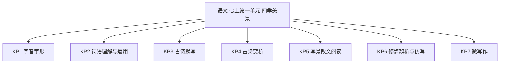
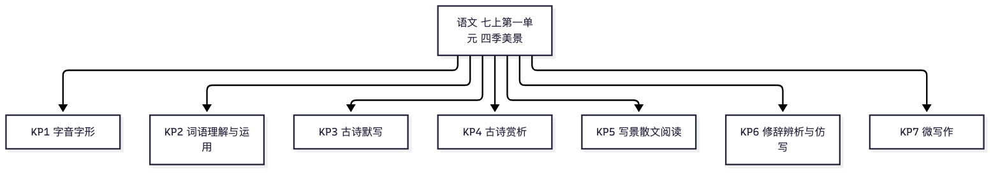

# 语文·七年级上学期第一个月自我检测（教师版）

> 适用：湖南省初一上学期第 1 个月（2026 年 9 月）｜ 满分 100 分 ｜ 建议用时 60 分钟
> 教材对照：统编版（2024）七年级上册第一单元——阅读《春》《济南的冬天》《雨的四季》《古代诗歌四首》，写作"热爱写作，学会观察"；其他版本学校以实际进度对应本单元为界。以学校实际用书与进度为准。
> 教师版含答案解析、双向细目表（评价接口）与知识框架图；学生用 学生版，家庭用 家长版。

## 一、本月学什么（教学范围）

本卷只考第一个月（2026 年 9 月）所学，对应统编 2024 新教材七年级上册第一单元，单元主题"四季美景"：

- 阅读：《春》（朱自清）、《济南的冬天》（老舍）、《雨的四季》（刘湛秋）——练习朗读（重音、停连），学习"写了什么景、怎么写的、为什么动人"的阅读路径，掌握比喻、拟人两种修辞。
- 古诗词：《古代诗歌四首》（《观沧海》《闻王昌龄左迁龙标遥有此寄》《次北固山下》《天净沙·秋思》）——读熟、背准、会默写，初步学会从"意象—画面—情感"赏析诗句。
- 写作：热爱写作，学会观察——观察身边的景物，抓住特征，按一定顺序写出来。
- 特别说明：本单元没有文言文，本卷不考文言文。

4 周速览：

| 周次 | 教学内容（常见安排） | 对应知识点 |
|---|---|---|
| 第 1 周 | 开学常规 +《春》：朗读重音与停连、比喻拟人 | KP1 KP6 |
| 第 2 周 | 《济南的冬天》《雨的四季》：写景散文的概括与赏析 | KP1 KP2 KP5 |
| 第 3 周 | 《古代诗歌四首》：诵读、默写、赏析 | KP3 KP4 |
| 第 4 周 | 写作·热爱写作，学会观察 + 单元梳理复习 | KP6 KP7 |

进度差异说明：各校快慢不一，若尚未讲完，按下表跳过，等级按已做题折算：

- 未讲《古代诗歌四首》：跳过第 1~8、13、14 题（共 24 分），按 76 分折算百分等级；
- 未上写作专题：跳过第 12、21 题（共 34 分），按 66 分折算百分等级；
- 未讲《雨的四季》不影响作答（第 18~20 题为课外自读材料）。

## 二、试卷

### 一、积累运用（本题 12 小题，共 26 分）

（一）古诗默写。补写下面名句中的空缺部分，每空 2 分；错字、漏字、添字该空不得分。

1. 东临碣石，＿＿＿＿。（曹操《观沧海》）（2分）
2. 树木丛生，＿＿＿＿。（曹操《观沧海》）（2分）
3. ＿＿＿＿＿＿＿，闻道龙标过五溪。（李白《闻王昌龄左迁龙标遥有此寄》）（2分）
4. 我寄愁心与明月，＿＿＿＿＿＿＿。（李白《闻王昌龄左迁龙标遥有此寄》）（2分）
5. 潮平两岸阔，＿＿＿＿＿。（王湾《次北固山下》）（2分）
6. ＿＿＿＿＿，江春入旧年。（王湾《次北固山下》）（2分）
7. 枯藤老树昏鸦，小桥流水人家，＿＿＿＿＿＿。（马致远《天净沙·秋思》）（2分）
8. 马致远《天净沙·秋思》中，直接抒发天涯游子悲伤愁苦之情、点明全曲主旨的句子是：夕阳西下，＿＿＿＿＿＿。（2分）

（二）阅读下面的语段，完成 9~12 题。

> 初秋的清晨，我沿着湘江风光带漫步。江风拂面，带着清新湿润的水汽；橘子洲头的橘树挂满了青黄的果实，在风中轻轻点头。远处的岳麓山层林尽染，像一幅徐徐展开的画卷。秋阳一点儿也不＿＿＿＿（lìn sè），把碎金般的光洒在江面上，江水泛起粼粼波光。林间传来几声鸟鸣，嘹亮而清脆，与江水的低声**应和**着。这样的清晨，真让人心旷神怡。

9. ① 根据拼音，在语段横线上写出正确的词语：lìn sè（　　　）；② 给语段中加点的"应和"的"和"字注音：＿＿＿。（2分）
10. 联系语境，说说"心旷神怡"的意思，并写出语段中是什么让"我"心旷神怡。（2分）
11. 下面两个句子都写了秋风，哪一句运用了拟人的修辞手法？请说明理由。（2分）

   ① 秋风掠过田野，稻穗沙沙作响。
   ② 秋风温柔地抚摸着稻田，稻穗羞涩地低下了头。

12. 仿照朱自清《春》中的例句，以"秋天"开头，写一个运用比喻或拟人手法的句子。（4分）

   例句：春天像刚落地的娃娃，从头到脚都是新的，它生长着。
   我的仿写：＿＿＿＿＿＿＿＿＿＿＿＿＿＿＿＿＿＿＿＿＿＿＿＿＿＿＿＿

### 二、阅读鉴赏（本题 8 小题，共 44 分）

（一）古诗赏析。阅读《观沧海》，完成 13~14 题。

> 东临碣石，以观沧海。水何澹澹，山岛竦峙。
> 树木丛生，百草丰茂。秋风萧瑟，洪波涌起。
> 日月之行，若出其中；星汉灿烂，若出其里。
> 幸甚至哉，歌以咏志。
> ——东汉·曹操《观沧海》

13. 阅读全诗，回答问题。（4分）

    ① "水何澹澹，山岛竦峙"描绘了怎样的景象？（2分）
    ② "日月之行，若出其中；星汉灿烂，若出其里"表现了诗人怎样的胸怀？（2分）

14. 李白听说王昌龄被贬龙标，写下此诗遥寄友人。阅读全诗，回答问题。（4分）

    ① "杨花落尽子规啼"写了哪些意象？渲染了怎样的氛围？（2分）
    ② "我寄愁心与明月，随君直到夜郎西"是怎样表达诗人对友人的情感的？（2分）

（二）课内散文阅读。阅读《济南的冬天》选段，完成 15~17 题。

> 最妙的是下点小雪呀。看吧，山上的矮松越发的青黑，树尖上顶着一髻儿白花，好像日本看护妇。山尖全白了，给蓝天镶上一道银边。山坡上，有的地方雪厚点，有的地方草色还露着；这样，一道儿白，一道儿暗黄，给山们穿上一件带水纹的花衣；看着看着，这件花衣好像被风儿吹动，叫你希望看见一点更美的山的肌肤。等到快日落的时候，微黄的阳光斜射在山腰上，那点薄雪好像忽然害了羞，微微露出点粉色。就是下小雪吧，济南是受不住大雪的，那些小山太秀气！
> ——老舍《济南的冬天》（选段）

15. 阅读选段，回答问题。（6分）

    ① 选段按怎样的顺序描写雪后的山景？（2分）
    ② 从"山上、山尖、山坡、山腰"中任选两处，用简洁的语言概括各处景致的特点。（4分）

16. 赏析选段中两处加粗句子。（6分）

    ① **山尖全白了，给蓝天镶上一道银边。**（3分）
    ② **那点薄雪好像忽然害了羞，微微露出点粉色。**（3分）

17. 班级要举办"课文朗读会"，请你完成下面的朗读设计。（6分）

    ① "最妙的是下点小雪呀"一句，你会把重音落在哪个词上？为什么？（2分）
    ② 句末的"呀"应该怎样读？请说出理由。（2分）
    ③ 结尾"就是下小雪吧，济南是受不住大雪的，那些小山太秀气！"应读出怎样的语气？为什么？（2分）

（三）课外阅读。阅读下面的材料，完成 18~20 题。

**（阅读材料）湘江边的秋天**

> 九月的湘江边，秋意是悄悄来的。
> 先是江风变了性子，不再黏热，变得清爽干净，扑在脸上，像浸过井水的毛巾，凉丝丝的。江水退下去一些，露出一线浅滩，几只白鹭立在水边，一动不动，**像守着什么心事**。对岸的岳麓山，绿意里悄悄掺进了黄和红，一层一层的，**像谁打翻了颜料盘**。水边偶尔传来一声鸟鸣，清清亮亮，像落在琴弦上。
> 沿江的桂花开了，细碎的小花藏在绿叶间，香气却漫得满堤都是，深吸一口，甜到了心里。梧桐叶的边缘泛起浅浅的黄，风一过，便有三两片打着旋儿飘下来，轻轻落在长椅上，像一封封没有署名的信。
> 傍晚，夕阳把江面铺成一条金红的绸带，白鹭掠过水面，翅膀上驮着光。散步的人们不约而同放慢了脚步——这样的秋天，谁舍得匆匆走过呢？
> （本材料为本卷自写的湖南秋景短文，约 300 字）

18. 阅读材料从哪些感官角度描写湘江边的秋天？请从"视觉、听觉、嗅觉、触觉"中任选三种，分别举出一例。（6分）
19. 请从材料中两处加粗句子中任选一句，结合语境加以赏析。（6分）
20. 结尾写道"这样的秋天，谁舍得匆匆走过呢？"这句话表达了作者怎样的思想感情？请结合文中具体内容简要分析。（6分）

### 三、写作（本题 1 小题，共 30 分）

21. 从下面两个题目中任选一题，写一段 200~250 字的写景短文。（30分）

    题目一：校园（或上下学路上）的秋天。选择一处景物，抓住它在秋天的特征，按一定顺序写下来。
    题目二：一场秋雨。调动眼、耳、鼻、手等感官，写出这场雨的特点和你的感受。

    要求：①抓住景物特征来写；②按时间或空间顺序组织；③至少用一处比喻或拟人；④字数 200~250；⑤书写工整，卷面整洁。

    写完后对照下面的自评量表，做到一条画一个"√"：

    □ 我抓住了景物在秋天的特征（颜色、形状、声音、气味等）
    □ 我按一定顺序来写（时间顺序或空间顺序）
    □ 我用到了比喻或拟人
    □ 我写出了自己的感受
    □ 我数了字数：在 200~250 字之间，书写工整

## 三、参考答案与解析

### 答案速查

```
1. 以观沧海
2. 百草丰茂
3. 杨花落尽子规啼
4. 随君直到夜郎西
5. 风正一帆悬
6. 海日生残夜
7. 古道西风瘦马
8. 断肠人在天涯
9. ① 吝啬 ② hè
10. 心旷神怡：心情舒畅，精神愉快
11. 第 ② 句是拟人
12. 见解析
13. 见解析
14. 见解析
15. 见解析
16. 见解析
17. 见解析
18. 见解析
19. 见解析
20. 见解析
21. 见解析
```

### 逐题解析

**默写（1~8 题，每空 2 分，错字、漏字、添字该空不得分）**

1. 出自曹操《观沧海》开篇"东临碣石，以观沧海"。易错点："沧海"的"沧"是三点水，不要写成"苍"。
2. 出自《观沧海》"树木丛生，百草丰茂"。易错点："茂"字下面不要多一点。
3. 出自李白《闻王昌龄左迁龙标遥有此寄》首句。易错点："杨花"的"杨"是木字旁，不要写成"扬"；"啼"是口字旁。
4. 同上诗末句。易错点：统编教材为"随君直到夜郎西"，不是"随风"；"郎"不要写成"朗"。
5. 出自王湾《次北固山下》"潮平两岸阔，风正一帆悬"。易错点："悬"上部不要少写。
6. 同诗颈联"海日生残夜，江春入旧年"。易错点："生"不要写成"升"。
7. 出自马致远《天净沙·秋思》。易错点："瘦"是病字旁，里面不要写错。
8. 理解性默写，考直接抒情、点明主旨句。答案"夕阳西下，断肠人在天涯"。易错点："天涯"的"涯"不要写成"崖"。

**积累运用语段题（9~12 题）**

9. ① 吝啬（注意"啬"的写法，"墙"字头下面是"回"形结构变形，不要多笔少画）；② "应和"的"和"读 hè（第四声），（声音）相和、应答之意，本词出自《春》"跟轻风流水应和着"，"应"在此读 yìng。采分：每小题 1 分，写错该小题不得分。
10. 心旷神怡：心境开阔，心情舒畅，精神愉快（1 分）。语段中让"我"心旷神怡的是湘江边清晨的美景——清爽的江风、如画卷般层林尽染的岳麓山、洒满碎金般光斑的江面、清脆的鸟鸣等（答出其中两处即可，1 分）。
11. 第②句运用拟人（1 分）。理由：②中"温柔地抚摸""羞涩地低下头"分别赋予秋风、稻穗人的动作和情态，把物当作人来写；而①中"沙沙作响"只是客观描摹秋风掠过稻田的声音，没有赋予物以人的情态（1 分）。
12. 示例：秋天像一位沉静的画家，从田野到山冈都是金色的，它挥洒着。评分：恰当运用比喻或拟人 2 分；抓住秋天特征、内容贴切 1 分；与例句句式大体一致、语言通顺 1 分。判错点：只写"秋天像金色的"之类没有喻体展开的句子，或虽用"像"字却无比喻关系的（如"秋天像去年一样来了"），手法分不能给。

**古诗赏析（13~14 题）**

13. ① "澹澹"写大海水波动荡，"竦峙"写山岛高高耸立——大海辽阔涌动，山岛巍峨挺立，一动一静，勾勒出苍茫壮观的沧海景象（2 分：抓住两词含义 1 分，描绘出动静结合的画面 1 分）。② 这四句想象奇特：大海仿佛包容了日月星辰的运行，衬托出诗人开阔博大的胸怀和建功立业、一统天下的雄心壮志（2 分：答出"博大胸怀"1 分，答出"雄心壮志／豪迈气概"1 分）。
14. ① 意象：杨花、子规（杜鹃）（1 分）。飘零落尽的杨花、啼声哀切的子规点明暮春时节，渲染出萧瑟凄清、哀伤惆怅的氛围，暗含对友人贬谪远行的同情与不舍（1 分）。② 诗人把"愁心"托付给明月，让明月陪伴友人直到遥远的夜郎西——运用拟人，把明月当作善解人意的信使，表达对友人被贬的深切同情、牵挂与安慰（2 分：指出拟人／托月寄情 1 分，答出同情牵挂之情 1 分）。

**课内散文阅读（15~17 题）**

15. ① 空间顺序，由高到低：山上→山尖→山坡→山腰（2 分：只答"空间顺序"得 1 分，答出由高到低的具体路径得满分）。② 示例：山上——矮松顶着白雪，如"日本看护妇"，秀美挺立；山尖——全白，像给蓝天镶上一道银边，洁白明亮；山坡——雪色与草色相间，如穿"花衣"，色彩斑斓；山腰——薄雪在夕阳下"害了羞"，微微露出粉色，娇美动人（4 分：答出任意两处、特点概括恰当即可，每处 2 分）。
16. ① 运用比喻，把雪后白亮的山尖比作"银边"，一个"镶"字写出白色山尖衬着蓝天的精巧贴切，突出小雪装点下的小山秀美可爱，流露出作者的喜爱之情（3 分：手法 1 分，结合"银边""镶"分析 1 分，情感 1 分）。② 运用拟人，"害了羞"把夕阳斜照下薄雪微露粉色的情态，写成少女含羞的样子，生动传神，写出雪的娇美，表达作者的怜爱（3 分：采分点同前）。
17. ① 重音落在"妙"（或"最妙"）上——"妙"是统领全段的文眼，重读能突出雪后山景的可爱，唤起听者的期待（2 分：指出重音 1 分，说清理由 1 分；选其他词言之成理亦可）。② "呀"读得轻短、微微上扬，带惊喜赞叹的语气——那是看到小雪后山景时由衷的感叹（2 分：读法 1 分，理由 1 分）。③ 读出轻柔、怜爱（呵护）的语气——"就是……吧"是商量、请求的口吻，因为济南的小山"太秀气"，受不住大雪；语速放缓、语调轻柔，读出对雪、对小山的珍爱（2 分：语气 1 分，理由 1 分）。

**课外阅读（18~20 题）**

18. 触觉——江风扑在脸上"像浸过井水的毛巾，凉丝丝的"；听觉——"水边偶尔传来一声鸟鸣，清清亮亮"；嗅觉——桂花"香气却漫得满堤都是"；视觉——岳麓山"绿意里悄悄掺进了黄和红"（或夕阳下"金红的绸带"）。采分：每种角度 1 分 + 举例恰当 1 分，答出三种即得满分 6 分。
19. 示例一（第一处加粗句）：运用拟人，"像守着什么心事"把静立水边的白鹭写成有心事的生灵，画面安静而有情味，衬托出江边清晨的宁静，流露出作者的喜爱与遐想。示例二（第二处加粗句）：运用比喻，把层林初染的岳麓山比作"打翻的颜料盘"，生动写出秋山绿、黄、红交织、色彩斑斓的层次之美，传达出作者发现秋色的惊喜。采分：指出手法 2 分；结合句子内容分析 2 分；说出表达效果或情感 2 分。
20. 表达了作者对湘江边秋景的喜爱、陶醉与赞美，对家乡（湖南）秋天的深情（2 分）。结合内容：正因江风清爽、白鹭安静、山色绚烂、桂香甜润、暮江如绸带，景致处处可爱，作者才发出"谁舍得匆匆走过"的感慨；反问句把珍爱之情推向高潮（4 分：结合文中两处具体内容分析，每处 2 分）。

**微写作（21 题，30 分）**

评分量表（三块合计 30 分，宁少给、不高估）：

| 维度 | 分值 | 评分点 |
|---|---|---|
| 内容 | 10 | 抓住景物特征 4 分；顺序清晰 3 分；有真实感受 3 分 |
| 语言 | 10 | 语句通顺 4 分；比喻或拟人运用恰当 4 分；用词准确生动 2 分 |
| 书写与结构 | 10 | 书写工整、卷面整洁 4 分；标点正确 3 分；一段之内条理清楚 3 分 |

说明：两个题目任选其一，满足要求即同等给分，不设题材偏好；字数不足 200 字酌扣 2~4 分；自评量表不另行给分，用于学生自查。

示例范文（题目一，约 210 字）：校门口的桂花开了。远远望去，那两棵桂树像撑开的绿伞，绿叶间藏着点点金黄。走近了，香气一股一股地涌过来，甜丝丝的，把整个校门都熏香了。细看，小花只有米粒大，四片花瓣挤在一起，一簇一簇躲在叶子后面，像害羞的孩子。一阵风过，几朵小花打着旋儿落在我的书页上，我轻轻拾起一枚，舍不得放下。上学的路每天都走，可只有这个季节，桂树用香气提醒我：秋天来了，要好好看看身边的美好。

## 四、评价接口（双向细目表）

| 题号 | 分值 | 知识点 | 课标锚点（2022版·内容要求摘句） | 难度 | 大纲匹配 |
|---|---|---|---|---|---|
| 1 | 2 | KP3 古诗默写 | 诗文积累：背诵优秀诗文 80 篇（段），注重积累 | 易 | 强 |
| 2 | 2 | KP3 古诗默写 | 诗文积累：背诵优秀诗文 80 篇（段），注重积累 | 易 | 强 |
| 3 | 2 | KP3 古诗默写 | 诗文积累：背诵优秀诗文 80 篇（段），注重积累 | 易 | 强 |
| 4 | 2 | KP3 古诗默写 | 诗文积累：背诵优秀诗文 80 篇（段），注重积累 | 易 | 强 |
| 5 | 2 | KP3 古诗默写 | 诗文积累：背诵优秀诗文 80 篇（段），注重积累 | 易 | 强 |
| 6 | 2 | KP3 古诗默写 | 诗文积累：背诵优秀诗文 80 篇（段），注重积累 | 易 | 强 |
| 7 | 2 | KP3 古诗默写 | 诗文积累：背诵优秀诗文 80 篇（段），注重积累 | 易 | 强 |
| 8 | 2 | KP3 古诗默写 | 诗文积累：背诵优秀诗文 80 篇（段），注重积累 | 中 | 强 |
| 9 | 2 | KP1 字音字形 | 识字与写字：能熟练地使用字典、词典独立识字 | 易 | 强 |
| 10 | 2 | KP2 词语理解与运用 | 语言文字积累与梳理：在语言运用情境中理解、积累词语 | 中 | 中 |
| 11 | 2 | KP6 修辞辨析与仿写 | 了解常用的修辞方法，体会其表达效果 | 中 | 中 |
| 12 | 4 | KP6 修辞辨析与仿写 | 了解常用的修辞方法，体会其表达效果 | 较难 | 拓展 |
| 13 | 4 | KP4 古诗赏析 | 诵读古代诗词，注重积累、感悟和运用，提高欣赏品位 | 中 | 强 |
| 14 | 4 | KP4 古诗赏析 | 诵读古代诗词，注重积累、感悟和运用，提高欣赏品位 | 中 | 强 |
| 15 | 6 | KP5 写景散文阅读 | 欣赏文学作品，有自己的情感体验，品味作品中富于表现力的语言 | 易 | 强 |
| 16 | 6 | KP5 写景散文阅读 | 欣赏文学作品，有自己的情感体验，品味作品中富于表现力的语言 | 易 | 中 |
| 17 | 6 | KP5 写景散文阅读 | 欣赏文学作品，有自己的情感体验，品味作品中富于表现力的语言 | 较难 | 拓展 |
| 18 | 6 | KP5 写景散文阅读 | 欣赏文学作品，有自己的情感体验，品味作品中富于表现力的语言 | 易 | 强 |
| 19 | 6 | KP5 写景散文阅读 | 欣赏文学作品，有自己的情感体验，品味作品中富于表现力的语言 | 易 | 中 |
| 20 | 6 | KP5 写景散文阅读 | 欣赏文学作品，有自己的情感体验，品味作品中富于表现力的语言 | 较难 | 中 |
| 21 | 30 | KP7 微写作 | 写作要有真情实感，力求表达自己对自然、社会、人生的感受、体验和思考 | 中 | 强 |

```json
{
  "subject": "语文",
  "duration_min": 60,
  "total_score": 100,
  "items": [
    {"no": 1, "score": 2, "kp": "KP3", "difficulty": "易", "match": "强"},
    {"no": 2, "score": 2, "kp": "KP3", "difficulty": "易", "match": "强"},
    {"no": 3, "score": 2, "kp": "KP3", "difficulty": "易", "match": "强"},
    {"no": 4, "score": 2, "kp": "KP3", "difficulty": "易", "match": "强"},
    {"no": 5, "score": 2, "kp": "KP3", "difficulty": "易", "match": "强"},
    {"no": 6, "score": 2, "kp": "KP3", "difficulty": "易", "match": "强"},
    {"no": 7, "score": 2, "kp": "KP3", "difficulty": "易", "match": "强"},
    {"no": 8, "score": 2, "kp": "KP3", "difficulty": "中", "match": "强"},
    {"no": 9, "score": 2, "kp": "KP1", "difficulty": "易", "match": "强"},
    {"no": 10, "score": 2, "kp": "KP2", "difficulty": "中", "match": "中"},
    {"no": 11, "score": 2, "kp": "KP6", "difficulty": "中", "match": "中"},
    {"no": 12, "score": 4, "kp": "KP6", "difficulty": "较难", "match": "拓展"},
    {"no": 13, "score": 4, "kp": "KP4", "difficulty": "中", "match": "强"},
    {"no": 14, "score": 4, "kp": "KP4", "difficulty": "中", "match": "强"},
    {"no": 15, "score": 6, "kp": "KP5", "difficulty": "易", "match": "强"},
    {"no": 16, "score": 6, "kp": "KP5", "difficulty": "易", "match": "中"},
    {"no": 17, "score": 6, "kp": "KP5", "difficulty": "较难", "match": "拓展"},
    {"no": 18, "score": 6, "kp": "KP5", "difficulty": "易", "match": "强"},
    {"no": 19, "score": 6, "kp": "KP5", "difficulty": "易", "match": "中"},
    {"no": 20, "score": 6, "kp": "KP5", "difficulty": "较难", "match": "中"},
    {"no": 21, "score": 30, "kp": "KP7", "difficulty": "中", "match": "强"}
  ]
}
```

## 五、知识体系框架图




（查看器不渲染 mermaid 时看上方 PNG。）

---
*AI 辅助生成，内容仅供参考，请以教材与老师要求为准；使用前请教师/家长抽查核对。hunan-g7-learn / month1-selfcheck · 2026-09*
