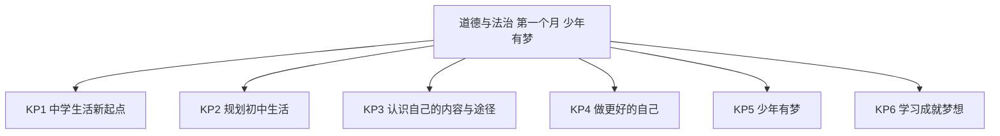
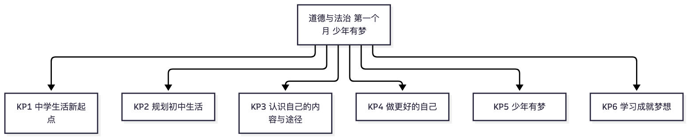

# 道德与法治·七年级上学期第一个月自我检测（教师版）

> 适用：湖南省初一上学期第 1 个月（2026 年 9 月）｜ 满分 100 分 ｜ 建议用时 40 分钟
> 教材对照：统编 2024 版《道德与法治》七年级上册第一单元"少年有梦"——第一课 开启初中生活（奏响中学序曲 / 规划初中生活）；第二课 正确认识自我（认识自己 / 做更好的自己）；第三课 梦想始于当下（做有梦的少年 / 学习成就梦想）。以学校实际用书与进度为准。
> 教师版含答案解析、双向细目表（评价接口）与知识框架图；学生用 学生版，家庭用 家长版。

## 一、本月学什么（教学范围）

本月进入统编 2024 版七年级上册第一单元"少年有梦"，共三课：第一课 开启初中生活（奏响中学序曲 / 规划初中生活）；第二课 正确认识自我（认识自己 / 做更好的自己）；第三课 梦想始于当下（做有梦的少年 / 学习成就梦想）。这门课的考查重点不是背诵原文，而是"想明白 + 做得到"：给一个真实情境，学生能否作出正确判断，并结合材料写出具体可行的做法。情境题答案开放，言之有理即可。

| 周次 | 课题 | 对应知识点 |
|---|---|---|
| 第 1 周（9.1~9.6） | 第一课 奏响中学序曲 | KP1 中学生活新起点 |
| 第 2 周（9.7~9.13） | 第一课 规划初中生活；第二课 认识自己 | KP2 规划初中生活；KP3 认识自己的内容与途径 |
| 第 3 周（9.14~9.20） | 第二课 做更好的自己 | KP4 做更好的自己 |
| 第 4 周（9.21~9.30） | 第三课 做有梦的少年；学习成就梦想 | KP5 少年有梦；KP6 学习成就梦想 |

**进度差异说明**：个别学校本月只讲到第二课。未讲到第三课的学校，判断第 5、6、10 题，选择题第 22~25 题以及第 28 题可跳过；等级按已做题换算（得分 ÷ 已做题总分 × 100，再对照学生版等级表）。

## 二、试卷

### 一、判断题（本题 10 小题，共 10 分）

（答题说明：你认为正确的答"对"，错误的答"错"。每小题 1 分。）

1. 跨进中学大门，我们站在一个新的起点上：新环境、新同学、新课程，都可能是我们成长的礼物。（1分）
2. 初中生活不需要规划，走一步看一步就行。（1分）
3. 我们可以通过自我评价认识自己，也可以通过他人评价认识自己。（1分）
4. 做更好的自己，需要接纳自己：既接纳自己的优点，也接纳自己的不完美。（1分）
5. 梦想只要天天挂在嘴边，不用行动就会实现。（1分）
6. 学习不只是获取书本知识，还包括能力的培养和如何做人。（1分）
7. 学习计划一经制订，无论情况怎么变都不能调整。（1分）
8. 对他人的评价，我们既要重视，又要冷静分析：不盲从，也不忽视。（1分）
9. 做更好的自己，就要把自己的缺点藏起来，不让别人发现。（1分）
10. 少年的梦想与时代的脉搏紧密相连，与中国梦密不可分。（1分）

### 二、选择题（本题 15 小题，共 45 分）

（答题说明：每小题只有一个最符合题意的选项，把字母填进括号。每小题 3 分。）

11. 小湘走进新校园，认识了来自不同小学的新同学，发现初中要学的科目也变多了。对中学生活，认识正确的是（ ）
A. 中学生活和小学没有区别，不用在意
B. 中学生活带来新的机会和可能，也带来新的目标和挑战
C. 科目变多只会带来麻烦
D. 新同学太多，干脆谁都不理

12. 中学生活给我们送来一份特别的"成长的礼物"。下面最贴近这份"礼物"的是（ ）
A. 作业更多、考试更难
B. 离开父母管束，想干什么就干什么
C. 中学生活只是小学生活的简单重复
D. 更多发展自我的机会，激励我们不断实现自我超越

13. 有同学说："定了目标也没用，还不如不定。"下列说法最能反驳他的是（ ）
A. 目标只是写给老师看的
B. 目标定得越高越好
C. 明确的目标能给我们的成长指引方向、增添动力
D. 有了目标，梦想就自动实现

14. 制订初中生活规划时，下列做法最合理的是（ ）
A. 计划精确到每一分钟，一点空闲都不留
B. 从自己的实际出发，目标明确、切实可行，并留有余地
C. 照搬同桌的计划，省事
D. 计划做好后锁进抽屉，从不回头看

15. 老师在班会上写下"知人者智，自知者明"。这句话提醒我们（ ）
A. 要正确认识自己，才能更好地促进自我发展
B. 认识自己就是为了和别人比较
C. 自己的情况自己最清楚，不需要别人的评价
D. 只要了解别人就行，不用了解自己

16. 想更全面地认识自己，小湘可以（　）
①从身体、心理、社会等方面观察自己
②通过自我评价，反思自己的表现
③重视他人评价，听听老师和同学的看法
④只听表扬，不听任何批评
A. ①②③　　B. ①②④　　C. ①③④　　D. ②③④

17. 小湘认为自己数学解题思路不错，同桌却提醒他"步骤不规范，常丢过程分"。面对同桌的评价，小湘应该（ ）
A. 一概不听，坚持己见
B. 立刻全盘否定自己，觉得自己一无是处
C. 冷静分析：说得有道理就改进，不合理的也不过度敏感
D. 以后不再和同桌说话

18. "天生我材必有用。"做更好的自己，首先要（ ）
A. 学会接纳与欣赏自己
B. 处处与别人比较，比过别人才开心
C. 只看自己的优点，回避自己的不足
D. 事事都追求十全十美

19. 小湘跑得快，入选了校田径队，但数学基础较弱。下列选择可取的是（ ）
A. 只练体育，数学干脆放弃
B. 只学数学，退出田径队
C. 扬长避短：合理安排时间，训练学习两不误
D. 反正自己不完美，干脆躺平

20. 关于改正缺点，下列做法正确的是（ ）
A. 缺点是天生带来的，改不了
B. 写下具体的改进办法，从容易的事情做起，坚持一段时间
C. 等长大后自然就好了
D. 只要不被别人发现，就不用改

21. 下列关于激发潜能的说法，正确的是（ ）
A. 潜能生下来就固定了，激发不了
B. 潜能只属于少数有天赋的人
C. 珍惜自己的热爱，通过积极行动、坚持练习，潜能可以被激发
D. 激发潜能主要靠运气

22. 袁隆平院士年轻时立下学农的志向，几十年扎根稻田，培育杂交水稻。这告诉我们（ ）
A. 少年的梦想与个人的人生目标紧密相连，能激励我们不断奋进
B. 梦想只是随口一说，与人生目标无关
C. 志向是大人的事，中学生谈梦想太早
D. 有了梦想就不需要努力

23. 袁隆平的"禾下乘凉梦"，让更多人端稳饭碗，也与国家的粮食安全紧紧连在一起。这说明少年的梦想（ ）
A. 只关乎个人前途，与国家无关
B. 与时代的脉搏紧密相连，与中国梦密不可分
C. 离我们中学生太遥远，想想就好
D. 越离奇越有价值

24. "梦想始于当下。"对中学生来说，把梦想变成现实，最需要（ ）
A. 等机会从天而降
B. 画一张漂亮的蓝图就够了
C. 从今天的学习和行动做起，一步一个脚印
D. 先痛痛快快玩三年再说

25. 小湘觉得"学习就是背书、刷题"。以下认识能帮助他改进的是（ ）
A. 学习只发生在教室里
B. 学会学习，要发现并保持学习兴趣，掌握科学的方法，养成良好的习惯
C. 学习就是为了考试排名
D. 只要熬夜苦读，就一定能学好

### 三、情境分析题（本题 3 小题，共 45 分）

（答题说明：结合材料作答，写出具体的想法和做法；意思相近、言之有理均可得分。）

26. 阅读材料，回答问题。（15分）
小湘是长沙市某中学的七年级新生。开学半个月，他又兴奋又有点手忙脚乱：校园更大了，科目一下子多了好几门；班级要竞选班干部，社团开始招新，身边的同学一个个都很优秀。妈妈对他说："初中三年怎么过，可以先想一想、写下来。"
(1) 结合材料，说说中学生活给小湘带来了哪些新的机会与新的挑战。（7分）
(2) 请帮小湘写一份简单的初中生活规划：列出 1 个学期目标，并写出 2 条落实做法。（8分）

27. 阅读材料，回答问题。（15分）
班级开展"闪光卡"活动，请同学互相写下彼此的闪光点。同学送给小湘的卡片上写着："你数学特别好，讲题思路清楚；可你上课从来不敢举手发言，其实你的答案常常很棒！"小湘看着卡片愣住了：他从没想过自己在别人眼中是这个样子，也从没意识到"不敢发言"这件事。
(1) 材料中的小湘是通过哪些途径认识自己的？请结合材料说明。（7分）
(2) 结合材料，谈谈小湘可以怎样"做更好的自己"。（8分）

28. 阅读材料，回答问题。（15分）
"人就像种子，要做一粒好种子。"袁隆平院士被誉为"杂交水稻之父"。他从湖南怀化安江农校的一块试验田起步，几十年如一日扎根稻田，怀着"禾下乘凉梦"和"杂交水稻覆盖全球梦"，把一生写在祖国大地上，让更多人远离饥饿。
(1) 结合材料，说说少年梦想的特点。（7分）
(2) "梦想始于当下。"结合材料，谈谈学习与梦想的关系，以及中学生应当怎样学习。（8分）

## 三、参考答案与解析

### 答案速查

```
1. 对
2. 错
3. 对
4. 对
5. 错
6. 对
7. 错
8. 对
9. 错
10. 对
11. B
12. D
13. C
14. B
15. A
16. A
17. C
18. A
19. C
20. B
21. C
22. A
23. B
24. C
25. B
26. 见解析
27. 见解析
28. 见解析
```

### 逐题解析

**判断题（每题一句判错点 / 判断依据）**

1. 对——中学生活是新起点，新环境与新机会是成长的礼物（第一课"奏响中学序曲"）。
2. 错——"凡事预则立，不预则废"：初中生活需要规划，走一步看一步会陷入被动。
3. 对——认识自己的两条主要途径：自我评价、他人评价。
4. 对——接纳自己的全部（包括不完美），是欣赏和完善自己的前提。
5. 错——把"有梦"当成"自动实现"：梦想的实现要靠今天的行动，"梦想始于当下"。
6. 对——学习包括知识的获取、能力的培养和如何做人，生活处处有学习。
7. 错——把计划当成死规矩：实际情况变化时计划应作调整，调整不等于失败。
8. 对——对待他人评价的正确态度：重视但冷静分析，不盲从、不忽视。
9. 错——把"做更好的自己"偷换成"掩盖缺点"：缺点要主动改正，不是藏起来。
10. 对——少年梦想的特点之一：与时代的脉搏紧密相连，与中国梦密不可分。

**选择题（每题一句排除理由）**

11. B。A 否认初中生活的变化；C 只见麻烦不见机会；D 消极回避——B 全面正确。
12. D。"成长的礼物"指更多发展机会与自我超越；A 是挑战不是礼物；B 心态错误；C 否认了"新"。
13. C。目标的意义在于指引方向、激发动力；A 消极，B 目标并非越高越好，D 绝对化。
14. B。规划要从实际出发、切实可行、留有余地；A 过满难执行；C 照搬他人；D 定而不做。
15. A。"自知者明"点出正确认识自己才能促进自我发展；B 是功利比较，C 拒绝他人评价，D 与句意相反。
16. A。①②③都是认识自己的正确途径；④只听表扬必然片面。
17. C。正确态度是冷静分析、有则改之；A、D 拒绝沟通，B 过度自我否定。
18. A。做更好的自己，先学会接纳与欣赏自己；B 处处比较徒增焦虑，C 回避不足，D 追求完美不可取。
19. C。扬长避短、统筹安排；A、B 单一发展，D 自我放弃。
20. B。改正缺点：写出具体办法、从容易处做起、坚持下去；A、C 放任不管，D 掩盖问题。
21. C。潜能可以通过珍惜热爱、积极行动、坚持练习被激发；A、B 否认潜能的普遍性与可开发性，D 靠运气错误。
22. A。材料突出"立下志向、一生坚守"——梦想与人生目标紧密相连并激励奋进；B、C 否定梦想的意义，D 否定努力。
23. B。"禾下乘凉梦"连着国家粮食安全，体现个人梦想与时代脉搏、中国梦相连；A 只见个人，C、D 认识错误。此题较难，难在要从材料读出"个人—国家"的联系。
24. C。梦想的实现要落到当下的学习与行动中；A 坐等机会，B 空有蓝图，D 荒废光阴。
25. B。学会学习＝发现并保持兴趣＋掌握科学方法＋养成良好习惯；A 场所绝对化，C 功利化，D 熬夜苦读方法不当。

**情境分析题（开放题，言之有理即可；先给采分点分步分，再给示例答案）**

26.（15 分）
第(1)问（7 分）采分点：新机会 4 分（新学校新同学新老师、更多样的课程、社团与竞选等发展自我的平台，答出 2 点即可，每点 2 分）；新挑战 3 分（科目增多节奏加快、身边同学优秀带来的压力、人际与时间安排的适应，答出 2 点即可）。
示例答案：新机会——小湘来到更大的校园，能结识新同学、新老师，还能参加社团招新、竞选班干部，这些都是发展自我的新机会。新挑战——科目一下子变多、学习节奏加快，身边优秀的同学很多，怎样安排时间、怎样融入新集体，都是小湘要面对的挑战。
第(2)问（8 分）采分点：学期目标 3 分（明确、切实可行，写清"做什么、达到什么程度"）；落实做法 4 分（每条 2 分，要求具体、可操作）；结合自身实际、表达完整 1 分。
示例答案：目标——这学期学会管理时间，各科作业按时完成，期中考试争取进入班级中上游。做法——①每天放学后先列作业清单，按先难后易的顺序完成；②每周日晚用 20 分钟回顾一周计划完成情况，调整下周安排。

27.（15 分）
第(1)问（7 分）采分点：通过他人评价认识自己 4 分（同学的"闪光卡"反馈）；通过自我评价认识自己 3 分（对照卡片回想、反思自己的课堂表现）。
示例答案：①他人评价——同学的"闪光卡"让小湘第一次知道自己在别人眼中"数学好、不敢发言"，这是通过他人评价认识自己；②自我评价——小湘对照卡片回想、反思自己平时上课的表现，这是通过自我评价认识自己。
第(2)问（8 分）采分点：正确对待他人评价 2 分（冷静分析、虚心接受）；接纳自己 2 分（既欣赏"数学好"，也接纳"不敢发言"的不完美）；主动改正缺点、有具体做法 2 分；激发潜能、积极展示自我 2 分。
示例答案：小湘可以冷静分析同学的提醒，有道理就虚心接受；接纳自己——欣赏"数学好"的自己，也接纳"不敢发言"这个暂时的不完美；再主动改正缺点——这周先在数学课上举手回答一次，下周在语文课上也争取发言，从小的台阶做起；坚持下去，还能激发自己的潜能，做更好的自己。

28.（15 分）
第(1)问（7 分）采分点：少年的梦想与个人的人生目标紧密相连 3 分（袁隆平立下志向、一生坚守）；少年的梦想与时代的脉搏紧密相连、与中国梦密不可分 4 分（结合"禾下乘凉梦""覆盖全球梦"与国家粮食安全作答）。
示例答案：少年的梦想与个人的人生目标紧密相连——袁隆平年轻时立下学农志向，一生朝着目标奋进；少年的梦想又与时代的脉搏紧密相连、与中国梦密不可分——他把"禾下乘凉梦""杂交水稻覆盖全球梦"种在祖国大地上，让个人梦想汇入国家发展、人民幸福的大潮。
第(2)问（8 分）采分点：学习与梦想的关系 4 分（学习成就梦想：今天的学习是为明天实现梦想储备本领，意思相近即可）；怎样学习 3 分（兴趣、方法、习惯各 1 分）；结合材料或自身 1 分。
示例答案：学习成就梦想——袁隆平的梦想靠几十年学农、钻研、试验一步步实现，我们的梦想也要靠今天一点一滴的学习来铺路。中学生要学会学习：发现并保持对学习的兴趣，像袁老热爱种子一样热爱所学；掌握科学的学习方法，把每天的任务安排清楚；养成良好的学习习惯并坚持下去，把远大的志向变成今天课堂上的一次专注、作业本上的一道认真题。

## 四、评价接口（双向细目表）

| 题号 | 分值 | 知识点 | 课标锚点（2022版·内容要求摘句） | 难度 | 大纲匹配 |
|---|---|---|---|---|---|
| 1 | 1 | KP1 中学生活新起点 | 健全人格：适应初中新生活，积极面对新机遇与新挑战 | 易 | 强 |
| 2 | 1 | KP2 规划初中生活 | 健全人格：理解目标的意义，学会自主规划学习与生活 | 易 | 强 |
| 3 | 1 | KP3 认识自己的内容与途径 | 健全人格：多角度认识自我，正确运用自我评价与他人评价 | 易 | 强 |
| 4 | 1 | KP4 做更好的自己 | 健全人格：悦纳自我，形成积极的自我形象 | 中 | 中 |
| 5 | 1 | KP5 少年有梦 | 政治认同：理解梦想的意义，懂得梦想始于当下 | 易 | 强 |
| 6 | 1 | KP6 学习成就梦想 | 责任意识：全面理解学习的意义，珍惜学习时光 | 易 | 强 |
| 7 | 1 | KP2 规划初中生活 | 健全人格：学会自主规划，根据实际调整计划 | 中 | 中 |
| 8 | 1 | KP3 认识自己的内容与途径 | 健全人格：理性对待他人评价，不盲从不忽视 | 易 | 强 |
| 9 | 1 | KP4 做更好的自己 | 健全人格：主动改正缺点，完善自我 | 易 | 强 |
| 10 | 1 | KP5 少年有梦 | 政治认同：将个人梦想与中国梦联系起来，厚植家国情怀 | 易 | 强 |
| 11 | 3 | KP1 中学生活新起点 | 健全人格：适应初中新生活，积极面对新机遇与新挑战 | 易 | 强 |
| 12 | 3 | KP1 中学生活新起点 | 健全人格：发现中学生活的发展机会，追求自我超越 | 易 | 强 |
| 13 | 3 | KP2 规划初中生活 | 健全人格：理解目标的意义，增强成长内驱力 | 易 | 强 |
| 14 | 3 | KP2 规划初中生活 | 健全人格：学会自主规划，合理安排学习与生活 | 中 | 中 |
| 15 | 3 | KP3 认识自己的内容与途径 | 健全人格：正确认识自我，促进自我发展 | 易 | 强 |
| 16 | 3 | KP3 认识自己的内容与途径 | 健全人格：多角度认识自我，正确运用自我评价与他人评价 | 中 | 中 |
| 17 | 3 | KP3 认识自己的内容与途径 | 健全人格：理性对待他人评价，冷静分析 | 中 | 中 |
| 18 | 3 | KP4 做更好的自己 | 健全人格：悦纳自我，欣赏自我 | 易 | 强 |
| 19 | 3 | KP4 做更好的自己 | 健全人格：扬长避短，统筹安排成长路径 | 中 | 中 |
| 20 | 3 | KP4 做更好的自己 | 健全人格：主动改正缺点，完善自我 | 易 | 强 |
| 21 | 3 | KP4 做更好的自己 | 健全人格：激发自我潜能，增强自信 | 中 | 中 |
| 22 | 3 | KP5 少年有梦 | 政治认同：理解梦想与人生目标的关系，激励奋进 | 易 | 强 |
| 23 | 3 | KP5 少年有梦 | 政治认同：将个人梦想与中国梦联系起来，厚植家国情怀 | 较难 | 中 |
| 24 | 3 | KP5 少年有梦 | 政治认同：懂得梦想始于当下，付诸行动 | 易 | 强 |
| 25 | 3 | KP6 学习成就梦想 | 责任意识：学会学习，用兴趣方法习惯成就学习 | 中 | 中 |
| 26 | 15 | KP1 中学生活新起点 / KP2 规划初中生活 | 健全人格：适应新生活并学会自主规划，解决真实成长问题 | 中 | 拓展 |
| 27 | 15 | KP3 认识自己的内容与途径 / KP4 做更好的自己 | 健全人格：正确认识自我，悦纳自我，完善自我 | 较难 | 拓展 |
| 28 | 15 | KP5 少年有梦 / KP6 学习成就梦想 | 政治认同：将个人梦想与中国梦联系起来；责任意识：学会学习 | 较难 | 拓展 |

JSON 接口（与上表逐行一致，供后续 H5 / 短板评估程序读取）：

```json
{
  "subject": "道德与法治",
  "duration_min": 40,
  "total_score": 100,
  "items": [
    {"no": 1, "score": 1, "kp": "KP1", "difficulty": "易", "match": "强"},
    {"no": 2, "score": 1, "kp": "KP2", "difficulty": "易", "match": "强"},
    {"no": 3, "score": 1, "kp": "KP3", "difficulty": "易", "match": "强"},
    {"no": 4, "score": 1, "kp": "KP4", "difficulty": "中", "match": "中"},
    {"no": 5, "score": 1, "kp": "KP5", "difficulty": "易", "match": "强"},
    {"no": 6, "score": 1, "kp": "KP6", "difficulty": "易", "match": "强"},
    {"no": 7, "score": 1, "kp": "KP2", "difficulty": "中", "match": "中"},
    {"no": 8, "score": 1, "kp": "KP3", "difficulty": "易", "match": "强"},
    {"no": 9, "score": 1, "kp": "KP4", "difficulty": "易", "match": "强"},
    {"no": 10, "score": 1, "kp": "KP5", "difficulty": "易", "match": "强"},
    {"no": 11, "score": 3, "kp": "KP1", "difficulty": "易", "match": "强"},
    {"no": 12, "score": 3, "kp": "KP1", "difficulty": "易", "match": "强"},
    {"no": 13, "score": 3, "kp": "KP2", "difficulty": "易", "match": "强"},
    {"no": 14, "score": 3, "kp": "KP2", "difficulty": "中", "match": "中"},
    {"no": 15, "score": 3, "kp": "KP3", "difficulty": "易", "match": "强"},
    {"no": 16, "score": 3, "kp": "KP3", "difficulty": "中", "match": "中"},
    {"no": 17, "score": 3, "kp": "KP3", "difficulty": "中", "match": "中"},
    {"no": 18, "score": 3, "kp": "KP4", "difficulty": "易", "match": "强"},
    {"no": 19, "score": 3, "kp": "KP4", "difficulty": "中", "match": "中"},
    {"no": 20, "score": 3, "kp": "KP4", "difficulty": "易", "match": "强"},
    {"no": 21, "score": 3, "kp": "KP4", "difficulty": "中", "match": "中"},
    {"no": 22, "score": 3, "kp": "KP5", "difficulty": "易", "match": "强"},
    {"no": 23, "score": 3, "kp": "KP5", "difficulty": "较难", "match": "中"},
    {"no": 24, "score": 3, "kp": "KP5", "difficulty": "易", "match": "强"},
    {"no": 25, "score": 3, "kp": "KP6", "difficulty": "中", "match": "中"},
    {"no": 26, "score": 15, "kp": "KP1+KP2", "difficulty": "中", "match": "拓展"},
    {"no": 27, "score": 15, "kp": "KP3+KP4", "difficulty": "较难", "match": "拓展"},
    {"no": 28, "score": 15, "kp": "KP5+KP6", "difficulty": "较难", "match": "拓展"}
  ]
}
```

（说明：第 26~28 题为跨点综合情境题，`kp` 记双点、"score"记整题分；按 KP 统计得分时请按小问拆分——26(1)归 KP1、26(2)归 KP2、27(1)归 KP3、27(2)归 KP4、28(1)归 KP5、28(2)归 KP6，与学生版短板表的口径一致。）

## 五、知识体系框架图




（查看器不渲染 mermaid 时看上方 PNG。）

---
*AI 辅助生成，内容仅供参考，请以教材与老师要求为准；使用前请教师/家长抽查核对。hunan-g7-learn / month1-selfcheck · 2026-09*
