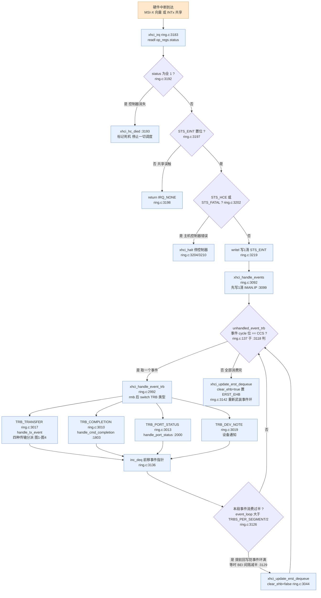

# USB 2.0 / USB 3.2 / xHCI 规范学习笔记 —— 四种传输类型完整流程（从硬件中断开始，逐行锚定 Linux 内核）

> 版本基线（2026-09 核对）：
> - **USB 2.0**：Rev 2.0 主规范（2000-04-27）+ 官方现行 ECN/勘误包 **usb_20_20250603**（usb.org 现行发布，内含约 30 份 ECN/Errata，另含 OTG/Inter-Chip 等独立补充规范）
> - **USB 3.2**：Rev **1.1**（2022-06-03），向下吞并 3.0/3.1（成为 Gen1/Gen2 速度档）
> - **xHCI**：Rev **1.2**（2019-05，Intel 编制 / USB-IF 发布，无更新修订版）
> - **代码基线**：本地源码树 `/Volumes/KernelSrc/linux` = **Linux v7.3.0**，文中全部 `文件:行号` 以该树为准：
>   `ring.c` = drivers/usb/host/xhci-ring.c，`xhci.c` = drivers/usb/host/xhci.c，`hcd.c` = drivers/usb/core/hcd.c，`urb.c` = drivers/usb/core/urb.c（行号均为函数内语句所在行）
>
> 五张流程图统一**从 xHCI 硬件中断出发**，走完"中断处理 → URB 回收 → 重新提交 → 门铃 → 总线传输 → 完成事件 → 回到中断"的完整闭环。**软件路径每个节点落到真实函数与行号**；`USB 2.0 总线`/`USB 3.x 总线`子图内是 xHC 硬件行为（行号不适用，判据注规范章节）。

---

## 0. 阅读地图：三份规范各管一段

| 规范 | 管什么 | 关键章节 |
|---|---|---|
| USB 2.0 | 总线级协议：包格式/PID、帧与微帧节拍、四种传输的事务形态、数据翻转与重试、设备框架（枚举） | ch5 数据流模型（5.4-5.9 四种传输）、ch7 电气、ch8 协议层、ch9 设备框架 |
| USB 3.2 | 增强超高速体系：双通道物理层、链路层（LTSSM/U 状态/链路重传）、协议层（HP 头包 + burst + 信用流控）、设备框架增补 | Physical / Link / Protocol Layer 各章、Enhanced Hub 与 Device Framework 章 |
| xHCI 1.2 | 主机控制器寄存器级接口：环模型（命令/传输/事件环）、TRB、门铃、中断器与 MSI-X、USB2/USB3 双路径调度、Streams | ch3 架构总览、ch4 操作模型、ch5 寄存器、ch6 TRB 定义、6.4.5（完成码表 Table 6-90）、4.11.2.5（Frame ID 等时窗口）、附录 B（HS 高带宽等时规则）、附录 F（SS 总线约束） |

一笔传输的完整链路（四种传输通用；右侧是 Linux v7.3 实际函数）：

```
应用/内核消费者
  → usb_submit_urb            urb.c:367   （参数校验 maxp/方向/wLength）
    → usb_hcd_submit_urb      hcd.c:1515  （DMA 映射 :1540）
      → xhci_urb_enqueue      xhci.c:1620 （按端点类型分派 :1695-1712）
        → xhci_queue_{ctrl,bulk,intr,isoc}  组 TRB 挂传输环
          → giveback_first_trb  ring.c:3437
            → xhci_ring_ep_doorbell ring.c:551（写门铃寄存器）
              → xHC 硬件按 USB2/USB3 总线协议搬运数据
                → 完成，写 Transfer Event 到事件环
                  → xhci_irq    ring.c:3183（MSI-X 中断）
                    → xhci_handle_events → handle_tx_event ring.c:2632
                      → usb_hcd_giveback_urb hcd.c:1731 → urb->complete
                        →（驱动重投，回到顶部，闭环）
```

**最容易误解的一点**：USB 总线上**不存在设备到主机的硬件中断线**。"中断传输"（Interrupt Transfer）的本质是**主机按 bInterval 周期性主动轮询**、以此保证延迟上界的传输类型；USB 3.x 的 ERDY 事务包给了设备"主动通知"的能力，但最终仍由主机调度执行。真正的硬件中断只发生在**主机控制器（xHC）→ CPU** 这一段：传输完成、端口变化、命令完成等事件。

---

## 1. USB 2.0 总线机制速览

### 1.1 节拍与调度预算

- 全速/低速以 **1ms 帧**为节拍（SOF 令牌）；高速把每帧切成 **8 个 125µs 微帧**。
- 高速微帧预算：周期性传输（等时 + 中断）最多 **80%**，控制传输保底 FS/LS **10%**、HS **20%**（§5.5.4），批量吃掉全部剩余带宽。全速：周期性 ≤90%（§5.6.4）。

### 1.2 包形态（ch8）

| 类别 | PID | 说明 |
|---|---|---|
| 令牌 | SETUP / IN / OUT / SOF | 主机广播，指定地址 + 端点 + 方向 |
| 数据 | DATA0 / DATA1（高带宽等时另有 DATA2 / MDATA） | 载荷 + CRC16 |
| 握手 | ACK / NAK / STALL / NYET（仅高速） | ACK 收下；NAK 稍后重试；STALL 挂起；NYET 高速"本次收下下次未必要" |
| 特殊 | PRE / PING / SPLIT / ERR | PING 供高速 OUT 探路；SPLIT 供 2.0 集线器拆分 FS/LS 事务 |

事务铁律：**令牌 → 数据 → 握手**；DATA0/DATA1 翻转防丢包重放；超时/坏 CRC 由主机重发（翻转保护下对端安全丢弃重复包）；**连续 3 次错误才上报**。等时是唯一例外：**无握手、无重试、无翻转**。

### 1.3 四种传输的 USB 2.0 语义与参数

| 参数 | 控制 Control | 批量 Bulk | 中断 Interrupt | 等时 Isochronous |
|---|---|---|---|---|
| 用途 | 枚举/配置（仅 EP0） | 大块数据（U 盘/网口） | 有界延迟小事件（HID） | 恒速率流（音频/摄像头） |
| 带宽保证 | 预算保底 | 无，吃剩余 | 周期预留 | 微帧预留 |
| 延迟保证 | 无 | 无 | **≤ bInterval** | ≤ 传输间隔 |
| 最大包长 | FS 8/16/32/64；HS 64 | FS 64；HS 512 | FS 64；HS 1024（LS 8） | FS 1023；HS 1024 |
| 轮询周期 | - | 空闲伺机 | FS：bInterval 毫秒（1-255）；HS：125µs × 2^(bInterval-1)；LS：10-255ms | 每（微）帧固定 |
| 握手/重试/翻转 | 有/有/有 | 有/有/有 | 有/有/有 | **无/无/无** |
| 失败表现 | STALL | 3 次错误后管道失效 | 3 次错误后管道失效 | 坏包静默丢弃 |

高速批量 OUT 的 PING 协议：先发 PING 探路，ACK 才发数据、NYET 继续 PING——不把微帧带宽浪费在必然 NAK 的大包上。**内核对应完成码 `COMP_NO_PING_RESPONSE_ERROR`**（handle_tx_event() ring.c:2774）。

---

## 2. USB 3.2 关键变化速览

### 2.1 速度档与双通道

| 市场名 | 规范名 | 速率 | 编码 | 通道 |
|---|---|---|---|---|
| USB 5Gbps | USB 3.2 Gen 1 | 5 Gb/s | 8b/10b | 1 对差分/方向 |
| USB 10Gbps | USB 3.2 Gen 2 | 10 Gb/s | 128b/132b | 1 对差分/方向 |
| USB 20Gbps | USB 3.2 Gen 2x2 | 20 Gb/s | 128b/132b | **2 对差分/方向**（仅 Type-C；双通道能力在 Polling.PortMatch 用 PHY Capability LBPM 判定 6.13.2，速率协商经 LFPS 3.2.1.2） |

双总线架构：SuperSpeed 差分对与 USB2 D+/D- 相互独立，可同时各自工作（hub 必须双总线同时工作、外设禁止同时——3.2.6.1/9.2.6.6），枚举时按能力择一路径。

### 2.2 分层模型

- **物理层**：Gen2 用 128b/132b 块编码（开销 ~1.5% 对比 8b/10b 的 20%）+ 加扰；LTSSM Polling/Configuration 完成均衡与通道映射。
- **链路层**：LTSSM 电源状态 **U0/U1/U2/U3**；包类型 **LMP**（链路管理）、**TP**（事务包：ACK/NRDY/ERDY/STATUS/STALL/PING/DEV_NOTIFICATION）、**DP**（=16 字节 **Header Packet（CRC-16）** + 可选 **DPP 载荷（CRC-32）**）、**ITP**（等时时间戳，主机在根端口 U0 时于每个 125µs 总线区间边界 0-8µs 窗口内广播，8.7/8.12.5）。链路层只重传 **Header Packet**；DPP 校验 CRC-32，非等时由**协议层端到端重传**（rty+序列号，8.12.1.2），等时完全不重传（8.12.6.1）。
- **协议层**：四种传输类型语义保留，流控与错误机制换代。

### 2.3 与 USB 2.0 逐项对照（读流程图前先记这张表）

| 机制 | USB 2.0 | USB 3.x |
|---|---|---|
| 可靠性 | 翻转 + 主机重发 | HP 链路层重传；DP 协议层端到端重传（序列号+rty） |
| 流控 | NAK（反复轮询撞墙） | **NumP 信用**（DP 头携带）+ **NRDY/ERDY** |
| 设备通知 | 无（纯被动） | **ERDY** 主动宣告"有数据/有空间" |
| burst | 无（每包握手） | 一次调度连发最多 **bMaxBurst+1** 个 DP |
| 等时重传 | 无 | 同样无（链路层对等时 DPP 不重传） |
| 中断传输服务 | 主机按 bInterval 盲轮询 | 设备 ERDY 触发 |
| 等时同步 | SOF | **ITP** 时间戳 |
| 控制 Status 阶段 | 零长 DATA1 + 握手 | **STATUS 事务包** |

---

## 3. xHCI 1.2 编程模型 + Linux v7.3 实码对照

### 3.1 环模型与所有权

- **三种环**：命令环（软件→xHC）、每端点传输环（TRB 组成 TD，Link TRB 回卷）、事件环（xHC→软件，每中断器一条）。
- **Cycle 位**：消费者只处理 cycle 位符合当前相位的 TRB（内核 `unhandled_event_trb` ring.c:137，在 `xhci_handle_events` ring.c:3118 循环里判）。
- **事件环寄存器组**：ERSTBA / ERSTSZ / **ERDP**（最低位 EHB，写回即重新武装——`xhci_update_erst_dequeue` ring.c:3044，`clear_ehb=true` 时置 ERST_EHB :3069）+ **IMAN**（IP/IE）+ **IMOD**（合流间隔）。
- **门铃**：每槽一个寄存器，写槽号 + 端点号（+ Stream ID）——`xhci_ring_ep_doorbell` ring.c:551，`writel(DB_VALUE(ep_index, stream_id))` :572；五种 ep_state 门禁不响铃（EP_STOP_CMD_PENDING / SET_DEQ_PENDING / EP_HALTED / EP_CLEARING_TT / EP_DROP_PENDING）:566。

### 3.2 完成码 → errno 映射（handle_tx_event ring.c:2676 switch，逐条实测行号）

| 完成码 | errno | 行号（除标注外均在 handle_tx_event() 内） | 备注 |
|---|---|---|---|
| COMP_SUCCESS（但剩余长度非 0） | 改判 COMP_SHORT_PACKET | :2680-2686 | 成功 + 余量 = 短包 |
| COMP_STALL_ERROR | -EPIPE | :2705 | xHCI 上 stall 恒停端点（xhci_halted_host_endpoint() :2210-2212） |
| COMP_USB_TRANSACTION_ERROR | -EPROTO | :2715 | 批量/中断有软重试（:2542） |
| COMP_BABBLE_DETECTED_ERROR | -EOVERFLOW | :2720 | |
| COMP_TRB_ERROR | -EILSEQ | :2726 | |
| COMP_DATA_BUFFER_ERROR | -ENOSR | :2733 | 内存带宽不够 |
| COMP_RING_UNDERRUN / OVERRUN | 不算 TD 错 | :2749 / :2758 | 等时环断供事件 |
| COMP_MISSED_SERVICE_ERROR | 帧级 -EXDEV | :2762 | 置 ep->skip 逐 TD 补偿（:2847-2931） |
| COMP_NO_PING_RESPONSE_ERROR | 丢弃一个 TD | :2774 | PING 无应答 |

### 3.3 USB2 与 USB3 两条路径的调度差异

| | USB2 路径 | USB3 路径 |
|---|---|---|
| 中断/批量 | xHC 周期/异步逻辑自动反复服务传输环，软件持续喂 TRB | 门铃即发；之后设备 ERDY 驱动再服务 |
| 等时 | 软件按 MFINDEX + 提前量算 Frame ID（xHCI 4.11.2.5 Valid Frame Window；内核 `xhci_get_isoc_start_frame` ring.c:4021，IST 提前量 `xhci_ist_microframes` :3976） | 同按 Frame ID，节拍 125µs；连发用 SIA（`TRB_SIA` :4174） |
| 高带宽等时 | 微帧内最多 3 笔：TBC/TLBPC 描述（`xhci_get_burst_count` :3930 / `xhci_get_last_burst_packet_count` :3950） | companion 描述符 bMaxBurst |
| Streams | - | 门铃带 Stream ID（UAS 依赖） |

### 3.4 Linux xhci-hcd 函数 → 行号总表（v7.3.0 实测）

| 流程步骤 | 函数 | 位置 |
|---|---|---|
| 提交入口 | usb_submit_urb | urb.c:367（尾调 usb_hcd_submit_urb :586） |
| HCD 分发 | usb_hcd_submit_urb → urb_enqueue | hcd.c:1515（:1542） |
| xHCI 入队分派 | xhci_urb_enqueue | xhci.c:1620（类型 switch :1695-1712） |
| 控制组装 | xhci_queue_ctrl_tx | ring.c:3775 |
| 批量组装 | xhci_queue_bulk_tx | ring.c:3616 |
| 中断组装 | xhci_queue_intr_tx（**转调 bulk_tx** :3496 + check_interval :3453） | ring.c:3488 |
| 等时准备/组装 | xhci_queue_isoc_tx_prepare / xhci_queue_isoc_tx | ring.c:4296 / :4096 |
| 交出首 TRB/响铃 | giveback_first_trb / xhci_ring_ep_doorbell | ring.c:3437 / :551 |
| 中断入口 | xhci_irq | ring.c:3183 |
| 事件循环 | xhci_handle_events → xhci_handle_event_trb | ring.c:3092 / :2992 |
| 传输事件 | handle_tx_event | ring.c:2632 |
| 分类型完成处理 | process_ctrl_td / process_isoc_td / process_bulk_intr_td | ring.c:2306 / :2401 / :2505 |
| halted 恢复 | finish_td → xhci_handle_halted_endpoint（Reset Endpoint 命令 :1016） | ring.c:2247 / :982 |
| 回收 | xhci_td_cleanup → xhci_giveback_urb_in_irq → usb_hcd_giveback_urb | ring.c:877 / :807 / hcd.c:1731 |
| 回调 | __usb_hcd_giveback_urb → urb->complete | hcd.c:1630（:1657） |

---

## 4. 中断处理统一主干（四种传输共用）




要点复盘：
- `status == 全1` 在最前：控制器被拔/死时 MMIO 读回全 1，先判它防止误处理（ring.c:3192）；
- 过半即回写 ERDP（xhci_handle_events() ring.c:3126）是**防"Event Ring Full"**的关键——长中断风暴时不等全部消费完就腾地方；
- `isoc_bei_interval` 减半（:3129）与图3 的 TRB_BEI 配合：等时 URB 不必每个 TD 都中断。

---

## 5. 四种传输完整流程图（从硬件中断开始的闭环）

> 四图统一结构（图中边标签上的行号属于其源节点已标注的函数；未重复标注处，以最近一个带函数名的节点所指函数为准）：**上半环 = 中断侧**（完成处理 → URB 回收），**下半环 = 提交与总线侧**（重投 → 门铃 → USB2/USB3 分叉的总线行为），事件环写回后回到起点中断，构成完整服务闭环。图序按要求从中断传输开始。

### 5.1 中断传输（Interrupt Transfer）

典型用户：HID 键鼠、集线器状态。核心特征：**主机周期轮询（USB2）/ 设备 ERDY 唤醒（USB3）+ 延迟上界 bInterval**。**代码层最意外的事实：中断传输的 TRB 组装与完成处理和批量完全共用**（`xhci_queue_intr_tx` 直接转调 `xhci_queue_bulk_tx` ring.c:3496），差异只在 `check_interval`（ring.c:3453）与端点上下文的周期属性。

```mermaid
flowchart TD
  IRQ["xHC 中断<br/>经图0主干取出 Transfer Event"] --> EVT["handle_tx_event ring.c:2632<br/>解析 slot/EP/完成码 :2648-2651"]
  EVT --> CC{"switch 完成码 ring.c:2676"}
  CC -->|"COMP_STALL_ERROR :2705"| C1["status = -EPIPE"]
  CC -->|"COMP_USB_TRANSACTION_ERROR :2715"| C2["status = -EPROTO 走软重试"]
  CC -->|"COMP_BABBLE :2720"| C3["status = -EOVERFLOW"]
  CC -->|"SUCCESS 或 SHORT_PACKET :2680"| C4["status = 0"]
  C1 --> PBI["process_bulk_intr_td ring.c:2505<br/>中断与批量共用完成处理"]
  C2 --> PBI
  C3 --> PBI
  C4 --> PBI
  PBI --> SOFT{"事务错误且 err_count<br/>未超 MAX_SOFT_RETRY=3 ?<br/>ring.c:2542 xhci.h:1271"}
  SOFT -->|"是 EP_SOFT_RESET ring.c:2550"| HW["xHC 重新调度该端点<br/>回到总线执行"]
  SOFT -->|"否 或无错"| FTD["finish_td ring.c:2247"]
  FTD --> HLT{"xhci_halted_host_endpoint ?<br/>ring.c:2204 STALL 恒 halt"}
  HLT -->|"halted"| RST["xhci_handle_halted_endpoint :982<br/>td 挂 cancelled 表 :1005<br/>xhci_reset_halted_ep :1016<br/>xhci_ring_cmd_db :1022<br/>命令完成后 Set TR Deq 清缓存"]
  HLT -->|"未 halt"| DEQ["xhci_dequeue_td ring.c:924"]
  RST --> GB["xhci_td_cleanup ring.c:877<br/>last_td_in_urb 时<br/>usb_hcd_giveback_urb hcd.c:1731"]
  DEQ --> GB
  GB --> GBH["__usb_hcd_giveback_urb hcd.c:1630<br/>int URB 走 high_prio_bh :1745<br/>urb->complete 回调 :1657"]
  GBH --> RESUB["驱动回调后重投 URB<br/>usb_submit_urb urb.c:367"]
  RESUB --> HCD["usb_hcd_submit_urb hcd.c:1515<br/>urb_enqueue :1542"]
  HCD --> ENQ["xhci_urb_enqueue xhci.c:1620<br/>INT 分支 :1706 num_tds=1"]
  ENQ --> QI["xhci_queue_intr_tx ring.c:3488<br/>check_interval :3453 于 :3494<br/>转调批量组装 :3496"]
  QI --> QB["xhci_queue_bulk_tx :3616 组装 Normal TRB<br/>末 TRB IOC :3711 IN 方向 ISP :3724"]
  QB --> DB["giveback_first_trb ring.c:3437<br/>xhci_ring_ep_doorbell :551<br/>门禁五态不响铃 :566<br/>writel DB_VALUE :572"]
  DB --> WHICH{"根端口路径?"}
  WHICH -->|"USB2 高速/全速/低速"| U2
  WHICH -->|"USB3 Gen1/Gen2/2x2"| U3
  subgraph U2["USB 2.0 总线 主机周期轮询 规范 ch5.8"]
    P1["xHC 周期逻辑按端点 Interval 轮询<br/>HS 125微秒 x 2^(bInterval-1)<br/>FS 每 bInterval 毫秒"]
    P1 --> P2{"设备有无数据或空间?"}
    P2 -->|"无 设备NAK 下周期再来<br/>延迟上界即 bInterval"| P1
    P2 -->|"有"| P4["IN: 设备回DATAx 主机ACK<br/>OUT: 主机发DATAx 设备ACK<br/>DATA0/DATA1 翻转防丢包<br/>TD 完成"]
  end
  subgraph U3["USB 3.x 总线 ERDY 通知 规范 Protocol Layer"]
    B1["设备就绪主动发 ERDY<br/>主机无需盲目轮询"] --> B2{"设备还有空间或数据?"}
    B2 -->|"不足 回NRDY<br/>恢复后再 ERDY"| B1
    B2 -->|"就绪 burst 最多 bMaxBurst+1 个DP<br/>DP头 NumP 信用"| B5["按DP序列号收发<br/>HP 链路层重传<br/>DPP 协议层端到端重试<br/>TD 完成"]
  end
  P4 --> DONE["xHC 写 Transfer Event 入事件环"]
  B5 --> DONE
  HW --> DONE
  DONE -->|"闭环 回到中断"| IRQ
  classDef ev fill:#FFE8CC,stroke:#D79A5B
  class IRQ,EVT,DONE ev
```




要点复盘：
- **中断传输延迟上界 = bInterval**：设备 NAK 后主机下一周期才回来，这是轮询模型的物理下限；
- 中断端点在 USB3 的 burst 上限被规范压到 **3**（每服务区间，8.12.4，对应 bMaxBurst≤2）；NRDY 之后主机也可不经 ERDY 直接恢复、并须忽略非流控态端点发来的 ERDY（8.10.1）；
- 软重试机制（process_bulk_intr_td() 的 `EP_SOFT_RESET` ring.c:2550，重试上限宏 `MAX_SOFT_RETRY`=3 xhci.h:1271）：事务错误先软复位端点重跑，3 次后才升级 -EPROTO——比"一次错误就报"温和；
- 重投 URB 是中断端点的常态（键盘驱动长期挂一个待命 URB），整条闭环每敲一个键走一遍。

### 5.2 批量传输（Bulk Transfer）

典型用户：U 盘（BOT/UAS）、网卡。核心特征：**零带宽承诺、空闲带宽全归它；USB2 靠 PING/NAK 伺机重试，USB3 靠 burst + 信用**；USB3 上还有 Streams 多队列（UAS 依赖）。

```mermaid
flowchart TD
  IRQ["xHC 中断<br/>经图0主干取出 Transfer Event"] --> EVT["handle_tx_event ring.c:2632"]
  EVT --> CC{"switch 完成码 ring.c:2676"}
  CC -->|"SHORT_PACKET 短包 ring.c:2531"| SP["status=0<br/>数据提前收发完毕"]
  CC -->|"STALL_ERROR :2705"| ST["status=-EPIPE<br/>类驱动 Clear-HALT 恢复"]
  CC -->|"USB_TRANSACTION_ERROR :2715"| TX["软重试至多 3 次 :2542<br/>超限 -EPROTO"]
  CC -->|"SUCCESS :2520"| OK["status=0 err_count 清零"]
  SP --> PBI["process_bulk_intr_td ring.c:2505<br/>actual_length = 请求-剩余 :2557"]
  ST --> PBI
  TX --> PBI
  OK --> PBI
  PBI --> FTD["finish_td ring.c:2247<br/>halted 则走图1同款<br/>Reset Endpoint 恢复链"]
  FTD --> GB["xhci_td_cleanup ring.c:877<br/>xhci_giveback_urb_in_irq :807<br/>usb_hcd_giveback_urb hcd.c:1731"]
  GB --> GBH["__usb_hcd_giveback_urb hcd.c:1630<br/>urb->complete 回调 :1657"]
  GBH --> RESUB["继续提交 URB<br/>usb_submit_urb urb.c:367"]
  RESUB --> HCD["usb_hcd_submit_urb hcd.c:1515"]
  HCD --> ENQ["xhci_urb_enqueue xhci.c:1620<br/>BULK 分支 :1702<br/>URB_ZERO_PACKET 且整包对齐<br/>则 num_tds=2 :1634"]
  ENQ --> STR{"urb->stream_id 非 0 ?"}
  STR -->|"是 Streams 如 UAS"| SQ["xhci_urb_to_transfer_ring<br/>按 stream_id 选流 ring.c:3634<br/>门铃写 stream_id :572"]
  STR -->|"否 普通单队列"| Q["xhci_queue_bulk_tx ring.c:3616"]
  SQ --> Q
  Q --> PRE["sg 表走 count_sg_trbs :3645<br/>否则 count_trbs :3647<br/>prepare_transfer :3651"]
  PRE --> LOOP["TRB 循环 :3675<br/>64KB 边界切 TRB :3680<br/>TRB_CHAIN :3698<br/>段尾不对齐 bounce 补齐<br/>xhci_align_td :3546 于 :3700<br/>IN 方向 TRB_ISP :3724<br/>小包 IDT 内联 :3715"]
  LOOP --> ZP{"need_zero_pkt ? ring.c:3660"}
  ZP -->|"是 补零长包"| ZP2["追加零长 Normal TRB + IOC<br/>ring.c:3758-3765"]
  ZP -->|"否"| DB
  ZP2 --> DB["giveback_first_trb ring.c:3769<br/>xhci_ring_ep_doorbell :551 响铃"]
  DB --> WHICH{"根端口路径?"}
  WHICH -->|"USB2"| U2
  WHICH -->|"USB3"| U3
  subgraph U2["USB 2.0 总线 异步伺机 规范 ch5.8"]
    P1["xHC 异步逻辑在微帧剩余带宽<br/>伺机服务该端点"]
    P1 --> P2{"高速 OUT 先 PING 探路?"}
    P2 -->|"NYET 继续探路"| P2
    P2 -->|"PING 得 ACK 或无需探路"| P4["发 DATAx 对端ACK收下<br/>DATA0/DATA1 翻转防丢包"]
    P4 -->|"NAK 保留toggle重发同包<br/>硬件3次错误才上报"| P1
    P4 -->|"ACK 且TD内还有包"| P1
    P4 -->|"ACK 且TD全部包完成"| PD["TD 完成"]
  end
  subgraph U3["USB 3.x 总线 burst+信用 规范 Protocol Layer"]
    B1["主机直接发起 burst 无需轮询<br/>连发最多 bMaxBurst+1 个 DP<br/>DP 头携带本方 NumP 信用"] --> B2{"设备还有接收空间?"}
    B2 -->|"不足 回 NRDY<br/>恢复后 ERDY 再来"| B1
    B2 -->|"充足 链路层对 HP 自动重传<br/>序列号去重"| B5["TD 完成"]
  end
  PD --> DONE["TD 完成<br/>xHC 写 Transfer Event 入事件环"]
  B5 --> DONE
  DONE -->|"闭环 回到中断"| IRQ
  classDef ev fill:#FFE8CC,stroke:#D79A5B
  class IRQ,EVT,DONE ev
```




要点复盘：
- **批量/中断在 xHCI 里几乎是同一套代码**（组装 ring.c:3616、完成 ring.c:2505），差别只在端点上下文的调度属性与 `check_interval`——读代码时不要找"中断专属路径"；
- `URB_ZERO_PACKET`（xhci_queue_bulk_tx() ring.c:3660）驱动"补一个零长包"的语义在 xHCI 侧体现为 num_tds=2 追加零长 TD；
- `xhci_align_td`（:3546）bounce buffer 是为了"TD 不跨 64KB 边界且按 maxp 对齐"，U 盘性能调优常见关注点；
- Streams（UAS）：`stream_id` 贯穿选环（xhci_urb_to_transfer_ring() 调用点 ring.c:3634）与门铃（xhci_ring_ep_doorbell() :572），一条端点多队列并发。

### 5.3 等时传输（Isochronous Transfer）

典型用户：USB 音频、摄像头。核心特征：**带宽按时钟预留、出错不重传、软件必须提前排班（Frame ID/SIA）**。

```mermaid
flowchart TD
  IRQ["xHC 中断<br/>经图0主干取出 Transfer Event"] --> EVT["handle_tx_event ring.c:2632"]
  EVT --> CC{"switch 完成码 ring.c:2676"}
  CC -->|"RING_UNDERRUN 或 OVERRUN<br/>:2749/:2758"| RUN["ring_xrun_event=true<br/>端点级事件 不判 TD 错"]
  CC -->|"MISSED_SERVICE<br/>:2762"| MISS["ep->skip=true ring.c:2769<br/>错过的 TD 逐个补账"]
  CC -->|"Babble 或 CRC 类"| BAB["等时无重试 坏包直接丢<br/>status 仅记帧"]
  CC -->|"SUCCESS 或 SHORT_PACKET"| OK["status=0"]
  RUN --> SKP
  MISS --> SKP["skip 循环 ring.c:2847-2931<br/>isoc 且 skip 时<br/>未命中的 TD 直接 xhci_dequeue_td :2863<br/>core 已预置 frame.status=-EXDEV"]
  BAB --> SKP
  OK --> SKP
  SKP --> PIT["process_isoc_td ring.c:2401<br/>按帧处理 idx=num_tds_done :2414"]
  PIT --> FSM{"帧状态映射 :2421-2479"}
  FSM -->|"BANDWIDTH_OVERRUN"| F1["frame.status=-ECOMM :2434"]
  FSM -->|"BABBLE 或 BUFFER_OVERRUN"| F2["frame.status=-EOVERFLOW :2441"]
  FSM -->|"MISSED_SERVICE"| F3["frame.status=-EXDEV :2446"]
  FSM -->|"SUCCESS SHORT 等"| F4["frame.status=0 :2428/:2431"]
  F1 --> LEN
  F2 --> LEN
  F3 --> LEN
  F4 --> LEN["每帧 actual_length 汇总<br/>:2484-2490<br/>error_mid_td 则等最终事件 :2494"]
  LEN --> FTD["finish_td ring.c:2247<br/>等时永不 halt :2227 排除 ISOC<br/>直接 xhci_dequeue_td :2286"]
  FTD --> GB["xhci_td_cleanup ring.c:877<br/>bandwidth_isoc_reqs 递减 :815<br/>xhci_giveback_urb_in_irq :807"]
  GB --> GBH["usb_hcd_giveback_urb hcd.c:1731<br/>isoc/int 走 high_prio_bh :1745<br/>urb->complete 回调 :1657"]
  GBH --> RESUB["音频/摄像头栈立即续投<br/>整段缓冲 一次多个区间"]
  RESUB --> HCD["usb_hcd_submit_urb hcd.c:1515"]
  HCD --> ENQ["xhci_urb_enqueue xhci.c:1620<br/>ISOC 分支 :1710<br/>num_tds=number_of_packets :1633"]
  ENQ --> P4296["xhci_queue_isoc_tx_prepare ring.c:4296<br/>count_isoc_trbs_needed :4314<br/>prepare_ring :4319<br/>check_interval :4328<br/>空环重同步 next_uframe=-1 :4334"]
  P4296 --> Q4096["xhci_queue_isoc_tx ring.c:4096<br/>FS/LS uinterval 乘 8 :4131<br/>start_uframe=xhci_get_isoc_start_frame<br/>:4021 于 :4134"]
  Q4096 --> PERTD["逐 TD :4137<br/>total_pkt_count=DIV_ROUND_UP(帧长,maxp) :4148<br/>burst_count :3930 仅 xHCI1.0+ 且 SS<br/>last_burst_pkt_count :3950"]
  PERTD --> FID{"选 Frame ID 或 SIA<br/>:4170-4175"}
  FID -->|"连续排班"| FID2["TRB_FRAME_ID<br/>取 start_uframe+i*uinterval 的帧号 :4171"]
  FID -->|"断续流"| FID3["TRB_SIA :4174<br/>由 xHC 自选最早区间"]
  FID2 --> TRB
  FID3 --> TRB["首 TRB: TRB_ISOC+TLBPC<br/>+TBC :4182-4189<br/>use_extended_tbc 则走 TD_SIZE_TBC :4230<br/>IN 方向 ISP :4201<br/>末 TRB IOC+BEI :4212-4214"]
  TRB --> DB["next_uframe 前移 :4255<br/>giveback_first_trb :4263<br/>门铃 :551"]
  DB --> WHICH{"根端口路径?"}
  WHICH -->|"USB2"| U2
  WHICH -->|"USB3"| U3
  subgraph U2["USB 2.0 总线 微帧节拍 规范 ch5.9"]
    P1["xHC 在目标微帧发事务<br/>FS 每帧1笔 不超1023字节<br/>HS 每笔最大1024字节"]
    P1 --> P2{"高带宽端点?"}
    P2 -->|"是 最多3笔每微帧"| P3["DATA2 DATA1 DATA0 MDATA<br/>专用 PID 序列拼包<br/>单微帧最高 3072 字节<br/>拆包布局即 TBC TLBPC"]
    P2 -->|"否"| P4["单笔即发"]
    P3 --> P5["无握手不等ACK<br/>不重传 无 toggle"]
    P4 --> P5
  end
  subgraph U3["USB 3.x 总线 区间 burst 规范 Protocol Layer"]
    E1["主机按 125微秒 区间排 DP burst<br/>companion 描述符给 burst 上限"]
    E1 --> E2["链路层对等时不重传<br/>坏包丢弃 接收方按序列号<br/>检测缺口 上层 PLC 掩盖"]
    E2 --> E3["ITP 每 125微秒 总线区间边界广播<br/>0-8微秒窗口 支撑端到端同步"]
  end
  U2 --> DONE["xHC 写 Transfer Event 入事件环"]
  U3 --> DONE
  DONE -->|"闭环 回到中断"| IRQ
  classDef ev fill:#FFE8CC,stroke:#D79A5B
  class IRQ,EVT,DONE ev
```




要点复盘：
- ** Missed Service 的补偿机制**：`ep->skip` 置位后（handle_tx_event() ring.c:2769），skip 循环把没命中的 TD 逐个 `xhci_dequeue_td`（:2863），每帧状态由 usbcore 预置 -EXDEV——上层收到的是"这些帧丢了"而不是整个 URB 报废；
- **BEI（Block Event Interrupt，xhci_queue_isoc_tx() ring.c:4213 + `trb_block_event_intr()` :4077）**：连续等时流不必每个 TD 都中断，靠 `xhci_handle_events` 的过半回写（:3126）与 `isoc_bei_interval` 减半（:3129）兜底防断流；
- **SIA vs Frame ID**（:4170）：连续流用显式帧号精确排班，断续流（如按需启动的麦克风）丢给 `TRB_SIA` 让 xHC 自选最早区间；
- `xhci_get_isoc_start_frame`（:4021）内含 IST（Isochronous Scheduling Threshold，`xhci_ist_microframes` :3976）——排班必须晚于 xHC 的"视线"。

### 5.4 控制传输（Control Transfer）

典型用户：枚举与一切配置（仅 EP0）。核心特征：**三阶段 TRB 链一次挂完（xHCI 效率优势所在），Status 阶段报整笔成败**。

```mermaid
flowchart TD
  IRQ["xHC 中断<br/>经图0主干取出 Transfer Event"] --> EVT["handle_tx_event ring.c:2632"]
  EVT --> CC{"switch 完成码 ring.c:2676<br/>控制 URB 通常只在<br/>Status TRB 置 IOC 一次事件"}
  CC -->|"STALL_ERROR"| STALL["status=-EPIPE ring.c:2705<br/>EP0 的 STALL 下一 SETUP 自动解除"]
  CC -->|"SHORT_PACKET"| SP["status=0 ring.c:2331<br/>数据阶段提前结束<br/>如读短描述符"]
  CC -->|"SUCCESS 或其他"| OK["进入 process_ctrl_td"]
  STALL --> PCT
  SP --> PCT
  OK --> PCT["process_ctrl_td ring.c:2306<br/>看事件命中的 TRB 类型 :2315"]
  PCT --> WT{"命中哪个阶段?"}
  WT -->|"Setup TRB 事件 :2375"| FIN1["finish_td"]
  WT -->|"Data TRB 事件 :2382"| WAIT["td.urb_length_set=true<br/>actual_length=请求-剩余 :2385<br/>等 Status 阶段最终事件"]
  WT -->|"Status TRB 事件 :2390"| GB
  WAIT --> GB["finish_td ring.c:2247<br/>xhci_halted_host_endpoint :2204<br/>STALL 恒 halt :2210<br/>EP0 跳过 TT 清理 :2278"]
  FIN1 --> GB
  GB --> GBR["halted: xhci_handle_halted_endpoint :982<br/>Reset Endpoint + Set TR Deq<br/>未 halt: xhci_dequeue_td :924"]
  GBR --> GB2["xhci_td_cleanup ring.c:877<br/>xhci_giveback_urb_in_irq :807<br/>usb_hcd_giveback_urb hcd.c:1731<br/>整笔控制请求回驱"]
  GB2 --> NEXT["驱动发起下一请求<br/>GET_DESCRIPTOR SET_ADDRESS<br/>SET_CONFIGURATION 完成枚举"]
  NEXT --> RESUB["usb_submit_urb urb.c:367<br/>控制专属校验 :403-419<br/>方向 wLength 一致性"]
  RESUB --> HCD["usb_hcd_submit_urb hcd.c:1515"]
  HCD --> ENQ["xhci_urb_enqueue xhci.c:1620<br/>CONTROL 分支 :1698"]
  ENQ --> QCT["xhci_queue_ctrl_tx ring.c:3775<br/>num_trbs=2 有数据再+1 :3814-3821"]
  QCT --> S1["Setup TRB :3843-3862<br/>TRB_IDT 内联8字节请求<br/>TRT 声明数据方向 :3848-3854<br/>hci_version>=1.0 才写 TRT"]
  S1 --> S2{"wLength 大于 0 ?"}
  S2 -->|"有数据阶段"| S3["Data TRB :3866-3897<br/>IN 方向 TRB_ISP :3866<br/>小包 IDT 内联 :3875<br/>TRB_DIR_IN :3891"]
  S2 -->|"无"| S4
  S3 --> S4["Status TRB :3905-3915<br/>方向与数据阶段相反 :3906-3909<br/>TRB_IOC + TRB_STATUS :3915"]
  S4 --> DB["giveback_first_trb ring.c:3917<br/>xhci_ring_ep_doorbell :551 响铃 EP0"]
  DB --> WHICH{"根端口路径?"}
  WHICH -->|"USB2"| U2
  WHICH -->|"USB3"| U3
  subgraph U2["USB 2.0 三阶段总线形态 规范 ch5.5/ch8.5.3"]
    B1["Setup 阶段<br/>SETUP 令牌 + DATA0 内联8字节"]
    B1 --> B2{"有数据阶段?"}
    B2 -->|"有"| B3["IN 或 OUT DATA1 起步翻转<br/>短包可提前结束"]
    B2 -->|"无"| B4["Status 阶段方向反转<br/>零长 DATA1 报告结果"]
    B3 --> B4
    B4 --> B5{"设备应答"}
    B5 -->|"ACK 成功 NAK 稍后<br/>STALL 失败"| B6["阶段间限时 5 秒<br/>主机掌控节奏"]
  end
  subgraph U3["USB 3.x 三阶段总线形态 规范 Protocol Layer"]
    C1["Setup 阶段<br/>OUT DP 携带 8 字节请求"]
    C1 --> C2{"有数据阶段?"}
    C2 -->|"有"| C3["DP burst 传输<br/>序列号代替 toggle"]
    C2 -->|"无"| C4["Status 阶段<br/>STATUS 事务包代替零长包"]
    C3 --> C4
    C4 --> C5{"STATUS 语义"}
    C5 -->|"SUCCESS STALL 或 NRDY"| C6["设备未就绪回 NRDY<br/>恢复后发 ERDY 再跑状态阶段"]
  end
  U2 --> DONE["xHC 写 Transfer Event 入事件环"]
  U3 --> DONE
  B6 --> DONE
  C6 --> DONE
  DONE -->|"闭环 回到中断"| IRQ
  classDef ev fill:#FFE8CC,stroke:#D79A5B
  class IRQ,EVT,DONE ev
```




要点复盘：
- xHCI 与 UHCI/OHCI 的代差在此最直观：**三阶段 TRB 一次挂完**（ring.c:3775 全函数），硬件自动走 Setup→Data→Status，软件只在 IOC 处被中断一次；
- `process_ctrl_td` 以**事件命中的 TRB 类型**（TRB_SETUP/TRB_DATA/TRB_STATUS，process_ctrl_td() :2315）区分阶段：Data 阶段事件只记账不等收尾（:2382-2388），Status 事件才 finish；
- SUCCESS 出现在非 Status TRB 上是异常（process_ctrl_td() ring.c:2323-2326，直判 -ESHUTDOWN）——有的控制器不守规矩；
- EP0 的协议 STALL 与普通端点功能 STALL 在 xHCI 里同样表现为端点 halt（:2210），但 EP0 不需要 TT buffer 清理（finish_td() ring.c:2278）且设备侧下个 SETUP 自动解除。

---

## 6. 收束：四种传输一张表（代码视角）

| | 中断 | 批量 | 等时 | 控制 |
|---|---|---|---|---|
| 本质 | 轮询型有界延迟 | 抢剩余带宽 | 预留带宽的时钟流 | 三阶段请求-应答 |
| 组装函数 | xhci_queue_intr_tx ring.c:3488 **转调 bulk** | xhci_queue_bulk_tx ring.c:3616 | isoc_tx_prepare ring.c:4296 → isoc_tx :4096 | xhci_queue_ctrl_tx ring.c:3775 |
| 完成处理 | process_bulk_intr_td :2505 | process_bulk_intr_td :2505 | process_isoc_td :2401 | process_ctrl_td :2306 |
| 特有 TRB 语义 | Interval 属性（check_interval :3453） | URB_ZERO_PACKET :3660 / bounce :3546 / Streams | Frame ID/SIA :4170、TBC/TLBPC :4182、BEI :4213 | Setup IDT+TRT :3843、Status IOC :3915 |
| halt 恢复 | soft reset 重试 :2550 | 同左，hard reset :2281 | **永不 halt** :2227 | STALL 恒 halt :2210 |
| USB2 服务方式 | 按 bInterval 轮询 | 空闲伺机 + PING | 微帧预排 | 三阶段握手 |
| USB3 服务方式 | ERDY + burst | burst + 信用 + NRDY/ERDY | 区间预排 + ITP | DP + STATUS 包 |

## 7. 延伸阅读（规范章节 + 内核源码索引）

- USB 2.0：ch5.5-5.9（四种传输）、ch8.4-8.5（包与事务）、ch9（枚举与设备框架）、ch11（集线器与 SPLIT）
- USB 3.2 Rev 1.1：Physical Layer、Link Layer（LTSSM/LMP/TP/重传/U 状态）、Protocol Layer（HP/DPP/NumP/burst/ITP）、Device Framework（companion 描述符）
- xHCI 1.2：ch3.2（环模型）、ch4.8（事件环与中断）、ch4.12（Streams）、ch5（寄存器）、ch6.4.5（完成码表 Table 6-90）、4.11.2.5（Frame ID 窗口）、附录 B（HS 高带宽等时规则）
- Linux 源码（v7.3.0 本地树）：drivers/usb/host/xhci-ring.c（事件处理与入队全景）、drivers/usb/host/xhci.c（urb_enqueue/dequeue）、drivers/usb/core/hcd.c（提交/回收框架）、drivers/usb/core/urb.c（URB 校验）
